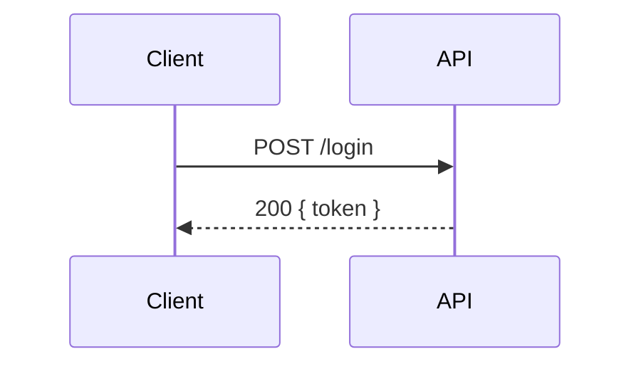

# Format d'une formation (source Markdown → ZIP)

Une formation est un dossier de fichiers Markdown que l'application importe via un `.zip`
(ou via `php artisan formation:import <dossier|zip>`).

## Arborescence

```
ma-formation/
├─ formation.yaml          # métadonnées de la formation (optionnel mais recommandé)
├─ 01-premier-module/      # un DOSSIER = un module ; ordre par le préfixe numérique
│  ├─ module.yaml          # titre du module (optionnel ; sinon déduit du dossier)
│  ├─ 01-une-lecon.md      # un FICHIER .md = une leçon
│  ├─ 02-autre-lecon.md
│  └─ 90-exo-pratique.md   # un exercice (front-matter type: exercise)
└─ 02-second-module/
   └─ 01-...md
```

- **Ordre** : déterminé par le préfixe numérique (`01-`, `02-`, `90-`). Le préfixe est
  retiré du slug final. À défaut, ordre alphabétique naturel.
- **Slug** : dérivé du nom de fichier/dossier sans préfixe (surchargeable en front-matter).
- **Titre de module** : déduit du nom de dossier, ou défini via un `module.yaml`
  (`title:`) — c'est ce titre qui s'affiche comme **étape** dans la roadmap du parcours.

## formation.yaml

```yaml
title: JWT, Bearer, Hexagonal & DDD
slug: jwt-hexagonal-ddd        # optionnel (déduit du titre sinon)
description: Formation pour devs Laravel.
stack: Laravel / PHP           # optionnel : techno/framework enseigné (badge affiché)
order: 0                       # optionnel
```

> `stack` décrit le langage/framework de la formation (ex. `Vue 3 + TypeScript`,
> `Python / FastAPI`, `React`). Il s'affiche comme badge dans le catalogue. C'est aussi
> l'info qui permettra de router le bon playground par framework (cf. README).

## Front-matter d'une leçon (.md)

```markdown
---
title: Structure d'un JWT
type: lesson          # lesson | exercise | quiz   (défaut: lesson)
order: 2              # optionnel (sinon préfixe du fichier)
---

Contenu Markdown de la leçon… tables, code, **gras**, etc.
```

## Exercices : énoncé + correction repliable

Dans un fichier `type: exercise`, le marqueur HTML `<!--correction-->` sépare
l'énoncé (affiché) de la correction (repliée dans l'UI).

```markdown
---
title: Décoder un token
type: exercise
---
## Énoncé
Écris une fonction `decode(token)`…

<!--correction-->
## Correction
```js
function decode(token) { /* ... */ }
```
```

## Exercices interactifs (`type: exercise` + bloc `exercise`)

Un exercice devient **interactif** (éditeur de code + tests dans le navigateur) s'il
déclare un bloc `exercise` en front-matter. Sans ce bloc, il reste en mode énoncé +
correction repliable.

### Gabarit (copier-coller)

```markdown
---
title: Mon exercice (JS)
type: exercise
exercise:
  language: js                 # seul "js" est exécuté (dans le navigateur)
  starter: |                   # code pré-rempli dans l'éditeur
    function maFonction(x) {
      // TODO : à compléter
      return null
    }
  tests:                       # suite de tests ; tout doit passer pour valider
    - name: "cas nominal"
      code: |
        const entree = 21
        const obtenu = maFonction(entree)
        console.log('entrée  :', entree)   # illustre : visible sous le test
        console.log('obtenu  :', obtenu)
        assertEqual(obtenu, 42, 'doit doubler la valeur')
    - name: "cas limite"
      code: |
        assertEqual(maFonction(0), 0, 'zéro reste zéro')
---
Énoncé…
<!--correction-->
Correction…
```

### Helpers disponibles dans `tests[].code`

| Helper | Rôle |
|---|---|
| `assert(condition, message)` | échoue si la condition est fausse |
| `assertEqual(obtenu, attendu, message)` | compare en profondeur (objets/tableaux) ; message d'échec « attendu … obtenu … » automatique |
| `console.log(...)` | **illustre** : la sortie s'affiche **sous le test** (ex. montrer entrée → sortie) |

### À savoir

- Chaque test est exécuté dans un **Web Worker** isolé (timeout anti-boucle-infinie).
  Réussir tous les tests marque la leçon comme complétée.
- Le `console.log` du **code de l'éditeur** (niveau global) s'affiche dans le panneau
  « Sortie (console) » ; celui d'un **test** s'affiche **sous ce test**.
- Les `const`/`let` d'un test sont locaux : pas de collision avec le code de l'éditeur.

## Cartes mémo (`type: flashcards`)

Pour des questions ouvertes/nuancées : la question s'affiche seule, on réfléchit, on
révèle la réponse, puis on s'auto-évalue (« su / à revoir »). Les cartes sont décrites
en front-matter (clé `cards`, avec `q` et `a` en Markdown).

```markdown
---
title: Cartes mémo — JWT
type: flashcards
cards:
  - q: |
      Pourquoi ne pas mettre de donnée sensible dans le payload ?
    a: |
      Parce qu'il est **encodé** (Base64URL), pas chiffré : lisible par tous.
---
Texte d'intro optionnel.
```

Quand toutes les cartes sont auto-évaluées, la leçon est marquée complétée (les notes
« su / à revoir » sont persistées localement).

## Quiz notés (`type: quiz`)

Un quiz est noté automatiquement. Ses questions sont décrites en **front-matter**
(clé `questions`), pas dans le corps. Chaque question : `prompt`, `options` (liste),
`answer` (index 0-indexé de la bonne option), `explanation` (Markdown, affichée après
correction).

```markdown
---
title: Quiz final
type: quiz
questions:
  - prompt: "Le payload d'un JWT est…"
    options:
      - "chiffré, illisible sans le secret"
      - "encodé en Base64, lisible par tous"
    answer: 1
    explanation: "Le payload est encodé, pas chiffré…"
---
Texte d'intro optionnel (corps Markdown).
```

L'API sert les questions **sans la réponse** ; la note et les explications ne sont
renvoyées qu'après soumission (`POST …/grade`). Les tentatives sont enregistrées en base.

## Images et diagrammes

**Images** : placez vos fichiers (PNG/JPG/SVG/GIF) dans un dossier **`assets/`** à la
racine de la formation, et référencez-les en relatif depuis n'importe quelle leçon :

```
ma-formation/
├─ assets/
│  └─ schema.svg
└─ 01-module/
   └─ 01-lecon.md      ← 
```

À l'import, les images sont copiées et servies ; leurs URLs sont réécrites
automatiquement. La formation reste **autonome** (pas de lien externe).

**Diagrammes (Mermaid)** : écrivez le diagramme en texte dans un bloc ` ```mermaid ` —
il est rendu graphiquement dans le navigateur (le thème du diagramme suit le thème de
l'app) :

````markdown

````

## Rendu
Le Markdown est converti en HTML côté serveur (CommonMark + GitHub Flavored :
tables, listes de tâches, autoliens). Le HTML inline est autorisé (callouts, etc.).
