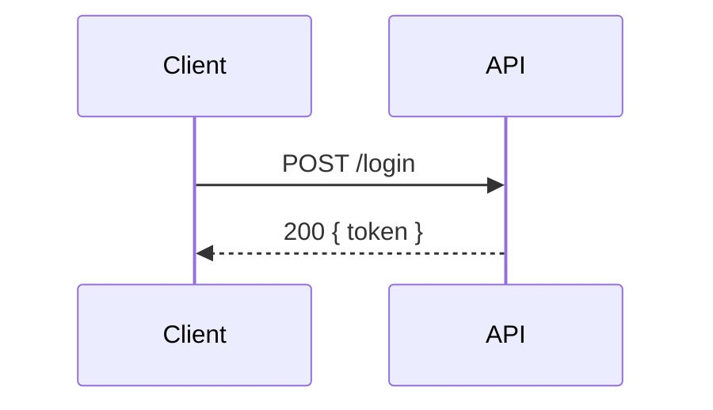

# Format d'une formation (source Markdown → ZIP)

Une formation est un dossier de fichiers Markdown que l'application importe via un `.zip`
(ou via `php artisan formation:import <dossier|zip>`).

## Arborescence

```
ma-formation/
├─ formation.yaml          # métadonnées de la formation (optionnel mais recommandé)
├─ 01-premier-module/      # un DOSSIER = un module ; ordre par le préfixe numérique
│  ├─ module.yaml          # titre du module (optionnel ; sinon déduit du dossier)
│  ├─ 01-une-lecon.md      # un FICHIER .md = une leçon
│  ├─ 02-autre-lecon.md
│  └─ 90-exo-pratique.md   # un exercice (front-matter type: exercise)
└─ 02-second-module/
   └─ 01-...md
```

- **Ordre** : déterminé par le préfixe numérique (`01-`, `02-`, `90-`). Le préfixe est
  retiré du slug final. À défaut, ordre alphabétique naturel.
- **Slug** : dérivé du nom de fichier/dossier sans préfixe (surchargeable en front-matter).
- **Titre de module** : déduit du nom de dossier, ou défini via un `module.yaml`
  (`title:`) — c'est ce titre qui s'affiche comme **étape** dans la roadmap du parcours.

## formation.yaml

```yaml
title: JWT, Bearer, Hexagonal & DDD
slug: jwt-hexagonal-ddd        # optionnel (déduit du titre sinon)
description: Formation pour devs Laravel.
stack: Laravel / PHP           # optionnel : techno/framework enseigné (badge affiché)
track: Data-Analyst            # optionnel : regroupe la formation dans un "cursus"
kind: formation                # optionnel : "formation" (défaut) ou "mission"
order: 0                       # optionnel
```

> `stack` décrit le langage/framework de la formation (ex. `Vue 3 + TypeScript`,
> `Python / FastAPI`, `React`). Il s'affiche comme badge dans le catalogue. C'est aussi
> l'info qui permettra de router le bon playground par framework (cf. README).

> `track` (optionnel) regroupe plusieurs formations en un **cursus** : dans le catalogue,
> toutes les formations partageant le même `track` sont rassemblées sous une section
> « Cursus &lt;track&gt; » et **numérotées dans l'ordre** donné par `order`. Les formations
> sans `track` apparaissent dans « Autres formations ». Exemple : les 6 parcours du cursus
> Data-Analyst portent `track: Data-Analyst` avec `order: 1..6`.

> `kind: mission` (optionnel) distingue un **travail réel** d'une formation d'apprentissage :
> une mission documente une tâche professionnelle en trois volets — **comprendre** (le
> contexte, l'architecture), **planifier** (le plan de la tâche), **résultat** (le bilan de
> ce qui a été fait). Structure recommandée : modules `01-comprendre/`, `02-planifier/`,
> `03-resultat/` avec des leçons `type: lesson` classiques (quiz/cartes facultatifs).
> Les missions s'affichent dans une section « Missions » dédiée du catalogue, hors cursus.

## Front-matter d'une leçon (.md)

```markdown
---
title: Structure d'un JWT
type: lesson          # lesson | exercise | quiz | flashcards | matching  (défaut: lesson)
order: 2              # optionnel (sinon préfixe du fichier)
---

Contenu Markdown de la leçon… tables, code, **gras**, etc.
```

## Exercices : énoncé + correction repliable

Dans un fichier `type: exercise`, le marqueur HTML `<!--correction-->` sépare
l'énoncé (affiché) de la correction (repliée dans l'UI).

```markdown
---
title: Décoder un token
type: exercise
---
## Énoncé
Écris une fonction `decode(token)`…

<!--correction-->
## Correction
```js
function decode(token) { /* ... */ }
```
```

## Exercices interactifs (`type: exercise` + bloc `exercise`)

Un exercice devient **interactif** (éditeur de code + tests dans le navigateur) s'il
déclare un bloc `exercise` en front-matter. Sans ce bloc, il reste en mode énoncé +
correction repliable.

### Gabarit (copier-coller)

```markdown
---
title: Mon exercice (JS)
type: exercise
exercise:
  language: js                 # js / ts (transpilés) OU python (exécuté via Pyodide)
  starter: |                   # code pré-rempli dans l'éditeur
    function maFonction(x) {
      // TODO : à compléter
      return null
    }
  tests:                       # suite de tests ; tout doit passer pour valider
    - name: "cas nominal"
      code: |
        const entree = 21
        const obtenu = maFonction(entree)
        console.log('entrée  :', entree)   # illustre : visible sous le test
        console.log('obtenu  :', obtenu)
        assertEqual(obtenu, 42, 'doit doubler la valeur')
    - name: "cas limite"
      code: |
        assertEqual(maFonction(0), 0, 'zéro reste zéro')
---
Énoncé…
<!--correction-->
Correction…
```

### Helpers disponibles dans `tests[].code`

| Helper | Rôle |
|---|---|
| `assert(condition, message)` | échoue si la condition est fausse |
| `assertEqual(obtenu, attendu, message)` | compare en profondeur (objets/tableaux) ; message d'échec « attendu … obtenu … » automatique |
| `console.log(...)` | **illustre** : la sortie s'affiche **sous le test** (ex. montrer entrée → sortie) |

### Exercices Python (`language: python`)

Le même gabarit marche en **Python**, exécuté dans le navigateur via **Pyodide**
(`import pandas`/`numpy` fonctionne). Les helpers s'écrivent à la Python :

| Helper | Rôle |
|---|---|
| `assert_(condition, message)` | échoue si la condition est fausse (`assert` est un mot-clé, d'où `assert_`) |
| `assert_equal(obtenu, attendu, message)` | compare ; message « attendu … obtenu … » automatique (alias : `assertEqual`) |
| `print(...)` | **illustre** : la sortie s'affiche **sous le test** |

> Le 1ᵉʳ lancement Python charge Pyodide (puis les paquets `import`és) : c'est plus long
> une seule fois. Pas de transpilation (contrairement à `ts`).

### À savoir

- Chaque test est exécuté dans un **Web Worker** isolé (timeout anti-boucle-infinie).
  Réussir tous les tests marque la leçon comme complétée.
- Le `console.log` du **code de l'éditeur** (niveau global) s'affiche dans le panneau
  « Sortie (console) » ; celui d'un **test** s'affiche **sous ce test**.
- Les `const`/`let` d'un test sont locaux : pas de collision avec le code de l'éditeur.

## Cartes mémo (`type: flashcards`)

Pour des questions ouvertes/nuancées : la question s'affiche seule, on réfléchit, on
révèle la réponse, puis on s'auto-évalue (« su / à revoir »). Les cartes sont décrites
en front-matter (clé `cards`, avec `q` et `a` en Markdown).

```markdown
---
title: Cartes mémo — JWT
type: flashcards
cards:
  - q: |
      Pourquoi ne pas mettre de donnée sensible dans le payload ?
    a: |
      Parce qu'il est **encodé** (Base64URL), pas chiffré : lisible par tous.
---
Texte d'intro optionnel.
```

Quand toutes les cartes sont auto-évaluées, la leçon est marquée complétée. Chaque note
(Encore / Difficile / Bien / Facile) est envoyée au serveur, qui **planifie la carte en
répétition espacée** (algorithme SM-2) **par utilisateur** (ou par `client_token` anonyme).
Les cartes dues reviennent dans la page **« À réviser »** (`/reviser`), toutes formations
confondues — le format Markdown, lui, ne change pas.

## Quiz notés (`type: quiz`)

Un quiz est noté automatiquement. Ses questions sont décrites en **front-matter**
(clé `questions`), pas dans le corps. Chaque question : `prompt`, `options` (liste),
`answer` (index 0-indexé de la bonne option), `explanation` (Markdown, affichée après
correction).

```markdown
---
title: Quiz final
type: quiz
questions:
  - prompt: "Le payload d'un JWT est…"
    options:
      - "chiffré, illisible sans le secret"
      - "encodé en Base64, lisible par tous"
    answer: 1
    explanation: "Le payload est encodé, pas chiffré…"
---
Texte d'intro optionnel (corps Markdown).
```

L'API sert les questions **sans la réponse** ; la note et les explications ne sont
renvoyées qu'après soumission (`POST …/grade`). Les tentatives sont enregistrées en base.

### Test de niveau (`kind: placement` → CEFR)

Un quiz marqué `kind: placement` calcule un **niveau** (CEFR ou autre échelle) à partir du
ratio `score/total`, via un barème `scoring` (paliers `min` → `label`, ordre indifférent).
Le niveau est renvoyé à la correction (« Niveau estimé : B1 ») et l'historique est consultable
sur **📊 Mes résultats** (`/f/<slug>/resultats`), avec une courbe d'évolution.

```markdown
---
title: Quiz — Grammaire
type: quiz
kind: placement
scoring:                       # ratio atteint (0..1) → palier
  - { min: 0.90, label: "C1" }
  - { min: 0.75, label: "B2" }
  - { min: 0.55, label: "B1" }
  - { min: 0.00, label: "A2" }
questions:
  - { prompt: "She ___ to school.", options: ["go", "goes"], answer: 1 }
---
```

> Seuls les quiz `placement` reçoivent un niveau ; ce sont eux (et eux seuls) qui
> apparaissent dans « Mes résultats ». Un quiz ordinaire n'est pas affecté.

### Stratégies de quiz (`strategy`)

Par défaut un quiz est `linear` (toutes les questions, dans l'ordre). Deux autres modes :

| `strategy` | Comportement |
|---|---|
| `linear` *(défaut)* | toutes les questions, dans l'ordre. |
| `random` | tire `draw` questions au hasard dans le pool (re-jouable). |
| `review` | ne repose que les questions **ratées** à la dernière tentative (sinon toutes). |

```yaml
type: quiz
strategy: random
draw: 12            # (random) nb de questions tirées ; total = questions présentées
```

> La sélection se fait côté front ; la **correction reste serveur**. Le score est calculé
> sur les seules questions présentées (`total` = nombre affiché).

## Relier EN↔FR (`type: matching`)

Deux colonnes : on relie chaque élément de gauche (EN) à sa traduction de droite (FR).
La colonne droite est **mélangée** à l'affichage ; auto-noté (score = nb de bonnes liaisons).
Interaction : clic à gauche, puis clic sur la traduction à droite.

```markdown
---
title: Relier les répliques — GoT S04E01
type: matching
pairs:
  - { en: "The North remembers.", fr: "Le Nord se souvient." }
  - { en: "You know nothing.", fr: "Tu ne sais rien." }
---
Texte d'intro optionnel.
```

> Alias acceptés : `left`/`right` à la place de `en`/`fr`. Idéal : **5-7 paires** par leçon.
> Alimentable directement par le `pairs.tsv` de `convert-tv learn --pairs`.

## Texte à trous (`type: cloze`)

Une ou plusieurs phrases avec des trous notés `{{réponse}}` ; l'apprenant saisit chaque mot
manquant, correction automatique (casse et espaces ignorés). Plusieurs réponses acceptées via
`{{a|b}}`.

```markdown
---
title: Complète les répliques
type: cloze
cloze:
  - "The North {{remembers}}."
  - "A Lannister always {{pays}} his {{debts}}."
  - "You {{know|knew}} nothing, Jon Snow."   # « know » OU « knew »
---
Texte d'intro optionnel.
```

> L'API sert les phrases **sans les réponses** (juste les segments de texte et le nombre de
> trous) ; la note et les bonnes réponses ne reviennent qu'après soumission.

## Images et diagrammes

**Images** : placez vos fichiers (PNG/JPG/SVG/GIF) dans un dossier **`assets/`** à la
racine de la formation, et référencez-les en relatif depuis n'importe quelle leçon :

```
ma-formation/
├─ assets/
│  └─ schema.svg
└─ 01-module/
   └─ 01-lecon.md      ← 
```

À l'import, les images sont copiées et servies ; leurs URLs sont réécrites
automatiquement. La formation reste **autonome** (pas de lien externe).

**Diagrammes (Mermaid)** : écrivez le diagramme en texte dans un bloc ` ```mermaid ` —
il est rendu graphiquement dans le navigateur (le thème du diagramme suit le thème de
l'app) :

````markdown

```mermaid
sequenceDiagram
    Client->>API: POST /login
    API-->>Client: 200 { token }
```
````

## Code exécutable (bouton « Tester »)

Les blocs de code dont le langage a un *playground* enregistré affichent un bouton
**« Tester »** qui ouvre un bac à sable pré-rempli, exécuté **dans le navigateur** :

| Langage du bloc | Exécution |
|---|---|
| ` ```js ` / ` ```ts ` | bac à sable JS/TS (Web Worker) |
| ` ```vue ` | playground Vue (SFC compilé) |
| ` ```python ` / ` ```py ` | **Python via Pyodide** (CPython→WASM ; `import pandas`/`numpy` fonctionne) |

> Le premier lancement Python télécharge Pyodide (quelques Mo) : c'est plus long une
> seule fois, puis l'exécution est rapide. Aucun serveur requis (tout est côté client).

## Réutiliser un module dans plusieurs parcours

Un même module (ex. « JavaScript essentiel ») peut servir dans plusieurs formations,
**sans copier-coller**, via une **bibliothèque** de modules + une **playlist**.

1. Place le module réutilisable dans **`content/_modules/<slug>/`** (un `module.yaml` +
   ses leçons). Le dossier `_modules/` n'est **pas** importé directement (préfixe `_`).
2. Dans le `formation.yaml`, déclare l'ordre des modules avec une playlist `modules:` —
   `shared:` pioche dans `_modules/`, `local:` désigne un module propre au parcours
   (préfixe numérique ignoré) :

```yaml
title: Parcours Angular
slug: parcours-angular
modules:
  - shared: js-essentiel     # mutualisé (content/_modules/js-essentiel)
  - shared: typescript
  - local: bases             # propre au parcours (dossier 01-bases/)
  - local: services-di
```

3. **Importe normalement** — l'importer **résout la playlist** (les `shared:` sont pris
   dans le `_modules/` voisin, les `local:` dans le parcours) :

```bash
docker compose exec backend php artisan formation:import-all /content
```

- **Rétro-compatible** : sans playlist `modules:`, la formation est importée telle quelle.
- La **progression reste indépendante** par parcours (chaque parcours reçoit sa copie du
  module ; finir un module dans l'un ne le coche pas dans l'autre).

**Export ZIP autonome (optionnel)** — pour produire un `.zip` partageable (drag-and-drop),
on doit d'abord *inliner* les modules partagés (un ZIP n'a pas de `_modules/` voisin) :

```bash
node content/_tools/build.mjs        # content/ -> content/_dist/ (modules inline, playlist retirée)
php content/make-zips.php            # zips depuis content/_dist
```

- `content/_dist/` est **généré** (gitignoré) ; la source de vérité reste `content/`.
- Tests de l'assembleur : `node --test content/_tools/build.test.mjs`.

## Rendu
Le Markdown est converti en HTML côté serveur (CommonMark + GitHub Flavored :
tables, listes de tâches, autoliens). Le HTML inline est autorisé (callouts, etc.).
