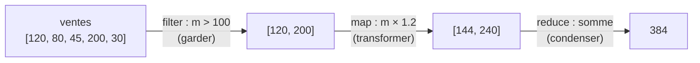

# Manipuler les tableaux

Dès qu'on traite des données, on transforme des **listes** sans arrêt (afficher, filtrer, totaliser). Ces méthodes **ne modifient pas** le tableau d'origine : elles en renvoient un **nouveau** (sauf `reduce`, qui renvoie une seule valeur). C'est ce qui les rend sûres à enchaîner.

> 🧠 **Rappel algo.** Chacune de ces méthodes cache une **boucle** qui parcourt le tableau élément par élément. Tu pourrais tout écrire avec un `for` classique ; ces méthodes te dispensent de gérer l'index et les bornes, et rendent l'**intention** lisible d'un coup d'œil (« transformer », « garder », « condenser »).

## `map` — transformer chaque élément

Produit un nouveau tableau de **même taille**, chaque élément transformé.

```js
const prices = [10, 20, 30]
const withTax = prices.map((p) => p * 1.2)
console.log(withTax)   // [12, 24, 36]
console.log(prices)    // [10, 20, 30] : l'original est intact
```

## `filter` — garder certains éléments

Produit un nouveau tableau **plus court**, en ne gardant que les éléments qui passent le test (la fonction renvoie `true`).

```js
const users = [
  { name: 'Ada', active: true },
  { name: 'Bob', active: false },
]
const activeUsers = users.filter((u) => u.active)
console.log(activeUsers)   // [{ name: 'Ada', active: true }]
```

## `find` — le premier qui correspond

Renvoie **l'élément** (pas un tableau) du premier qui passe le test, ou `undefined`.

```js
const ada = users.find((u) => u.name === 'Ada')
console.log(ada)   // { name: 'Ada', active: true }
```

## `reduce` — réduire à une seule valeur

Condense tout le tableau en **une** valeur (souvent une somme). Le `0` final est la valeur de départ de l'accumulateur `sum`.

```js
const total = [10, 20, 30].reduce((sum, p) => sum + p, 0)
console.log(total)   // 60
```

## `some` / `every` — tester

```js
console.log(users.some((u) => u.active))    // true  : au moins un actif
console.log(users.every((u) => u.active))   // false : pas tous actifs
```

## Le combo gagnant : enchaîner

Le vrai pouvoir vient de **mettre bout à bout** ces méthodes : chacune (sauf `reduce`) renvoie un tableau, donc on peut appeler la suivante dessus. On lit le traitement de gauche à droite, comme une phrase : « garde ceux qui… puis extrais… puis additionne ».

**Le pipeline `filter → map → reduce`**



```js
const sales = [120, 80, 45, 200, 30]

const totalBigWithTax = sales
  .filter((m) => m > 100)      // garder les ventes > 100 €  → [120, 200]
  .map((m) => m * 1.2)         // ajouter 20 % de TVA        → [144, 240]
  .reduce((s, m) => s + m, 0)  // additionner                → 384

console.log(totalBigWithTax)   // 384
```

> **Pourquoi ce style plutôt qu'une boucle `for` ?** Parce qu'il est **déclaratif** : on décrit *ce qu'on veut* (garder, transformer, additionner) plutôt que la mécanique (index, bornes, accumulateur). C'est plus court, plus lisible, et chaque étape produit un tableau **intact** — l'original n'est pas modifié, donc moins de bugs. Un `for` reste parfait quand la logique se complique ou qu'on a besoin de l'index : les deux styles coexistent.

> **Passerelle PHP/Python.** Le pipeline se lit comme une requête `SELECT SUM(m*1.2) FROM ventes WHERE m > 100` : `filter` ≈ le `WHERE`, `map` ≈ une colonne calculée, `reduce` ≈ une agrégation (`SUM`). En PHP tu as `array_filter` / `array_map` / `array_reduce` ; en Python les *list comprehensions* et `sum(...)`. Même intention, autre notation — ta mémoire data te resservira directement.

## À retenir

- Ces méthodes renvoient un **nouveau** tableau (sauf `reduce` → une valeur) : l'original reste intact.
- **`map`** transforme (même taille), **`filter`** garde (plus court), **`find`** renvoie le premier trouvé, **`reduce`** condense en une valeur, **`some`/`every`** testent.
- On les **enchaîne** en pipeline `filter → map → reduce`, lu de gauche à droite — le pendant de `SELECT … WHERE … SUM(…)`.
