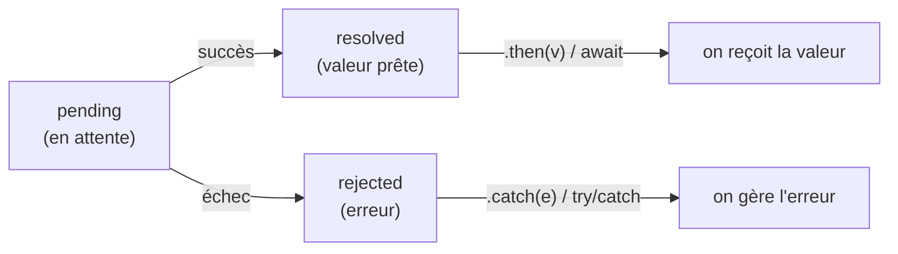

# Asynchrone

Charger des données prend du temps (le réseau n'est pas instantané). Plutôt que de **bloquer** tout le programme en attendant, JavaScript continue et reprend **plus tard**, quand la réponse arrive. C'est la base de tout appel à une API.

> **Passerelle PHP/Python.** En PHP classique, une requête HTTP **bloque** : la ligne suivante attend la réponse. En JS (comme en Python `asyncio`), on déclare qu'une opération est **asynchrone** : le code ne se met pas en pause sur place, il enregistre « quand ça arrive, fais ceci ». Le `async`/`await` de Python et celui de JS sont quasi jumeaux.

## Une promesse

Une `Promise` représente une valeur **future** — pas encore là, mais qui **arrivera** (succès) ou **échouera** (erreur). Une promesse passe par trois états, et une fois « réglée » elle ne change plus.

**Le cycle de vie d'une promesse**



- **pending** : l'opération est lancée, on **attend**.
- **resolved** : la valeur est arrivée → on la récupère avec `.then(v => …)` ou `await`.
- **rejected** : ça a échoué → on gère l'erreur avec `.catch(e => …)` ou un `try/catch`.

```js
fetch('/api/users')
  .then((res) => res.json())          // quand la réponse arrive, on la parse
  .then((users) => console.log(users)) // puis on l'utilise
  .catch((err) => console.error(err))  // en cas d'échec (réseau, etc.)
```

## `async` / `await` (plus lisible)

`await` met en pause **dans** une fonction `async` jusqu'à ce que la promesse soit réglée, puis renvoie sa valeur — le code se lit alors comme du synchrone, de haut en bas.

```js
async function loadUsers() {
  try {
    const res = await fetch('/api/users')   // attend la réponse
    const users = await res.json()          // attend le parsing
    return users
  } catch (err) {
    console.error('chargement échoué', err) // le rejected atterrit ici
    return []                                // valeur de repli
  }
}
```

> **Pourquoi préférer `async`/`await` aux `.then` en chaîne ?** Parce qu'on lit le code **dans l'ordre** (une ligne après l'autre) au lieu de suivre une cascade de *callbacks*. La gestion d'erreur se fait avec le `try/catch` habituel — la même mécanique que pour le code synchrone. C'est plus proche de la façon dont on **raisonne**.

> **Piège —** `await` ne fonctionne **que** dans une fonction `async`. Et souviens-toi : une fonction `async` renvoie **toujours une promesse**. Donc son appelant doit lui aussi `await` (ou faire `.then`) — sinon il récupère la promesse, pas la valeur.

## À retenir

- Une **promesse** est une valeur future : `pending` → `resolved` (succès) ou `rejected` (échec), et elle ne change plus une fois réglée.
- On récupère la valeur avec `.then` / `await` ; on gère l'échec avec `.catch` / `try/catch`.
- **`async`/`await`** rend le code asynchrone **lisible de haut en bas** ; `await` n'a de sens que dans une fonction `async`, qui renvoie elle-même une promesse.
