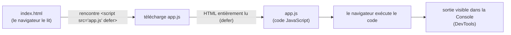

# Une page HTML qui inclut du JavaScript

Jusqu'ici tu as écrit du JavaScript dans un bac à sable. Mais « en vrai », ce code s'exécute **dans une page web**, chargée par un navigateur. Cette leçon montre comment fabriquer la page la plus simple possible et y **brancher** ton JavaScript.

> **Passerelle PHP/Python.** En PHP, c'est le **serveur** qui assemble le HTML et te l'envoie déjà tout fait. Ici, le navigateur télécharge un fichier HTML, puis exécute le JavaScript **chez le visiteur** (côté client). Même résultat visible à l'écran, mais l'endroit où le code tourne change complètement — et c'est ce qui te permet de réagir aux clics, de charger des données sans recharger la page, etc.

## Le squelette d'une page HTML

Une page web est un fichier `.html`. Sa structure minimale se compose de trois zones : la **déclaration** du type de document, l'**en-tête** (`<head>`, invisible : titre de l'onglet, métadonnées, liens vers les scripts et styles) et le **corps** (`<body>`, ce qu'on voit).

```html
<!DOCTYPE html>
<html lang="fr">
  <head>
    <meta charset="utf-8" />
    <title>Ma première page</title>
  </head>
  <body>
    <h1>Bonjour !</h1>
  </body>
</html>
```

- `<!DOCTYPE html>` : « ce document est du HTML moderne ». À mettre toujours en tête.
- `<head>` : les infos **sur** la page (titre de l'onglet, encodage, feuilles de style, scripts).
- `<body>` : le **contenu visible** (titres, paragraphes, boutons…).

## La balise `<script>` : deux façons

C'est la balise `<script>` qui dit au navigateur « voici du JavaScript à exécuter ». Deux manières de l'utiliser.

**1. JavaScript inline** — le code est écrit directement dans la page :

```html
<body>
  <h1>Bonjour !</h1>
  <script>
    console.log('Salut depuis la page !')
  </script>
</body>
```

**2. JavaScript dans un fichier externe** — le code vit dans un fichier `.js` séparé, la page le **référence** :

```html
<body>
  <h1>Bonjour !</h1>
  <script src="app.js" defer></script>
</body>
```

Et à côté, un fichier `app.js` :

```js
console.log('Salut depuis app.js !')
```

> **Pourquoi préférer un fichier externe ?** Parce que le code est **réutilisable** (plusieurs pages peuvent charger le même `app.js`), **plus lisible** (on sépare la structure HTML du comportement JS), et **mis en cache** par le navigateur (téléchargé une fois, gardé pour les visites suivantes). L'inline reste pratique pour un tout petit essai, mais dès que le code grandit, on le sort dans un `.js`.

## L'attribut `defer` : pourquoi il change tout

Regarde bien le `defer` dans l'exemple externe. Sans lui, un piège classique : si ton script s'exécute **avant** que le HTML soit lu en entier, il ne trouve pas encore les éléments de la page (ils n'existent pas au moment où il tourne).

`defer` dit au navigateur : « télécharge ce script en parallèle, mais **exécute-le seulement après** avoir fini de lire tout le HTML ». Résultat : quand ton code s'exécute, toute la page est en place.

> 🧠 **Rappel algo.** C'est une question d'**ordre des opérations**. Le navigateur lit le HTML de haut en bas et construit la page au fur et à mesure. Sans `defer`, un `<script>` rencontré en cours de route s'exécute **tout de suite**, avant les éléments qui le suivent. `defer` déplace l'exécution **après** la construction complète — l'ordre garanti évite le bug « élément introuvable ».

## Le chemin complet : du HTML à la Console

Voici ce qui se passe quand tu ouvres la page dans ton navigateur.

**Comment le JavaScript est chargé puis exécuté**



## Où voir la sortie : la Console des DevTools

Un `console.log(...)` ne s'affiche **pas** dans la page : il apparaît dans la **Console** des outils de développement (DevTools) du navigateur. Ouvre-les avec **F12** (ou clic droit → *Inspecter*), puis va sur l'onglet **Console** — c'est là que tu verras tes messages **et** les erreurs éventuelles (en rouge).

> **Pourquoi la Console et pas la page ?** Parce que `console.log` est un outil de **développeur**, pas un affichage destiné au visiteur. Pour écrire quelque chose *dans* la page, on manipulera le HTML depuis le JS (le DOM) — c'est l'étape suivante, une fois ces bases posées. Pour l'instant, la Console est ta fenêtre sur ce que fait ton code.

## À retenir

- Une page HTML minimale = `<!DOCTYPE html>` + `<head>` (invisible : titre, méta, scripts) + `<body>` (visible).
- On branche du JS avec `<script>` : **inline** (dans la page, pour un essai rapide) ou **externe** `<script src="app.js"></script>` (réutilisable, cacheable, plus propre — à privilégier).
- **`defer`** exécute le script **après** que tout le HTML est lu → le code trouve bien les éléments de la page. C'est une question d'ordre des opérations.
- Un `console.log` s'affiche dans la **Console** des DevTools (**F12** → onglet *Console*), pas dans la page.
- Le JS tourne **dans le navigateur** (côté client), contrairement au PHP qui génère le HTML côté **serveur**.
