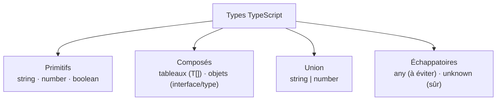

# Les types de base

TypeScript = JavaScript + des annotations de **type** vérifiées **avant** l'exécution. Le principe : on précise « cette variable est un nombre », et l'outil t'avertit dès que tu essaies d'y mettre autre chose.

> **Passerelle PHP/Python.** `let age: number` est l'équivalent de `int $age` en PHP ou de `age: int` en Python. La grosse différence : ces types TypeScript sont vérifiés par un outil **avant** que le code tourne, et ils **disparaissent** ensuite (on verra pourquoi dans la leçon sur la compilation).

## Annoter une variable

On colle le type après le nom, précédé de `:`.

```ts
let name: string = 'Ada'
let age: number = 30
let active: boolean = true
let tags: string[] = ['vue', 'ts']
```

Souvent l'annotation est **inférée** automatiquement — inutile de la répéter, TypeScript devine :

```ts
let total = 0          // TS sait déjà que c'est un number
```

> **Pourquoi ne pas tout annoter à la main ?** Parce que sur-annoter alourdit le code sans rien apporter. On laisse l'inférence faire le travail évident, et on annote là où ça **clarifie** : les paramètres de fonction, les structures de données importantes, les cas où le type n'est pas évident.

## Les types courants d'un coup d'œil

| Type | Exemple de valeur | À quoi ça sert |
|---|---|---|
| `string` | `'Ada'`, `` `Bonjour ${x}` `` | du texte |
| `number` | `30`, `3.14`, `-5` | tous les nombres (pas de distinction entier / décimal) |
| `boolean` | `true`, `false` | un vrai/faux |
| `string[]` | `['vue', 'ts']` | un tableau de chaînes (idem `number[]`, etc.) |
| `string \| number` | `'abc'` **ou** `42` | une **union** : plusieurs types possibles |
| `interface` / `type` | `{ id: 1, name: 'Ada' }` | la **forme** d'un objet |
| `any` | n'importe quoi | ⚠️ désactive la vérification — à éviter |
| `unknown` | n'importe quoi | comme `any`, mais **force à vérifier** avant usage |

**Comment TypeScript classe les types de base**



## Unions

Une valeur qui peut être de **plusieurs** types :

```ts
let id: string | number
id = 'abc'   // ok
id = 42      // ok
// id = true  // ❌ erreur : boolean n'est pas dans l'union
```

> 🧠 **Rappel algo.** Une union, c'est un « OU » sur les types : la valeur est de type A **ou** de type B. Très utile pour modéliser la réalité (un identifiant qui est tantôt une chaîne, tantôt un nombre) sans renoncer à la vérification.

## `interface` et `type`

Décrire la **forme** d'un objet — ses champs et leurs types :

```ts
interface User {
  id: number
  name: string
  role?: 'admin' | 'user'   // ? = champ optionnel
}

type Point = { x: number; y: number }
```

> **interface vs type —** Pour décrire un objet, les deux marchent. `interface` est extensible (plusieurs déclarations fusionnent) et très lisible pour des objets ; `type` est plus polyvalent (unions, alias). Règle simple : **`interface` pour les objets**, `type` pour le reste.

> **Pourquoi éviter `any` ?** `any` dit à TypeScript « ne vérifie plus rien ici » — tu perds tout le bénéfice du typage, et les bugs repassent. Quand tu ne connais pas le type (ex. une réponse d'API), préfère **`unknown`** : il t'oblige à **vérifier** le type avant de t'en servir, ce qui te force à gérer les cas imprévus.

## À retenir

- On annote avec `:` (`let age: number`), mais on laisse l'**inférence** faire l'évident.
- Types de base : `string`, `number`, `boolean`, tableaux `T[]`, **unions** `A | B`.
- **`interface`** (ou `type`) décrit la **forme** d'un objet ; `?` marque un champ optionnel.
- **Évite `any`** (désactive tout contrôle) ; préfère **`unknown`** (force à vérifier) quand tu ne sais pas.
