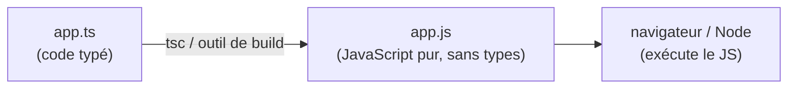

# Comment on « compile » du TypeScript

Tu as écrit du `.ts` typé, tout content. Une question naturelle : comment ce code **s'exécute**-t-il réellement dans un navigateur ou avec Node ? La réponse surprend souvent : **il ne s'exécute pas tel quel**. Cette leçon explique pourquoi, et ce qui se passe entre ton `.ts` et l'exécution. (Pas d'exercice ici : c'est une leçon de compréhension.)

## Le navigateur (et Node) n'exécutent pas le TypeScript

Ni le navigateur, ni Node ne comprennent le TypeScript. Ils exécutent du **JavaScript**. Il faut donc d'abord **transformer** ton `.ts` en `.js` : c'est la **compilation** (on dit aussi **transpilation**, car on passe d'un langage de haut niveau à un autre langage de haut niveau, pas vers du binaire).

> **Pourquoi ne pas exécuter le `.ts` directement ?** Parce que les annotations de type (`: number`, `interface`, etc.) ne font pas partie de JavaScript — c'est de la syntaxe en plus, comprise seulement par les outils TypeScript. Les moteurs d'exécution, eux, ne connaissent que le JS standard. On leur donne donc du JS.

**Le trajet d'un fichier TypeScript**



## L'outil de référence : `tsc` et `tsconfig.json`

Le compilateur officiel s'appelle **`tsc`** (TypeScript Compiler). On le configure avec un fichier **`tsconfig.json`** à la racine du projet, qui dit *comment* compiler (version de JS visée, dossier de sortie, sévérité des vérifications…).

```json
{
  "compilerOptions": {
    "target": "ES2020",
    "strict": true,
    "outDir": "dist"
  }
}
```

Lancé, `tsc` fait **deux choses** : il **vérifie les types** (et t'affiche les erreurs), puis il **produit** les fichiers `.js` correspondants.

> **Pourquoi un fichier de config plutôt que des options en ligne de commande ?** Pour que **tout le projet** compile de la même façon, chez toi comme chez tes collègues et sur le serveur d'intégration. `strict: true`, par exemple, active les vérifications sévères pour toute l'équipe d'un seul endroit.

## En pratique : souvent, c'est l'outil de build

Dans un vrai projet moderne (Vue, React…), tu lances rarement `tsc` à la main. C'est l'**outil de build** — **Vite**, qui s'appuie sur **esbuild** — qui transpile le TypeScript en JavaScript à la volée, très vite. Pour exécuter un script `.ts` directement pendant le développement, on utilise aussi **`ts-node`** (il compile en mémoire puis exécute, sans générer de fichier).

> **Pourquoi déléguer à Vite/esbuild ?** Parce que ces outils sont **beaucoup plus rapides** que `tsc` pour la transpilation, et qu'ils gèrent aussi le reste (import de fichiers, rechargement à chaud, minification pour la production). Nuance importante : pour la **vitesse**, esbuild se contente de *retirer* les types sans les vérifier en profondeur — on garde souvent `tsc --noEmit` (ou l'éditeur) en parallèle pour la **vérification** des types. Deux rôles distincts : transformer vs vérifier.

## Les types disparaissent : le *type erasure*

Voici le point-clé à bien intégrer : **les types n'existent plus dans le JavaScript produit**. Ils sont *effacés* à la compilation (*type erasure*). Ce `.ts` :

```ts
function greet(name: string): string {
  return `Bonjour ${name}`
}
```

devient ce `.js`, sans la moindre trace de type :

```js
function greet(name) {
  return `Bonjour ${name}`
}
```

Conséquence : à l'**exécution**, il n'y a plus aucun contrôle de type — le code qui tourne est du JavaScript ordinaire. Les types servent **avant** : à te prévenir dans l'éditeur et à la compilation. Ils ne te protègent **pas** à l'exécution (par exemple, une donnée venue d'une API mal formée peut toujours te surprendre — d'où la validation à l'exécution quand la donnée est incertaine).

> 🧠 **Rappel algo.** On distingue **vérification statique** (analyser le code **sans l'exécuter**, avant qu'il tourne) et **vérification dynamique** (à l'exécution, sur les vraies valeurs). TypeScript est **statique** : il raisonne sur les types au moment de la compilation. C'est puissant pour attraper les erreurs tôt, mais ça ne remplace pas les contrôles à l'exécution sur des données externes.

> **Passerelle PHP/Python.** Même logique que les **type hints Python** vérifiés par `mypy`, ou le typage progressif de PHP : ce sont des indications relues par un outil **avant** l'exécution, pour attraper les erreurs tôt. Nuance : en PHP les types **scalaires** sont bel et bien contrôlés **au runtime** par le moteur, alors qu'en TypeScript ils s'**effacent** entièrement. L'esprit « vérifier avant, pas au runtime » reste le même que `mypy`.

## À retenir

- Le navigateur et Node **n'exécutent pas** le `.ts` : on le **compile / transpile** d'abord en **JavaScript**.
- **`tsc`** + **`tsconfig.json`** est l'outil officiel : il **vérifie** les types **et** produit le `.js`.
- En pratique, c'est souvent l'outil de **build** (**Vite** / **esbuild**) qui transpile, ou **`ts-node`** pour exécuter directement — la vérification des types restant assurée par `tsc`/l'éditeur.
- **Type erasure** : les types **disparaissent** dans le JS produit. Ils servent à **vérifier avant** l'exécution (vérification **statique**), pas au **runtime** — même idée que `mypy` en Python.
