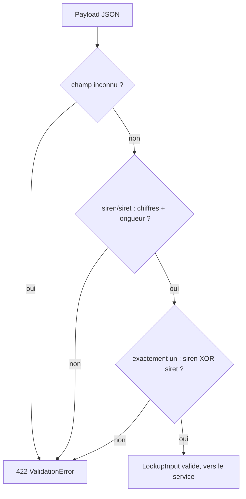

## 1. Le concept

Quand un client appelle ton API, il t'envoie du JSON. Du JSON, c'est juste du texte : rien ne garantit que `siren` contienne 9 chiffres, ni même que ce soit une chaîne. Si tu fais confiance aveuglément à ces données, ton code va planter au pire moment (une `KeyError` au fond d'un service, une requête SQL avec une valeur absurde…).

**L'idée de Pydantic** : tu décris la *forme attendue* des données sous forme de classe Python, et Pydantic vérifie que ce qui arrive correspond. C'est de la **validation déclarative** : tu dis *ce que tu veux*, pas *comment le vérifier* étape par étape.

> **Analogie.** Pense à un videur à l'entrée d'un club. Tu lui donnes une consigne unique (« majeur, tenue correcte »), et il filtre tout le monde. Une fois la donnée entrée, tu *sais* qu'elle est conforme.

Pydantic distingue deux moments de validation :

- **`field_validator`** — valide **un champ isolé** (ex. « `siren` ne contient que des chiffres »). Il ne voit que la valeur de ce champ.
- **`model_validator(mode="after")`** — valide **le modèle entier**, une fois tous les champs remplis. Indispensable pour les règles *croisées* (ex. « renseigner `siren` **OU** `siret`, mais pas les deux »).

Et un principe d'architecture : **modèle d'entrée ≠ modèle de sortie**. Ce que le client a le droit d'envoyer (`LookupInput`) n'est pas ce que tu renvoies (`CompanyOutput`).

**Flux de validation d'un payload par LookupInput (échec → 422)**



## 2. Dans REF-361 — le vrai code

Tout se passe dans `src/company/schemas.py`. Voici le modèle d'entrée le plus riche, `LookupInput`, recopié tel quel depuis le dépôt :

```python
from __future__ import annotations

from typing import Self

from pydantic import BaseModel, ConfigDict, Field, field_validator, model_validator


class LookupInput(BaseModel):
    """Recherche d'une entreprise par identifiant. SIREN (9) ou SIRET (14), exclusifs."""

    model_config = ConfigDict(extra="forbid")

    siren: str | None = Field(default=None, description="Numéro SIREN (9 chiffres)")
    siret: str | None = Field(default=None, description="Numéro SIRET (14 chiffres)")

    @field_validator("siren", "siret")
    @classmethod
    def _digits_only(cls, value: str | None) -> str | None:
        if value is not None and not value.isdigit():
            raise ValueError("L'identifiant ne doit contenir que des chiffres.")
        return value

    @model_validator(mode="after")
    def _check_exactly_one(self) -> Self:
        if bool(self.siren) == bool(self.siret):
            raise ValueError("Renseigner exactement l'un des champs siren (9) ou siret (14).")
        if self.siren and len(self.siren) != 9:
            raise ValueError("Le SIREN doit comporter 9 chiffres.")
        if self.siret and len(self.siret) != 14:
            raise ValueError("Le SIRET doit comporter 14 chiffres.")
        return self
```

### 2.1 Ligne par ligne

- `model_config = ConfigDict(extra="forbid")` — **interdit les champs inconnus**. Si le client envoie `{"siren": "...", "foo": "bar"}`, Pydantic rejette `foo` au lieu de l'ignorer en silence. Convention du projet : on ne laisse jamais passer du bruit.
- `siren: str | None = Field(default=None, ...)` — champ **optionnel**. Le `| None` *et* `default=None` vont ensemble.
- `@field_validator("siren", "siret")` + `@classmethod` — une seule méthode validant **les deux champs**. Elle **retourne la valeur** (un validator doit toujours retourner la valeur validée). Le `@classmethod` est obligatoire : Pydantic appelle le validator avant que l'instance n'existe.
- `@model_validator(mode="after")` — s'exécute **après** le remplissage des champs. Il porte la règle **XOR** : `bool(self.siren) == bool(self.siret)` est vrai quand les deux sont remplis *ou* les deux vides → on refuse. Reçoit `self` et doit retourner `self` (typé `Self`).

### 2.2 Le branchement FastAPI

Dans `src/company/routes.py`, il suffit de typer le paramètre :

```python
@router.post("/lookup")
def lookup_company(
    payload: LookupInput,
    service: CompanyService = Depends(get_company_service),
) -> JSONResponse:
    output = service.lookup(payload)
    return ApiResponse.success(output.model_dump())
```

### 2.3 Effet : 422 automatique

Le simple fait de typer `payload: LookupInput` suffit : FastAPI lit le corps JSON, le passe à `LookupInput(**body)`, et **si la validation échoue, le corps de `lookup_company` n'est jamais atteint** — FastAPI renvoie automatiquement un **HTTP 422**. Tu n'écris aucun `try/except` de validation. Ton service reçoit toujours un `payload` déjà conforme.

## 3. Pièges & bonnes pratiques

- **Oublier de retourner la valeur.** Un `field_validator` doit `return value`, un `model_validator(mode="after")` doit `return self`. Sinon Pydantic reçoit `None` et corrompt silencieusement ta donnée. Le type de retour `Self` t'y oblige sous `mypy --strict`.
- **Confondre `field_validator` et `model_validator`.** La règle XOR `siren`/`siret` *ne peut pas* être un `field_validator` : quand on valide `siren`, on ne connaît pas encore `siret`. Toute règle qui touche **plusieurs champs** → `model_validator(mode="after")`.
- **L'astuce `bool(a) == bool(b)`** pour un XOR strict est élégante mais piège les relecteurs : vraie si *les deux* sont remplis ou *les deux* vides. Un message d'erreur explicite est non négociable.
- **`extra="forbid"` sur les entrées, jamais sur les sorties.** On filtre ce qui *entre*, on assume ce qui *sort*.
- **Messages d'erreur en français accentué.** Convention du projet : les `ValueError` sont des textes utilisateur, pas du jargon ASCII.
- **`from __future__ import annotations` en tête de fichier.** Règle stricte du projet.

## Bac à sable

> Modifie les payloads passés à essai(...) puis exécute pour voir Pydantic accepter ou rejeter. Le code reflète fidèlement LookupInput de src/company/schemas.py.

```python
from __future__ import annotations

from typing import Self

from pydantic import BaseModel, ConfigDict, Field, field_validator, model_validator


class LookupInput(BaseModel):
    """SIREN (9) ou SIRET (14), exactement un des deux — calqué sur src/company/schemas.py."""

    model_config = ConfigDict(extra="forbid")

    siren: str | None = Field(default=None, description="Numéro SIREN (9 chiffres)")
    siret: str | None = Field(default=None, description="Numéro SIRET (14 chiffres)")

    @field_validator("siren", "siret")
    @classmethod
    def _digits_only(cls, value: str | None) -> str | None:
        if value is not None and not value.isdigit():
            raise ValueError("L'identifiant ne doit contenir que des chiffres.")
        return value

    @model_validator(mode="after")
    def _check_exactly_one(self) -> Self:
        if bool(self.siren) == bool(self.siret):
            raise ValueError("Renseigner exactement l'un des champs siren (9) ou siret (14).")
        if self.siren and len(self.siren) != 9:
            raise ValueError("Le SIREN doit comporter 9 chiffres.")
        if self.siret and len(self.siret) != 14:
            raise ValueError("Le SIRET doit comporter 14 chiffres.")
        return self


def essai(label, **payload):
    try:
        modele = LookupInput(**payload)
        print(f"OK  {label} -> {modele!r}")
    except Exception as exc:  # noqa: BLE001 (démo pédagogique)
        print(f"KO  {label} -> {type(exc).__name__}: {exc}")


# Modifie ces payloads et relance pour voir Pydantic en action :
essai("SIREN valide", siren="732829320")
essai("SIRET valide", siret="73282932000074")
essai("les deux (XOR violé)", siren="732829320", siret="73282932000074")
essai("aucun (XOR violé)")
essai("non numérique", siren="ABC123XYZ")
essai("mauvaise longueur", siren="123")
essai("champ inconnu (extra=forbid)", siren="732829320", foo="bar")
```
