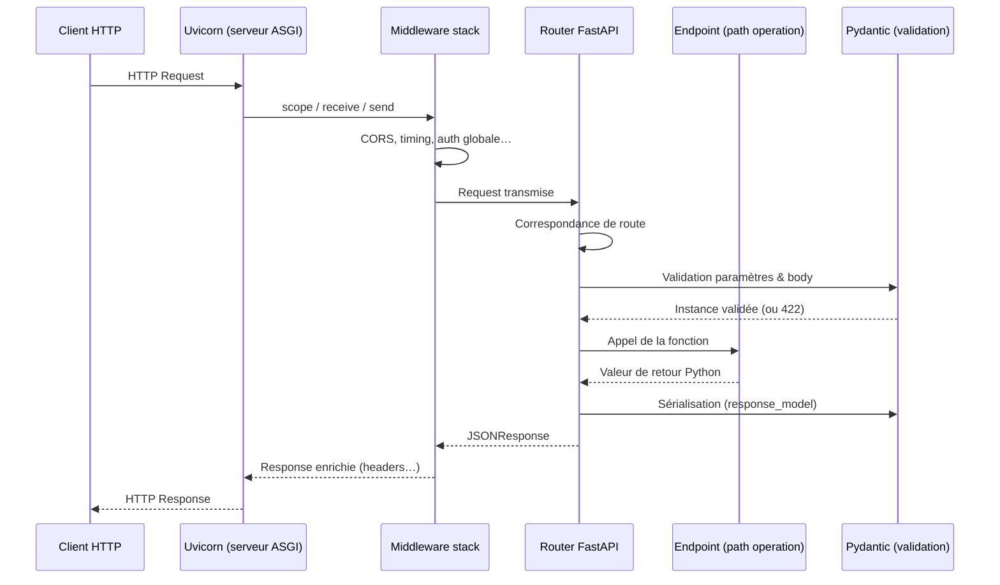
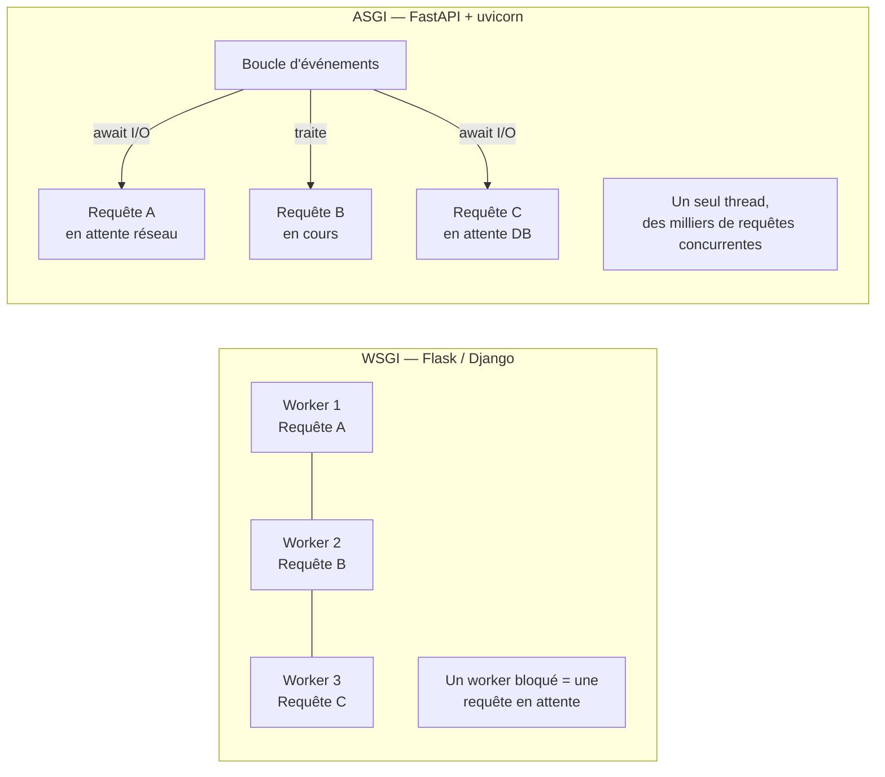

## Pourquoi FastAPI ?

**FastAPI** est un micro-framework web Python (3.8+) bâti sur deux piliers :

- **Starlette** pour la couche web/ASGI (routage, requêtes, réponses) ;
- **Pydantic** pour la validation et la sérialisation des données.

Ses arguments clés :

- **les *type hints* Python sont la source de vérité** : ils pilotent la validation, la conversion et la documentation ;
- une **doc interactive générée automatiquement** (Swagger UI sur `/docs`, ReDoc sur `/redoc`) ;
- des **performances élevées** grâce au modèle **asynchrone (ASGI)**.

## ASGI vs WSGI

WSGI (Flask, Django historique) est **synchrone** : un *worker* traite une requête à la fois.
**ASGI** (*Asynchronous Server Gateway Interface*) ajoute le support de `async/await`, des WebSockets et du streaming. FastAPI est une application **ASGI** ; il lui faut donc un serveur ASGI pour tourner — typiquement **uvicorn**.

> Mot-clé important : **une application FastAPI ne « tourne » pas toute seule.** C'est un objet `app` que l'on confie à un serveur ASGI (uvicorn) qui, lui, écoute le réseau.

### Flask / Django → FastAPI : comparaison rapide

| Point | Flask | Django | **FastAPI** |
|---|---|---|---|
| Interface serveur | WSGI | WSGI (ASGI depuis 3.0) | **ASGI natif** |
| Validation des données | Manuel / WTForms | Forms, DRF Serializers | **Pydantic intégré** |
| Doc API auto | Extension tierce | drf-spectacular (DRF) | **Swagger UI & ReDoc générés** |
| Typage | Optionnel | Optionnel | **Type hints = source de vérité** |
| Performances I/O | Limitées (sync) | Limitées (sync) | **Élevées (async event loop)** |
| ORM intégré | Non | Oui (Django ORM) | **Non** (choix libre : SQLAlchemy, Tortoise…) |

### Architecture ASGI : ce qui se passe à chaque requête



### WSGI vs ASGI : modèle de concurrence



```python
# main.py
from fastapi import FastAPI

app = FastAPI(title="My API", version="1.0.0")


@app.get("/")
def read_root() -> dict[str, str]:
    return {"message": "Hello FastAPI"}
```

## On lance le serveur en local (pas dans le navigateur)

```bash
pip install "fastapi[standard]" uvicorn
uvicorn main:app --reload
```

- `main` = le fichier `main.py` ;
- `app` = l'objet `FastAPI` ;
- `--reload` = redémarre à chaque sauvegarde (développement uniquement).

Ouvre ensuite `http://127.0.0.1:8000` puis la doc auto sur `http://127.0.0.1:8000/docs`.

> ⚠️ **Limite des sandboxes de ce cours** : un serveur HTTP ne peut pas s'exécuter dans le navigateur (Pyodide). Les zones de code **exécutables** de ce cours se limitent donc au **pur Python / Pydantic** (validation, modèles, logique). Tout ce qui est *route*, *Depends* ou *middleware* se lance **en local avec uvicorn**.

## Le décorateur = une route

`@app.get("/")` enregistre une **opération** : méthode HTTP `GET` sur le chemin `/`.
La fonction décorée est l'**opération de chemin** (*path operation function*). Sa valeur de retour est **sérialisée en JSON** automatiquement.

> **À retenir** : comparé à Flask, il n'y a plus de `jsonify()`, plus de configuration manuelle de la doc API, et plus de validation « à la main ». Le type hint *est* le contrat — FastAPI et Pydantic font le reste.
