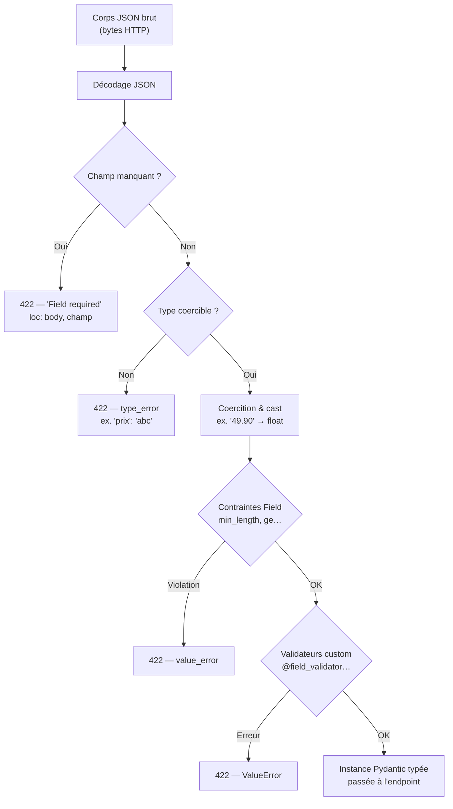

## Pipeline de validation Pydantic

Avant que ta fonction soit appelée, FastAPI fait passer le corps JSON par un **pipeline** :



### Comparaison avec Flask / DRF (Django REST Framework)

| Aspect | Flask (manuel) | Django DRF | **FastAPI + Pydantic** |
|---|---|---|---|
| Validation du body | `request.json` + vérifs manuelles | `Serializer.is_valid()` | **Automatique via type hints** |
| Erreurs 422 formatées | À coder soi-même | `serializer.errors` (format DRF) | **Générées, format OpenAPI** |
| Coercition de types | Non | Partielle | **Oui** (`"49.90"` → `float`) |
| Modèle de sortie filtré | À coder | `fields` sur le Serializer | **`response_model=`** |
| Génération de doc | Extension Flasgger… | drf-spectacular | **Intégrée (Swagger + ReDoc)** |

## Le corps de requête = un modèle Pydantic

Pour recevoir un **JSON structuré** (POST/PUT…), on déclare un paramètre dont le type est un `BaseModel`. FastAPI :

1. lit le corps de la requête,
2. le **valide** contre le modèle,
3. passe une **instance typée** à la fonction.

```python
from fastapi import FastAPI
from pydantic import BaseModel

app = FastAPI()

class ProduitIn(BaseModel):
    nom: str
    prix: float
    en_stock: bool = True

@app.post("/products")
def creer(produit: ProduitIn) -> dict[str, object]:
    return {"received": produit.model_dump(), "prix_ttc": round(produit.prix * 1.2, 2)}
```

## `response_model` : contrôler la sortie

On peut **filtrer** ce qui sort de l'API (ex. ne jamais renvoyer un mot de passe) avec `response_model`. FastAPI valide **aussi** la réponse et **n'expose que les champs du modèle de sortie**.

```python
class UtilisateurIn(BaseModel):
    email: str
    mot_de_passe: str        # input only

class UtilisateurOut(BaseModel):
    email: str               # the password does NOT appear

@app.post("/users", response_model=UtilisateurOut)
def creer_user(u: UtilisateurIn) -> UtilisateurIn:
    # Return the input object; FastAPI casts it into UtilisateurOut.
    return u
```

> Bonne pratique : **modèle d'entrée ≠ modèle de sortie**. On évite ainsi de fuiter des champs sensibles et on découple le contrat public de la structure interne.

## Exemple d'agence : catalogue produits

Un cas réel — API de catalogue pour une agence e-commerce. On sépare strictement le modèle d'entrée (création) du modèle de sortie (lecture), et on intègre un `id` généré côté serveur.

```python
# products/schemas.py
from __future__ import annotations
from pydantic import BaseModel, Field


class ProductCreate(BaseModel):
    """Payload sent by the client to create a product."""
    name: str = Field(min_length=2, max_length=120)
    price: float = Field(gt=0, description="Price excl. VAT, euros")
    in_stock: bool = True
    category: str = Field(default="misc", pattern=r"^[a-z\-]+$")


class ProductOut(BaseModel):
    """What the API returns — id is server-generated, price_vat is computed."""
    id: int
    name: str
    price_vat: float   # price including 20% VAT
    in_stock: bool
    category: str


# --- Simulated endpoint logic ---
_next_id = 1

def create_product(payload: ProductCreate) -> ProductOut:
    global _next_id
    result = ProductOut(
        id=_next_id,
        name=payload.name,
        price_vat=round(payload.price * 1.2, 2),
        in_stock=payload.in_stock,
        category=payload.category,
    )
    _next_id += 1
    return result
```

> Règle d'agence : un `ProductCreate` par action (create, update-partial), un `ProductOut` pour chaque lecture. On ne réutilise jamais le même modèle en entrée et en sortie — cela évite de fuiter un `cost_price` interne, par exemple.

## Sandbox : un modèle Pydantic réel

Le routage est serveur, mais **la validation est du pur Pydantic** : exactement ce que FastAPI exécute sur le corps de requête. Essaie de modifier le payload.

## Bac à sable

> Retire le champ `nom` du payload valide : observe l'erreur « Field required ».

```python
from pydantic import BaseModel, ValidationError


class ProduitIn(BaseModel):
    nom: str
    prix: float
    en_stock: bool = True


# Separate input and output (never leak a sensitive field).
class ProduitOut(BaseModel):
    nom: str
    prix_ttc: float


# 1) Valid payload — this is exactly what FastAPI would do on the JSON body.
payload = {"nom": "Keyboard", "prix": "49.90"}  # "49.90" is coerced into a float
produit = ProduitIn(**payload)
print("Valid:", produit.model_dump())

sortie = ProduitOut(nom=produit.nom, prix_ttc=round(produit.prix * 1.2, 2))
print("Response (response_model):", sortie.model_dump())

# 2) Invalid payload -> ValidationError (FastAPI would return a 422).
print("---")
try:
    ProduitIn(nom="Mouse", prix="not a number")
except ValidationError as exc:
    print("Errors:")
    for err in exc.errors():
        print(" -", err["loc"], err["msg"])
```
