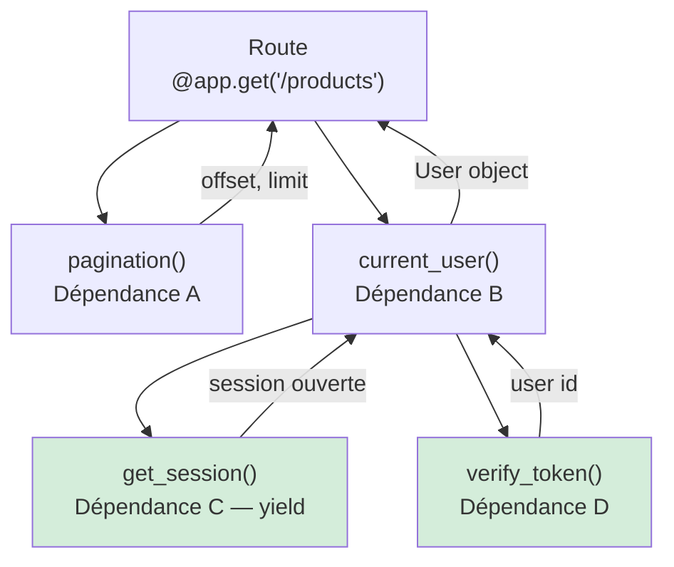

## Graphe de dépendances : comment FastAPI résout l'arbre



Chaque dépendance est **résolue une seule fois par requête** (mise en cache). Si deux routes dépendent de `get_session`, une seule session est ouverte.

## `Depends` : factoriser et injecter

Une **dépendance** est une fonction (ou un callable) dont FastAPI **appelle le résultat** et l'**injecte** dans ta route. Cela sert à :

- partager de la logique transverse (pagination, auth, accès base) ;
- déclarer des **prérequis** (la dépendance peut lever une `HTTPException`) ;
- garder les routes minces et testables.

```python
from typing import Annotated
from fastapi import Depends, FastAPI

app = FastAPI()

# Dependency: common pagination parameters.
def pagination(page: int = 1, taille: int = 20) -> dict[str, int]:
    return {"offset": (page - 1) * taille, "limit": taille}

Pagination = Annotated[dict[str, int], Depends(pagination)]

@app.get("/articles")
def lister(p: Pagination) -> dict[str, int]:
    return p   # {"offset": ..., "limit": ...}
```

## Dépendances avec `yield` (ressources)

Pour une ressource à **ouvrir puis fermer** (session BDD, client HTTP), on utilise `yield` : le code **avant** `yield` s'exécute à l'entrée, le code **après** au nettoyage — même en cas d'erreur.

```python
def get_session():
    session = Session()
    try:
        yield session          # injected into the route
    finally:
        session.close()        # always executed
```

## Sécurité / authentification

Une dépendance peut **garder** une route : si elle lève une `HTTPException(401)`, la route n'est jamais appelée.

```python
def utilisateur_courant(token: str = "") -> str:
    if token != "secret":
        raise HTTPException(status_code=401, detail="Not authenticated")
    return "alice"

@app.get("/me")
def me(user: Annotated[str, Depends(utilisateur_courant)]) -> dict[str, str]:
    return {"user": user}
```

> Les dépendances sont **composables** (une dépendance peut elle-même dépendre d'une autre) et **mises en cache** par requête.

## Exemple d'agence : catalogue produits avec dépendances imbriquées

Un endpoint réel de catalogue combine pagination, session DB et utilisateur authentifié — tous via `Depends`.

```python
# core/deps.py
from __future__ import annotations
from typing import Annotated, Generator
from fastapi import Depends, HTTPException, Header
from sqlalchemy.orm import Session
from .database import SessionLocal


def get_session() -> Generator[Session, None, None]:
    """Opens a DB session, always closes it after the request."""
    db = SessionLocal()
    try:
        yield db
    finally:
        db.close()


def verify_token(x_token: str = Header()) -> str:
    """Reads X-Token header; raises 401 if absent or invalid."""
    if not x_token.startswith("Bearer "):
        raise HTTPException(status_code=401, detail="Missing or invalid Bearer token")
    return x_token.removeprefix("Bearer ").strip()


def current_user(
    token: Annotated[str, Depends(verify_token)],
    db: Annotated[Session, Depends(get_session)],
) -> dict:
    """Resolves the token into a user row (simplified)."""
    user = db.execute("SELECT * FROM users WHERE token = :t", {"t": token}).first()
    if user is None:
        raise HTTPException(status_code=403, detail="User not found")
    return dict(user)


def pagination(page: int = 1, size: int = 20) -> dict[str, int]:
    if size > 100:
        raise HTTPException(status_code=400, detail="size must be ≤ 100")
    return {"offset": (page - 1) * size, "limit": size}


# products/routes.py
from fastapi import APIRouter
from .schemas import ProductOut

router = APIRouter(prefix="/products", tags=["products"])

@router.get("", response_model=list[ProductOut])
def list_products(
    p: Annotated[dict, Depends(pagination)],
    user: Annotated[dict, Depends(current_user)],
    db: Annotated[Session, Depends(get_session)],
) -> list[ProductOut]:
    # get_session is cached: the same session as in current_user is reused.
    rows = db.query(Product).offset(p["offset"]).limit(p["limit"]).all()
    return rows
```

### Comparaison Flask / Django → FastAPI (injection de dépendances)

| Besoin | Flask | Django | **FastAPI** |
|---|---|---|---|
| Partager une session DB | `g.db` dans `before_request` | `django.db.connection` (auto) | **`Depends(get_session)` avec `yield`** |
| Authentification | Décorateur `@login_required` | Décorateur `@login_required` | **Dépendance qui lève `HTTPException`** |
| Pagination commune | Fonction utilitaire appelée manuellement | Mixin `ListAPIView` | **`Depends(pagination)` réutilisable** |
| Testabilité | Monkeypatching `g` / contexte app | `override_settings` | **`app.dependency_overrides[dep] = mock`** |

## Sandbox : la *mécanique* d'injection en pur Python

`Depends` est lié au serveur, mais l'idée — **résoudre des dépendances, les mettre en cache, les injecter** — se reproduit en pur Python. La sandbox simule un mini-résolveur pour bien sentir le concept.

## Bac à sable

> Ajoute une 2e route qui réutilise `utilisateur_courant` dans le même `resoudre(...)` : le compteur reste à 1 (mise en cache).

```python
# Teaching mini-simulation of how Depends works:
# - a dependency is a function;
# - it is resolved once per "request" (cache);
# - its result is injected into the route.
from __future__ import annotations

from typing import Callable


def resoudre(deps: dict[str, Callable[[], object]]) -> dict[str, object]:
    cache: dict[str, object] = {}
    for nom, fabrique in deps.items():
        # FastAPI caches it: each dependency is called only once.
        if nom not in cache:
            cache[nom] = fabrique()
    return cache


appels = {"compteur": 0}


def pagination() -> dict[str, int]:
    return {"offset": 0, "limit": 20}


def utilisateur_courant() -> str:
    appels["compteur"] += 1
    return "alice"


# "Route" depending on pagination + utilisateur_courant.
injecte = resoudre({"p": pagination, "user": utilisateur_courant})
print("Injected into the route:", injecte)
print("The user dependency was called", appels["compteur"], "time(s) (cached per request).")

# A "guard" dependency can deny access.
def garde(token: str) -> str:
    if token != "secret":
        raise PermissionError("401 Not authenticated")
    return "ok"


for token in ["secret", "wrong"]:
    try:
        print("token", repr(token), "->", garde(token))
    except PermissionError as exc:
        print("token", repr(token), "->", exc)
```
