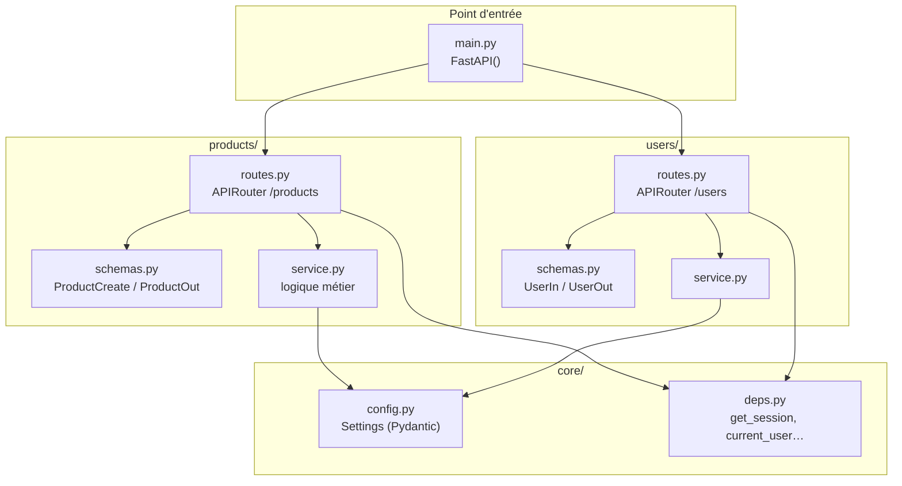

## Architecture d'une application FastAPI d'agence



**Règle** : `routes.py` orchestre (lit les paramètres, appelle `service.py`, retourne la réponse). Toute logique métier non triviale vit dans `service.py`.

## `APIRouter` : découper l'application

Au-delà de quelques routes, on **éclate** l'API par domaine grâce à `APIRouter`. Chaque module définit son routeur ; `main.py` les **assemble**.

```python
# users/routes.py
from fastapi import APIRouter

router = APIRouter(prefix="/users", tags=["users"])

@router.get("")
def lister_users() -> list[dict[str, str]]:
    return [{"nom": "alice"}]

@router.get("/{user_id}")
def get_user(user_id: int) -> dict[str, int]:
    return {"id": user_id}
```

```python
# main.py
from fastapi import FastAPI
from users.routes import router as users_router

app = FastAPI()
app.include_router(users_router)
```

- `prefix` : préfixe commun de chemin (`/users`) ;
- `tags` : regroupe les opérations dans la doc `/docs`.

## Une structure de projet lisible

Privilégier une organisation **par domaine métier** (et non par couche technique) :

```text
app/
├── main.py            # creates FastAPI, include_router(...)
├── core/
│   ├── config.py      # settings (Pydantic Settings)
│   └── deps.py        # cross-cutting dependencies (get_session, auth…)
├── users/
│   ├── routes.py      # APIRouter
│   ├── schemas.py     # Pydantic models (In / Out)
│   └── service.py     # business logic
└── products/
    ├── routes.py
    ├── schemas.py
    └── service.py
```

Règle d'or : **routes minces, logique dans `service.py`, contrats dans `schemas.py`.** Les routes orchestrent ; elles ne contiennent pas la logique métier.

## Dépendances et préfixes au niveau du routeur

On peut attacher des **dépendances à tout un routeur** (ex. exiger l'auth sur tout `/admin`) :

```python
admin = APIRouter(
    prefix="/admin",
    tags=["admin"],
    dependencies=[Depends(verifier_admin)],
)
```

Toutes les routes du routeur héritent alors de la garde. C'est la **composition** appliquée à l'organisation.

## Exemple complet : catalogue d'agence (structure réelle)

Voici ce à quoi ressemble un projet d'agence réel avec deux domaines : `products` et `users`.

```python
# main.py
from fastapi import FastAPI
from products.routes import router as products_router
from users.routes import router as users_router
from core.config import settings

app = FastAPI(
    title=settings.app_name,
    version=settings.version,
    docs_url="/docs" if settings.debug else None,  # hide docs in production
)

app.include_router(products_router)
app.include_router(users_router)
```

```python
# core/config.py
from pydantic_settings import BaseSettings

class Settings(BaseSettings):
    app_name: str = "Agency Catalog API"
    version: str = "1.0.0"
    debug: bool = False
    database_url: str = "postgresql+asyncpg://user:pass@db/catalog"

    class Config:
        env_file = ".env"

settings = Settings()
```

```python
# products/routes.py
from typing import Annotated
from fastapi import APIRouter, Depends, HTTPException
from sqlalchemy.orm import Session
from core.deps import get_session, current_user, pagination
from .schemas import ProductCreate, ProductOut
from . import service

router = APIRouter(prefix="/products", tags=["products"])


@router.get("", response_model=list[ProductOut])
def list_products(
    p: Annotated[dict, Depends(pagination)],
    db: Annotated[Session, Depends(get_session)],
) -> list:
    return service.list_products(db, **p)


@router.post("", response_model=ProductOut, status_code=201)
def create_product(
    payload: ProductCreate,
    db: Annotated[Session, Depends(get_session)],
    user: Annotated[dict, Depends(current_user)],
) -> object:
    return service.create_product(db, payload, owner_id=user["id"])


@router.get("/{product_id}", response_model=ProductOut)
def get_product(product_id: int, db: Annotated[Session, Depends(get_session)]) -> object:
    product = service.get_by_id(db, product_id)
    if product is None:
        raise HTTPException(status_code=404, detail="Product not found")
    return product
```

```python
# products/service.py  — business logic, no HTTP concerns
from sqlalchemy.orm import Session
from .models import Product
from .schemas import ProductCreate


def list_products(db: Session, offset: int, limit: int) -> list[Product]:
    return db.query(Product).offset(offset).limit(limit).all()


def create_product(db: Session, payload: ProductCreate, owner_id: int) -> Product:
    product = Product(**payload.model_dump(), owner_id=owner_id)
    db.add(product)
    db.commit()
    db.refresh(product)
    return product


def get_by_id(db: Session, product_id: int) -> Product | None:
    return db.get(Product, product_id)
```

### Comparaison avec Django REST Framework

| Concept DRF | Équivalent FastAPI |
|---|---|
| `ViewSet` + `Router` | `APIRouter` + fonctions |
| `Serializer` | `BaseModel` Pydantic |
| `permission_classes` | `Depends(current_user)` sur le routeur ou la route |
| `get_queryset()` | Logique dans `service.py` |
| `serializer.save()` | `db.add()` + `db.commit()` (SQLAlchemy) |

> **À retenir** : FastAPI ne dicte pas l'ORM. La séparation `routes.py / service.py / schemas.py` est une convention, pas une contrainte du framework — mais c'est celle adoptée par la quasi-totalité des projets sérieux.

> Concepts purement serveur → **pas de sandbox** dans ce module : on raisonne sur la structure. Lance le projet en local (`uvicorn app.main:app --reload`) pour le voir vivre.
