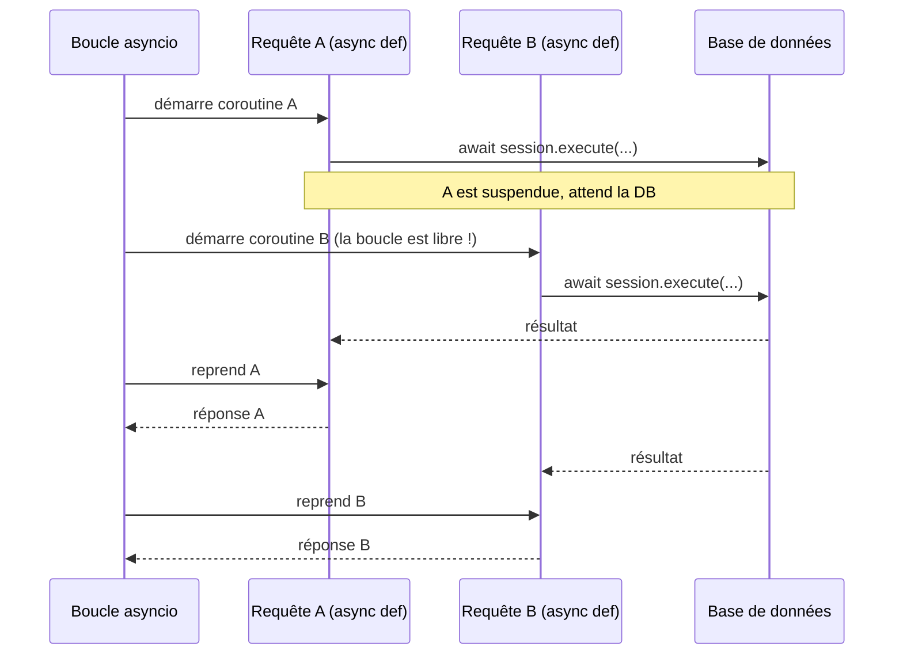

## `def` ou `async def` ?

FastAPI accepte les deux pour une route. La règle pratique :

- **`async def`** quand tu fais de l'**I/O asynchrone** (`await` sur une lib async : httpx, asyncpg, aioredis…). La coroutine s'exécute dans la **boucle d'événements** ;
- **`def`** (synchrone) quand ta route appelle du code **bloquant** (driver BDD synchrone, calcul lourd). FastAPI l'exécute alors dans un **threadpool**, pour **ne pas bloquer** la boucle.

> Piège classique : utiliser `async def` puis appeler dedans une lib **bloquante** (ex. `requests.get`, `time.sleep`). Cela **bloque la boucle** et tue la concurrence. Avec `async def`, **n'appelle que de l'I/O `await`-able**.

```python
import asyncio
import httpx
from fastapi import FastAPI

app = FastAPI()


# GOOD: non-blocking network I/O, we await it without freezing the loop.
@app.get("/aggregate")
async def agreger() -> dict[str, int]:
    async with httpx.AsyncClient() as client:
        # The two requests fire concurrently.
        r1, r2 = await asyncio.gather(
            client.get("https://example.com/a"),
            client.get("https://example.com/b"),
        )
    return {"a": r1.status_code, "b": r2.status_code}
```

## La concurrence ≠ le parallélisme

`asyncio` permet de **superposer des attentes I/O** : pendant qu'une requête réseau attend, la boucle traite **autre chose**. Ce n'est **pas** du calcul parallèle (un seul thread porte la boucle). Pour du **CPU intensif**, on délègue (threadpool, *process pool*, tâche de fond).



## Pièges async : les erreurs courantes

### Piège 1 — oublier `await`

```python
# BAD: coroutine object is created but never awaited → always None
@app.get("/bad")
async def bad_endpoint():
    result = some_async_function()   # missing await!
    return {"data": result}          # result is a coroutine object, not the value

# GOOD
@app.get("/good")
async def good_endpoint():
    result = await some_async_function()
    return {"data": result}
```

Python ne lève **pas d'erreur** immédiatement : l'objet coroutine est simplement créé mais jamais exécuté. Active les avertissements avec `PYTHONASYNCIODEBUG=1` ou `asyncio.set_event_loop_policy` pour détecter les coroutines non attendues.

### Piège 2 — bloquer la boucle depuis `async def`

```python
import time, requests

# CATASTROPHIC: blocks the event loop for the entire duration of the call.
# All other requests are frozen while this one waits.
@app.get("/blocking-in-async")
async def blocking():
    time.sleep(2)                      # blocks the loop — never do this
    r = requests.get("https://api.example.com/data")  # sync lib in async def
    return r.json()

# CORRECT: use an async HTTP client
import httpx

@app.get("/non-blocking")
async def non_blocking():
    async with httpx.AsyncClient() as client:
        r = await client.get("https://api.example.com/data")
    return r.json()
```

**Règle** : dans un `async def`, tout I/O doit être `await`-able. Si tu dois utiliser une lib synchrone bloquante, utilise **`def`** (pas `async def`) — FastAPI l'exécutera dans un threadpool automatiquement.

### Piège 3 — connexions DB synchrones dans un contexte async

```python
# BAD: psycopg2 / SQLAlchemy sync driver block the loop
@app.get("/users")
async def list_users(db: Session = Depends(get_session)):
    return db.query(User).all()   # sync query blocks the event loop!

# OPTION A: use a synchronous route (FastAPI runs it in threadpool)
@app.get("/users")
def list_users(db: Session = Depends(get_session)):
    return db.query(User).all()   # safe: def → threadpool

# OPTION B: use an async driver (asyncpg / SQLAlchemy async)
from sqlalchemy.ext.asyncio import AsyncSession

@app.get("/users")
async def list_users(db: AsyncSession = Depends(get_async_session)):
    result = await db.execute(select(User))
    return result.scalars().all()
```

### Piège 4 — `asyncio.run()` dans une route

```python
# BAD: never nest event loops
@app.get("/wrong")
async def wrong():
    result = asyncio.run(some_coroutine())   # RuntimeError: event loop already running
    return result

# GOOD: just await directly
@app.get("/right")
async def right():
    result = await some_coroutine()
    return result
```

> **À retenir** : la règle simple est `async def` + `await` partout, **ou** `def` + libs synchrones. Le mélange (appeler du sync bloquant dans `async def`) est le piège le plus fréquent en migration depuis Flask.

## Sandbox : sentir l'`async` en pur Python

Pyodide exécute du Python **asynchrone** (la sandbox utilise `runPythonAsync`). Compare une exécution **séquentielle** et une exécution **concurrente** avec `asyncio.gather` — c'est exactement le gain qu'apporte `async def` côté FastAPI sur de l'I/O.

## Bac à sable

> Augmente les durées et ajoute une 3e tâche dans `gather` : le temps concurrent reste celui de la plus longue, pas la somme.

```python
import asyncio
import time


async def tache(nom: str, duree: float) -> str:
    # 'await asyncio.sleep' simulates non-blocking I/O (network, async DB).
    await asyncio.sleep(duree)
    return f"{nom} finished in {duree}s"


async def sequentiel() -> None:
    debut = time.perf_counter()
    await tache("A", 0.3)
    await tache("B", 0.3)
    print(f"Sequential: {time.perf_counter() - debut:.2f}s (0.3 + 0.3)")


async def concurrent() -> None:
    debut = time.perf_counter()
    # gather fires the two "I/O" calls concurrently: we wait for the longest one.
    resultats = await asyncio.gather(tache("A", 0.3), tache("B", 0.3))
    print(f"Concurrent: {time.perf_counter() - debut:.2f}s ->", resultats)


# Pyodide already runs inside an event loop (runPythonAsync):
# so we can 'await' directly, without asyncio.run().
await sequentiel()
await concurrent()
```
