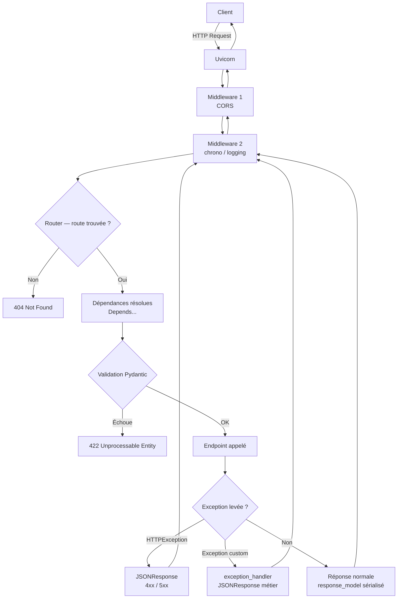

## Choisir le bon status code

Par défaut, une route renvoie **200**. On personnalise le **succès** via `status_code` :

```python
from fastapi import FastAPI, status

app = FastAPI()

@app.post("/products", status_code=status.HTTP_201_CREATED)
def creer() -> dict[str, str]:
    return {"status": "created"}     # -> 201
```

Repères utiles :

- **200** OK · **201** Created · **204** No Content ;
- **400** Bad Request · **401** Unauthorized · **403** Forbidden · **404** Not Found ;
- **422** Unprocessable Entity (validation) · **500** Internal Server Error.

Pour une réponse **204**, on ne renvoie **aucun corps**.

## Réponses sur mesure

- `JSONResponse` : contrôle fin du corps et des en-têtes ;
- `StreamingResponse` : flux (gros fichiers, SSE) ;
- `RedirectResponse` : redirection ;
- en-têtes/cookies personnalisés : on déclare un paramètre `response: Response` et on écrit `response.headers["X-..."] = ...`.

```python
from fastapi import Response

@app.get("/ping")
def ping(response: Response) -> dict[str, str]:
    response.headers["X-App"] = "demo"
    return {"pong": "ok"}
```

## Exception handlers custom

Au lieu de laisser FastAPI renvoyer des erreurs génériques, on peut **capturer des exceptions métier** et leur donner une réponse HTTP structurée. C'est l'équivalent des error handlers `@app.errorhandler(404)` de Flask, mais déclaré sur l'`app` et disponible pour n'importe quelle exception Python.

```python
from fastapi import FastAPI, Request
from fastapi.responses import JSONResponse


class ProductNotFoundError(Exception):
    """Raised by the service layer when a product does not exist."""
    def __init__(self, product_id: int) -> None:
        self.product_id = product_id


class StockError(Exception):
    """Raised when a purchase exceeds available stock."""
    def __init__(self, available: int, requested: int) -> None:
        self.available = available
        self.requested = requested


app = FastAPI()


@app.exception_handler(ProductNotFoundError)
async def product_not_found_handler(request: Request, exc: ProductNotFoundError) -> JSONResponse:
    return JSONResponse(
        status_code=404,
        content={"error": "product_not_found", "product_id": exc.product_id},
    )


@app.exception_handler(StockError)
async def stock_error_handler(request: Request, exc: StockError) -> JSONResponse:
    return JSONResponse(
        status_code=409,
        content={
            "error": "insufficient_stock",
            "available": exc.available,
            "requested": exc.requested,
        },
    )


# Service layer raises domain exceptions — no HTTP knowledge required.
@app.post("/orders")
async def place_order(product_id: int, quantity: int) -> dict:
    product = get_product_or_raise(product_id)   # raises ProductNotFoundError
    check_stock(product, quantity)               # raises StockError
    return {"status": "confirmed"}
```

L'avantage : le service (`service.py`) **ne connaît pas HTTP**. Il lève des exceptions Python métier ; le handler au niveau de l'`app` les traduit en réponses JSON cohérentes.

### Cycle de vie complet d'une requête avec middlewares et exception handlers



## Middlewares : autour de chaque requête

Un **middleware** enveloppe **toutes** les requêtes : il s'exécute **avant** la route, puis **après** la réponse. Idéal pour le logging, le temps de traitement, CORS, etc.

```python
import time
from fastapi import FastAPI, Request

app = FastAPI()

@app.middleware("http")
async def chrono(request: Request, call_next):
    debut = time.perf_counter()
    response = await call_next(request)        # runs the route
    response.headers["X-Process-Time"] = f"{time.perf_counter() - debut:.4f}"
    return response
```

Pour le partage cross-origine (front séparé), on ajoute le middleware **CORS** :

```python
from fastapi.middleware.cors import CORSMiddleware

app.add_middleware(
    CORSMiddleware,
    allow_origins=["https://my-frontend.example"],
    allow_methods=["*"],
    allow_headers=["*"],
)
```

> Routes, réponses et middlewares = **côté serveur** → ce module n'a **pas de sandbox**. On valide tout cela en local avec `uvicorn` et la doc `/docs`.
