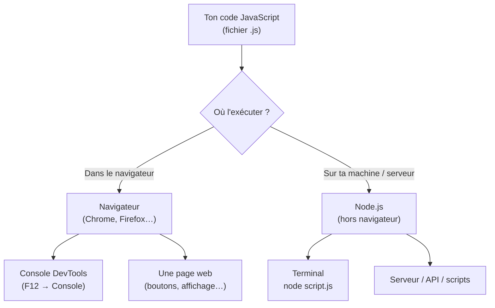

## Bienvenue (ou re-bienvenue !)

Tu as déjà codé, puis la vie t'a emmenée ailleurs pendant un moment. Bonne nouvelle : **ça revient vite**. La logique que tu as construite pendant ton Master BI — décomposer un problème, manipuler des données, écrire des requêtes — c'est **exactement** la matière première de la programmation. On va juste la reconnecter à un nouveau langage : **JavaScript** (souvent abrégé « JS »).

L'objectif de ce module : réveiller les bons réflexes, comprendre **où** ton code va tourner, et écrire ton premier script qui calcule et affiche un résultat.

## Pourquoi JavaScript ?

JavaScript est le **langage du web**. À l'origine, il servait à animer les pages dans le navigateur. Aujourd'hui il est partout :

- dans le **navigateur** (Chrome, Firefox…) : réagir à un clic, afficher un graphique, valider un formulaire ;
- côté **serveur** avec **Node.js** : lire des fichiers, interroger une base de données, construire une API ;
- même dans des **outils data** : dashboards, visualisations (D3.js), scripts d'automatisation.

Pour quelqu'un qui vient de la data, c'est un excellent second langage : la syntaxe ressemble à ce que tu as pu croiser, et il est **immédiatement exécutable** — pas d'installation lourde pour démarrer.

> **Passerelle depuis ton monde.** SQL manipule des données dans une base ; JavaScript manipule des données **en mémoire** dans un programme. Là où tu écrivais `SELECT SUM(montant) FROM ventes`, tu vas bientôt écrire une petite boucle qui additionne des montants. Même intention, autre outil.

## Où tourne ton code JavaScript ?

C'est LA question à clarifier en reprenant. Ton code JS ne « tourne » pas dans le vide : il lui faut un **moteur** (un programme qui lit et exécute le JS). Il existe deux grands endroits où ce moteur vit.



- **Dans le navigateur** : tout navigateur embarque un moteur JS. Ouvre les **outils de développement** (touche `F12`), onglet **Console** : tu peux y taper du JS et voir le résultat immédiatement. C'est ton « bac à sable » gratuit.
- **Avec Node.js** : Node, c'est le moteur JS de Chrome (V8) sorti du navigateur pour tourner directement sur ta machine. Tu écris un fichier `script.js` et tu lances `node script.js` dans un terminal.

> **Bonne nouvelle pour ce cours.** Tu n'as **rien à installer**. Les blocs de code ci-dessous ont un bouton **« Tester »** : le code s'exécute **dans ton navigateur**, comme dans une console. Concentre-toi sur la logique, pas sur l'outillage.

## Ton premier script : afficher quelque chose

En programmation, la toute première chose qu'on apprend, c'est **afficher**. En JavaScript, on affiche avec `console.log(...)`. Ce qu'on met entre les parenthèses est écrit dans la console.

```js
console.log("Bonjour, me revoilà au clavier !")
```

Clique sur **« Tester »** : tu devrais voir le texte apparaître. Félicitations, tu as exécuté du JavaScript.

`console.log` est ton meilleur ami de reprise : c'est l'équivalent d'afficher une cellule dans un tableur ou de faire un `SELECT` pour « voir ce qu'il y a dedans ». On l'utilise en permanence pour **inspecter** ce que fait le code.

> **Passerelle Python.** `console.log(...)` en JS ≈ `print(...)` en Python. Même rôle : montrer une valeur à l'écran.

## Un programme = une suite d'instructions, dans l'ordre

Voici le concept fondateur à raviver.

> 🧠 **Rappel algo.** Un programme est une **suite d'instructions exécutées de haut en bas, dans l'ordre où elles sont écrites** (on parle d'exécution *séquentielle*). L'ordinateur ne « devine » rien : il fait exactement ce qui est écrit, ligne après ligne. Si une étape dépend d'une autre, elle doit venir **après**.

```js
console.log("Étape 1 : je démarre")
console.log("Étape 2 : je calcule")
console.log("Étape 3 : j'affiche le résultat")
```

Les trois lignes s'affichent **dans cet ordre**, jamais mélangées. Simple, mais c'est la base de tout : un algorithme, c'est d'abord une recette suivie pas à pas.

### 🔧 Essaie dans la vraie console de ton navigateur

Pas besoin d'installer quoi que ce soit : **Chrome (ou Edge/Firefox) contient déjà une console JavaScript**.

1. Ouvre Chrome sur n'importe quelle page.
2. Appuie sur **F12** (ou **clic droit → Inspecter**), puis clique sur l'onglet **Console**.
   *(Raccourci direct vers la console : `Ctrl`+`Maj`+`J` sur Windows/Linux, `Cmd`+`Option`+`J` sur Mac.)*
3. À côté du chevron `>`, tape une instruction, puis **Entrée** :

```js
console.log("Bonjour !")
console.log(2 + 3)
```


Le résultat apparaît **juste en dessous** de ce que tu tapes. La console est un vrai bac à sable : tu peux y rejouer n'importe quelle ligne de ce cours. *(Sur cette plateforme, le bouton **Tester** sous les blocs de code fait exactement la même chose, sans quitter la page.)*

> **Passerelle.** Une **requête SQL** est aussi une suite d'instructions (`SELECT … FROM … WHERE … ORDER BY …`), évaluées selon un ordre précis. Une **formule Excel** enchaîne des opérations dans un ordre déterminé par les parenthèses. Coder, c'est le même geste mental : **décomposer un but en étapes ordonnées**.

## Des variables pour ranger les valeurs

Pour calculer, il faut **stocker** des valeurs quelque part. On utilise des **variables** (revues en détail au module suivant, ici juste l'échauffement). En JS moderne, on les déclare avec `const` (valeur qui ne changera pas) ou `let` (valeur qui peut changer).

```js
const vente1 = 120     // un montant, en euros
const vente2 = 80
const vente3 = 45

const total = vente1 + vente2 + vente3   // on calcule
console.log("Total des ventes :", total) // on affiche
```

Remarque deux choses utiles :

- on peut passer **plusieurs arguments** à `console.log`, séparés par des virgules : il les affiche côte à côte ;
- `//` démarre un **commentaire** : tout ce qui suit sur la ligne est ignoré par le moteur. Les commentaires sont pour **toi** (et tes collègues), pas pour la machine.

> **Passerelle tableur.** Ici, `vente1`, `vente2`, `vente3` jouent le rôle de trois cellules ; `total` est la cellule qui contient `=B2+B3+B4`. La grande différence : au lieu de cliquer dans une grille, tu **nommes** tes valeurs — ce qui rend le calcul lisible et réutilisable.

## Enchaînons un vrai petit calcul

Combinons tout : des variables, un calcul, un affichage.

```js
const prixUnitaire = 12.5
const quantite = 4

const sousTotal = prixUnitaire * quantite   // multiplication : *
console.log("Sous-total :", sousTotal, "€")

const moyenneParArticle = sousTotal / quantite  // division : /
console.log("Prix moyen par article :", moyenneParArticle, "€")
```

Tu viens d'écrire un programme complet : il **lit** des données (les variables), les **transforme** (calculs), et **communique** le résultat (`console.log`). C'est le squelette de la quasi-totalité des programmes que tu écriras.

## À retenir

- **JavaScript** est le langage du web ; il tourne dans le **navigateur** (console `F12`) ou avec **Node.js** (terminal). Ici, tout s'exécute dans ton navigateur via **« Tester »**.
- On **affiche** avec `console.log(...)` — l'équivalent de `print(...)` en Python.
- Un **programme** est une **suite d'instructions exécutées dans l'ordre**, de haut en bas.
- On **range** les valeurs dans des **variables** (`const` / `let`) pour les calculer et les réutiliser.
- `//` introduit un **commentaire** ignoré par la machine.
