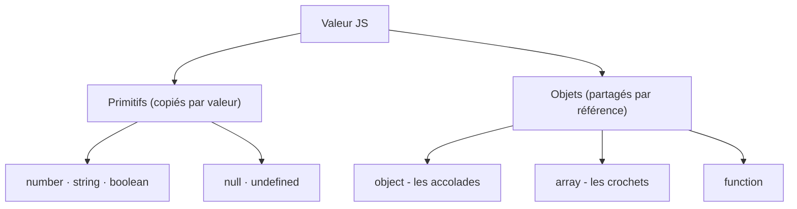

## Une variable, c'est quoi *vraiment* ?

Une **variable** n'est pas « un nom qui contient une valeur » : c'est une **étiquette** que tu poses sur une **case mémoire**. La case contient la valeur ; l'étiquette te permet d'y accéder par un nom.


> **Passerelle PHP/Python.** Comme `$age = 42;` en PHP ou `age = 42` en Python, l'idée est la même : **un nom pour une valeur**. (Et dans ton monde data : un alias de colonne en SQL, une cellule `B2` en tableur.)

## Déclarer : `let` et `const` (oublie `var`)

```js
let age = 42        // une valeur qui peut changer
age = 43            // OK

const nom = "Ada"   // l'étiquette est fixe
// nom = "Bob"      // ❌ TypeError : on ne peut pas réétiqueter une const

console.log(age, nom)
```

- `const` ne veut **pas** dire « valeur figée » : ça veut dire que **l'étiquette ne change pas de case**. (Le *contenu* d'un objet `const` peut, lui, changer — voir plus bas.)
- **Oublie `var`.** *Pourquoi ?* Il a une **portée de fonction** (pas de bloc), il est **hoisté** (utilisable *avant* sa déclaration → bugs silencieux) et il autorise la **redéclaration** sans erreur. `let`/`const` (portée de **bloc**, pas de hoisting piégeux) suppriment ces trois pièges.

> **Réflexe à prendre.** SQL/tableur n'ont pas cette distinction. En JS : **`const` par défaut**, `let` seulement si la valeur doit changer.

## Les types : primitifs vs objets



```js
console.log(typeof 42)         // "number"
console.log(typeof "Ada")      // "string"
console.log(typeof true)       // "boolean"
console.log(typeof undefined)  // "undefined"
console.log(typeof {})         // "object"
console.log(typeof [])         // "object"  (un tableau EST un objet)
```

> **Passerelle.** En JS, **pas de `int` vs `float`** : tout nombre est un seul type `number`. Et `typeof []` vaut `"object"`, pas `"array"`.

## Le piège important : **valeur vs référence**

Selon le type, copier une variable copie soit **la valeur**, soit **la référence** (l'adresse de la boîte). C'est l'erreur n°1 quand on débute.


```js
// Primitif : COPIE de la valeur
let a = 3
let b = a
b = 9
console.log(a, b)    // 3 9  → a est intact

// Objet : COPIE de la référence (même boîte !)
const o1 = { x: 1 }
const o2 = o1
o2.x = 9
console.log(o1.x)    // 9  → o1 a changé aussi !
```

> **Passerelle pandas.** Si tu as fait du pandas : `df2 = df1` **ne copie pas** le tableau — les deux noms pointent le **même** DataFrame, donc modifier l'un touche l'autre. C'est exactement le piège des objets/tableaux en JS. Pour vraiment copier : `{ ...o1 }` (objet) ou `[...t1]` (tableau) — l'équivalent de `df.copy()`.

## À retenir

- Variable = **étiquette → case mémoire**.
- **`const` par défaut**, `let` si ça change, **jamais `var`**.
- **Primitifs** : copiés *par valeur*. **Objets / tableaux** : partagés *par référence*.
- `const` fige l'étiquette, **pas** le contenu d'un objet.
