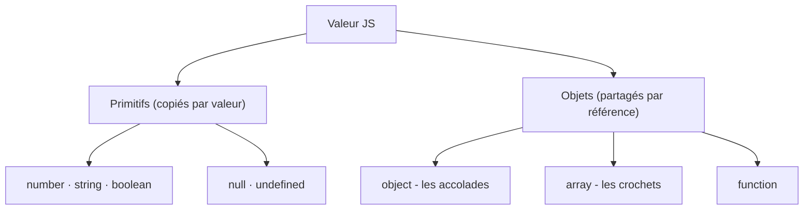
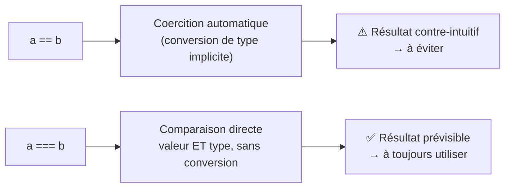

## Une variable, c'est quoi *vraiment* ?

Une **variable** n'est pas « un nom qui contient une valeur » : c'est une **étiquette** que tu poses sur une **case mémoire**. La case contient la valeur ; l'étiquette te permet d'y accéder par un nom.


> **Passerelle PHP/Python.** Comme `$age = 42;` en PHP ou `age = 42` en Python, l'idée est la même : **un nom pour une valeur**. (Et dans ton monde data : un alias de colonne en SQL, une cellule `B2` en tableur.)

## Déclarer : `let` et `const` (oublie `var`)

```js
let age = 42        // a value that can change
age = 43            // OK

const nom = "Ada"   // the label is fixed
// nom = "Bob"      // ❌ TypeError : cannot re-assign a const

console.log(age, nom)
```

- `const` ne veut **pas** dire « valeur figée » : ça veut dire que **l'étiquette ne change pas de case**. (Le *contenu* d'un objet `const` peut, lui, changer — voir plus bas.)
- **Oublie `var`.** *Pourquoi ?* Il a une **portée de fonction** (pas de bloc), il est **hoisté** (utilisable *avant* sa déclaration → bugs silencieux) et il autorise la **redéclaration** sans erreur. `let`/`const` (portée de **bloc**, pas de hoisting piégeux) suppriment ces trois pièges.

> **Réflexe à prendre.** SQL/tableur n'ont pas cette distinction. En JS : **`const` par défaut**, `let` seulement si la valeur doit changer.

> ⚠️ **Erreur fréquente — le piège de `var` et du hoisting.** Le moteur JS « remonte » (*hoist*) la déclaration `var` en haut du bloc **avant** d'exécuter quoi que ce soit — mais il n'y remonte **pas** l'initialisation. La variable existe donc depuis le début de la portée, mais vaut `undefined`. Aucune erreur, juste une valeur inexplicable : c'est le type de bug le plus silencieux.

```js
// ⚠️ What var does — dangerous silent bug
console.log(score)   // undefined — no error, but the value is not there yet!
var score = 42
console.log(score)   // 42

// ✅ With let, the same mistake gives a clear, easy-to-fix error:
// console.log(points)  // ReferenceError: Cannot access 'points' before initialization
let points = 42
```

Retiens : `let`/`const` te donnent une erreur **franche** si tu fais cette erreur — c'est toujours mieux qu'un `undefined` mystérieux.

## Les types : primitifs vs objets


```mermaid
flowchart TD
  V["Valeur JS"] --> P["Primitifs (copiés par valeur)"]
  V --> O["Objets (partagés par référence)"]
  P --> P1["number · string · boolean"]
  P --> P2["null · undefined"]
  O --> O1["object - les accolades"]
  O --> O2["array - les crochets"]
  O --> O3["function"]
```

```js
console.log(typeof 42)         // "number"
console.log(typeof "Ada")      // "string"
console.log(typeof true)       // "boolean"
console.log(typeof undefined)  // "undefined"
console.log(typeof {})         // "object"
console.log(typeof [])         // "object"  (un tableau EST un objet)
```

> **Passerelle.** En JS, **pas de `int` vs `float`** : tout nombre est un seul type `number`. Et `typeof []` vaut `"object"`, pas `"array"`.

## Le piège important : **valeur vs référence**

Selon le type, copier une variable copie soit **la valeur**, soit **la référence** (l'adresse de la boîte). C'est l'erreur n°1 quand on débute.


```js
// Primitif : COPIE de la valeur
let a = 3
let b = a
b = 9
console.log(a, b)    // 3 9  → a est intact

// Object: COPY of the reference (same box!)
const o1 = { x: 1 }
const o2 = o1
o2.x = 9
console.log(o1.x)    // 9  → o1 changed too!
```

> **Passerelle pandas.** Si tu as fait du pandas : `df2 = df1` **ne copie pas** le tableau — les deux noms pointent le **même** DataFrame, donc modifier l'un touche l'autre. C'est exactement le piège des objets/tableaux en JS. Pour vraiment copier : `{ ...o1 }` (objet) ou `[...t1]` (tableau) — l'équivalent de `df.copy()`.

## Le piège n°1 : `==` vs `===`

JavaScript a **deux opérateurs d'égalité**, et les confondre est l'une des erreurs les plus fréquentes chez les débutants.

- `===` (égalité **stricte**) : compare valeur **et** type, **sans aucune conversion**. C'est celui qu'on utilise.
- `==` (égalité **lâche**) : convertit les types automatiquement avant de comparer (*coercition*). Source de comportements incompréhensibles.

```js
// == (lax equality): JS converts types silently — full of surprises
console.log(0 == false)        // true  ← 0 and false both become 0
console.log("" == false)       // true  ← empty string and false both become 0
console.log("42" == 42)        // true  ← "42" is silently converted to a number
console.log(null == undefined) // true  ← special JS rule

// === (strict equality): NO conversion — always predictable
console.log(0 === false)       // false ← number ≠ boolean, types differ
console.log("42" === 42)       // false ← string ≠ number
console.log(null === undefined) // false ← two different types
```


```mermaid
flowchart LR
  A["a == b"] --> C1["Coercition automatique<br/>(conversion de type implicite)"]
  C1 --> R1["⚠️ Résultat contre-intuitif<br/>→ à éviter"]
  B["a === b"] --> C2["Comparaison directe<br/>valeur ET type, sans conversion"]
  C2 --> R2["✅ Résultat prévisible<br/>→ à toujours utiliser"]
```

> ⚠️ **Règle d'or : toujours `===` (et son contraire `!==`).** Le `==` génère des conversions implicites tellement surprenantes (même pour des développeurs expérimentés) qu'il vaut mieux l'ignorer complètement. Utilise `===` partout, sans exception.

## Exercice mental : que va afficher ce code ?

Lis chaque extrait et devine la sortie **avant** de cliquer sur la réponse.

**Extrait 1**
```js
let x = 5
let y = x
y = 10
console.log(x)   // ?
```
<details><summary>Réponse</summary>

`5` — `x` et `y` sont deux **primitifs** (nombres). Copier `y = x` crée une valeur indépendante : modifier `y` n'affecte pas `x`.

</details>

**Extrait 2**
```js
const obj = { price: 10 }
const obj2 = obj
obj2.price = 99
console.log(obj.price)   // ?
```
<details><summary>Réponse</summary>

`99` — `obj` et `obj2` **partagent la même référence** (la même boîte en mémoire). Modifier `obj2.price` modifie aussi `obj.price` : c'est le même objet vu sous deux noms.

</details>

**Extrait 3**
```js
console.log(typeof null)   // ?
```
<details><summary>Réponse</summary>

`"object"` — c'est un **bug historique** de JavaScript, présent depuis 1995 et jamais corrigé pour ne pas casser les anciens programmes. `null` est pourtant un primitif, pas un objet. Mémorise-le comme une exception à part.

</details>

## À retenir

- Variable = **étiquette → case mémoire**.
- **`const` par défaut**, `let` si ça change, **jamais `var`**.
- **Primitifs** : copiés *par valeur*. **Objets / tableaux** : partagés *par référence*.
- `const` fige l'étiquette, **pas** le contenu d'un objet.
