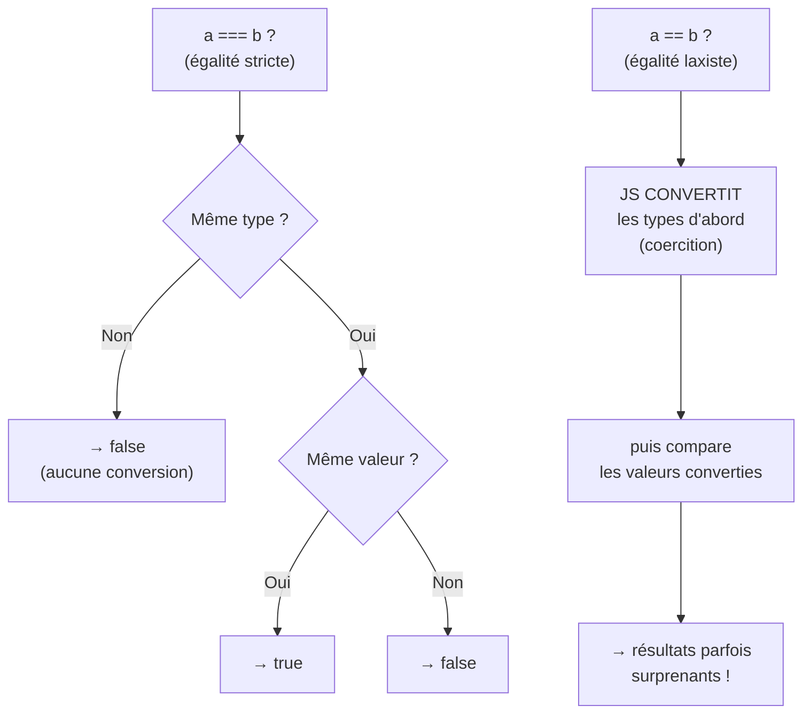

## Une expression, c'est quoi ?

Une **expression** est un morceau de code qui **s'évalue en une valeur unique**. C'est le cœur de tout calcul.

- `3 + 4` est une expression → elle s'évalue en `7`.
- `prix * quantite` s'évalue en un montant.
- `age >= 18` s'évalue en `true` ou `false`.

> 🧠 **Rappel algo.** Ne confonds pas **expression** et **instruction**. Une *expression* **produit une valeur** (`3 + 4`, `x > 0`). Une *instruction* **fait une action** (déclarer une variable, afficher, etc.). Une instruction contient souvent une ou plusieurs expressions : dans `const total = 3 + 4`, la partie `3 + 4` est l'expression, et « ranger le résultat dans `total` » est l'instruction.

> **Passerelle.** Dans un tableur, `=B2*C2` est une **expression** : la cellule affiche sa valeur évaluée. En SQL, `montant * 1.2` dans un `SELECT` est aussi une expression. Même idée : **un calcul qui aboutit à une valeur**.

## Arithmétique

Les opérateurs de calcul de base :

```js
console.log(7 + 3)    // 10   addition
console.log(7 - 3)    // 4    soustraction
console.log(7 * 3)    // 21   multiplication
console.log(7 / 3)    // 2.333...  division (toujours décimale en JS !)
console.log(7 % 3)    // 1    modulo : le RESTE de la division entière
console.log(2 ** 10)  // 1024 puissance : 2 puissance 10
```

Deux points qui surprennent souvent en reprise :

- **La division `/` ne fait PAS de division entière.** `7 / 3` donne `2.333…`, jamais `2`. (En SQL/Python, la division entière est parfois un opérateur à part ; en JS, `/` est toujours « réelle ».)
- **Le modulo `%`** donne le **reste**. `7 % 3` vaut `1` (car 7 = 2×3 + 1). Ultra utile : `n % 2 === 0` teste si `n` est **pair**.

### Priorité des opérateurs

Comme en maths (et dans un tableur) : `*`, `/`, `%` passent **avant** `+` et `-`. Les **parenthèses** forcent l'ordre.

```js
console.log(2 + 3 * 4)     // 14  (le * d'abord : 2 + 12)
console.log((2 + 3) * 4)   // 20  (parenthèses d'abord : 5 * 4)
```

> **Passerelle Excel.** Exactement les mêmes règles que `=2+3*4` dans une cellule. En cas de doute, **mets des parenthèses** : c'est plus lisible et ça évite les surprises.

## Concaténer du texte

Le `+` a deux rôles : additionner des **nombres**, ou **coller** des **chaînes** de caractères (concaténation).

```js
const prenom = "Ada"
console.log("Bonjour " + prenom + " !")   // "Bonjour Ada !"
```

Plus lisible : les **littéraux gabarits** (*template literals*), entre backticks `` ` ``, avec `${...}` pour insérer une valeur :

```js
const prix = 12.5
const quantite = 4
console.log(`Total : ${prix * quantite} €`)   // "Total : 50 €"
```

> **Passerelle SQL.** La concaténation `"a" + "b"` en JS ≈ `CONCAT('a', 'b')` (ou `'a' || 'b'`) en SQL. Les *template literals* ressemblent aux f-strings de Python : `f"Total : {prix * quantite} €"`.

## Comparaisons

Une comparaison s'évalue en un **booléen** : `true` ou `false`.

```js
console.log(5 > 3)     // true
console.log(5 < 3)     // false
console.log(5 >= 5)    // true   (supérieur OU égal)
console.log(5 <= 4)    // false
console.log(5 === 5)   // true   égalité STRICTE
console.log(5 !== 3)   // true   différence stricte
```

Retiens : pour tester l'égalité, on utilise **`===`** (trois signes égal) et la différence **`!==`**. On y revient tout de suite — c'est un point crucial.

> **Passerelle.** Ces comparaisons sont exactement celles d'une clause `WHERE` en SQL (`WHERE montant > 100`) ou d'un `=SI(A2>=18; ...)` dans Excel. Le résultat d'une comparaison est une réponse **oui/non** que le programme utilisera pour **décider** (au module suivant : les conditions).

## Le piège de la reprise : `==` vs `===`

JavaScript a **deux** égalités, et c'est la source de bugs la plus classique.

- `===` (**strict**) : compare **sans convertir** les types. `5 === "5"` → `false` (un nombre n'est pas une chaîne).
- `==` (**laxiste**) : **convertit** les types avant de comparer (on appelle ça la *coercition*). `5 == "5"` → `true` (JS transforme `"5"` en `5` d'abord).

```js
console.log(5 === "5")   // false   (types différents : number vs string)
console.log(5 == "5")    // true    (== convertit "5" en 5, puis compare)

console.log(0 == "")     // true    (les deux deviennent "faux/vide"…)
console.log(null == undefined) // true  (cas spécial de ==)
```



> **La règle d'or.** **Utilise toujours `===` et `!==`.** Ils sont prévisibles : pas de conversion cachée. Le `==` n'est utile que dans de rares cas experts ; en reprise, considère-le comme un piège à éviter. La plupart des équipes l'interdisent d'ailleurs via un *linter*.

## Booléens et logique

On combine des conditions avec trois opérateurs logiques :

```js
const age = 25
const abonne = true

console.log(age >= 18 && abonne)   // ET : true seulement si les DEUX sont vrais
console.log(age < 12 || abonne)    // OU : true si AU MOINS UN est vrai
console.log(!abonne)               // NON : inverse le booléen → false
```

- `&&` (**ET**) : vrai si **toutes** les conditions sont vraies.
- `||` (**OU**) : vrai si **au moins une** condition est vraie.
- `!` (**NON**) : inverse (`!true` → `false`).

> 🧠 **Rappel algo.** C'est de la **logique booléenne**, la même qu'en algèbre de Boole. Table de vérité mentale : `ET` = « les deux », `OU` = « l'un ou l'autre (ou les deux) », `NON` = « l'inverse ». JS évalue aussi en **court-circuit** : dans `a && b`, si `a` est faux, `b` n'est même pas évalué (inutile). Idem `a || b` s'arrête si `a` est vrai.

> **Passerelle SQL.** Ce sont les `AND` / `OR` / `NOT` d'une clause `WHERE` : `WHERE age >= 18 AND abonne = true`. Exactement la même logique, autre syntaxe.

## Le piège des flottants : `0.1 + 0.2`

Essaie ça — le résultat va te surprendre :

```js
console.log(0.1 + 0.2)          // 0.30000000000000004  (!)
console.log(0.1 + 0.2 === 0.3)  // false  (!!)
```

Ce n'est **pas un bug de JavaScript** : c'est ainsi que **tous** les langages représentent les nombres à virgule (norme IEEE 754, la même qu'en Python, Java, Excel…). Certains décimaux comme `0.1` ne se stockent pas exactement en binaire — comme `1/3 = 0.3333…` ne se note pas exactement en décimal.

**Conséquence pratique :** ne compare jamais deux flottants avec `===`. Pour de l'argent, deux réflexes :

```js
// 1) Arrondir à l'affichage
const total = 0.1 + 0.2
console.log(total.toFixed(2))   // "0.30"  (chaîne, arrondie à 2 décimales)

// 2) Ou raisonner en centimes (entiers) : 10 + 20 = 30 centimes
```

> **Passerelle.** Tu as peut-être déjà vu `0.30000000001` traîner dans un tableur ou un calcul pandas : c'est **la même cause**. La finance stocke souvent les montants en centimes (entiers) précisément pour éviter ça.

## À retenir

- Une **expression** s'**évalue en une valeur** (`3 * 4` → `12`, `age > 18` → booléen).
- Arithmétique : `+ - * / % **`. La division `/` est **toujours décimale** ; `%` donne le **reste**.
- Le `+` **concatène** aussi du texte ; préfère les **template literals** `` `… ${x} …` ``.
- Comparaisons → **booléen** ; logique avec `&& || !` (évaluation en **court-circuit**).
- **Utilise `===` / `!==`**, jamais `==` : le `==` fait des **conversions cachées** (coercition) sources de bugs.
- Les **flottants** sont imprécis (`0.1 + 0.2 !== 0.3`) : arrondis à l'affichage ou raisonne en entiers (centimes).
