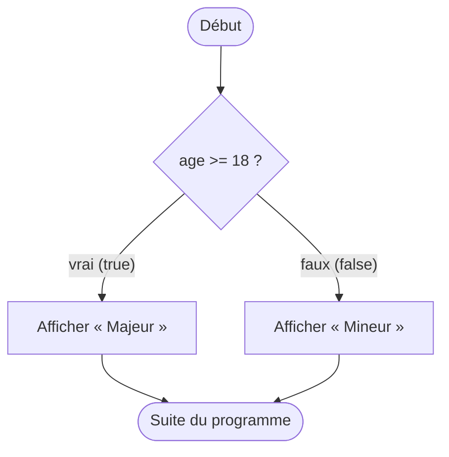
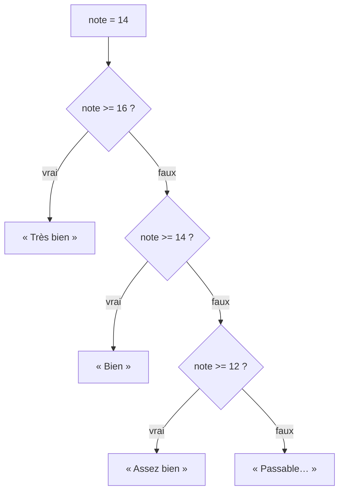
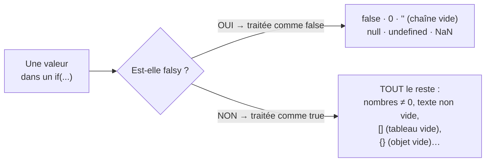

## Prendre une décision dans un programme

Jusqu'ici, nos programmes s'exécutaient tout droit, de haut en bas. Mais un vrai programme doit **décider** : appliquer une remise *si* le panier dépasse 50 €, afficher « majeur » *si* l'âge ≥ 18, ranger une vente dans une catégorie *selon* son montant… C'est le rôle des **conditions**.

> 🧠 **Rappel algo.** On appelle ça le **branchement** (ou structure de décision). Le programme évalue une condition (un booléen : vrai/faux) et **choisit un chemin** selon le résultat. C'est le deuxième pilier de l'algorithmique, après la séquence : *séquence* (faire dans l'ordre) puis *branchement* (choisir), et bientôt les boucles (répéter).

## Le `if` / `else`

La brique de base : `if` (si) exécute un bloc **quand la condition est vraie** ; `else` (sinon) exécute l'autre bloc.

```js
const age = 20

if (age >= 18) {
  console.log("Majeur")
} else {
  console.log("Mineur")
}
```

Anatomie :

- la **condition** est entre parenthèses `( … )` et doit s'évaluer en booléen ;
- le **bloc** à exécuter est entre accolades `{ … }` ;
- `else` est **optionnel** : parfois on ne veut agir que « si vrai ».



Ce schéma en losange (le test) avec deux flèches (vrai/faux) est le **flowchart** classique d'un branchement. Garde cette image en tête : une condition, c'est un aiguillage.

## Plusieurs cas : `else if`

Pour enchaîner plusieurs tests, on utilise `else if`. Le programme évalue les conditions **dans l'ordre** et s'arrête à la **première vraie**.

```js
const note = 14

if (note >= 16) {
  console.log("Très bien")
} else if (note >= 14) {
  console.log("Bien")
} else if (note >= 12) {
  console.log("Assez bien")
} else {
  console.log("Passable ou insuffisant")
}
// Affiche "Bien" : 16 est faux, 14 est vrai → on s'arrête là
```



> **Attention à l'ordre !** Comme on s'arrête à la première condition vraie, il faut trier du **plus restrictif au plus large**. Si tu testais `note >= 12` en premier, une note de 18 tomberait dans « Assez bien » — jamais dans « Très bien ». L'ordre des `else if` fait partie de la logique.

## Le `switch` : comparer une valeur à des cas

Quand on compare **une même variable** à plusieurs valeurs **précises**, le `switch` est souvent plus lisible qu'une longue chaîne de `else if`.

```js
const jour = "samedi"

switch (jour) {
  case "samedi":
  case "dimanche":
    console.log("Week-end")
    break
  case "vendredi":
    console.log("Bientôt le week-end")
    break
  default:
    console.log("Jour de semaine")
}
```

Points importants :

- chaque `case` se compare avec `===` (égalité stricte) ;
- **`break`** stoppe le `switch` : sans lui, l'exécution « déborde » sur le `case` suivant (piège classique !). Ici on l'exploite volontairement : `"samedi"` et `"dimanche"` partagent le même bloc ;
- `default` est le « sinon » (optionnel mais recommandé).

> **Passerelle SQL / Excel.** Le `switch` (et la cascade de `else if`) sont l'équivalent du `CASE WHEN … THEN … ELSE … END` en SQL, ou de la fonction `SI(condition; alors; sinon)` d'Excel — que tu imbriquais peut-être avec `SI(...; SI(...; ...))`. Même logique de décision, écrite plus lisiblement.

## Truthy / falsy : le grand piège de reprise

En JavaScript, une condition n'a **pas besoin** d'être un vrai booléen : **n'importe quelle valeur** est convertie en `true` ou `false` quand on la teste. On parle de valeurs **truthy** (« considérées vraies ») et **falsy** (« considérées fausses »).

**Retiens la liste des falsy** — il n'y en a que peu, tout le reste est truthy :



```js
if (0)          console.log("jamais")      // 0 est falsy
if ("")         console.log("jamais")      // chaîne vide : falsy
if (null)       console.log("jamais")      // falsy
if (undefined)  console.log("jamais")      // falsy
if (NaN)        console.log("jamais")      // NaN (Not a Number) : falsy

if ("bonjour")  console.log("ça oui")      // texte non vide : truthy
if (42)         console.log("ça oui")      // nombre non nul : truthy
if ([])         console.log("SURPRISE")    // tableau VIDE : truthy !
if ({})         console.log("SURPRISE")    // objet VIDE : truthy !
```

> **Le double piège à mémoriser.** Beaucoup pensent qu'un tableau vide `[]` ou un objet vide `{}` sont « faux/vides » donc falsy. **Faux !** En JS, `[]` et `{}` sont **truthy**. Pour tester si un tableau est vide, on regarde sa **longueur** : `if (liste.length === 0)`, pas `if (!liste)`.

> **Passerelle.** En SQL, `NULL` a une logique à part (trois états : vrai/faux/inconnu). En JS, le raisonnement est différent : chaque valeur bascule en vrai/faux via cette liste de falsy. Note que `0` est falsy — donc `if (montant)` serait faux pour un montant de `0 €`, ce qui n'est pas toujours voulu. Sois explicite : `if (montant > 0)`.

## Écrire des conditions lisibles

Une condition est juste une **expression booléenne** (module précédent). On peut la combiner avec `&&`, `||`, `!` :

```js
const montant = 120
const clientFidele = true

if (montant > 100 && clientFidele) {
  console.log("Remise fidélité appliquée")
}
```

Astuce lisibilité : nomme les conditions complexes dans une variable.

```js
const eligibleRemise = montant > 100 && clientFidele
if (eligibleRemise) {
  console.log("Remise appliquée")
}
```

> 🧠 **Rappel algo.** Décomposer une décision en sous-conditions nommées, c'est comme découper un calcul en cellules intermédiaires dans un tableur : plus lisible, plus facile à déboguer, et l'intention devient évidente à la relecture.

## À retenir

- Une **condition** réalise un **branchement** : le programme choisit un chemin selon un booléen.
- `if / else` pour deux cas ; `else if` pour enchaîner — l'**ordre compte** (du plus restrictif au plus large).
- `switch` compare **une valeur** à des `case` précis (avec `===`) ; n'oublie pas les **`break`**.
- **Truthy / falsy** : les falsy sont `false`, `0`, `""`, `null`, `undefined`, `NaN`. **Tout le reste est truthy**, y compris `[]` et `{}` !
- Pour tester un tableau vide : `liste.length === 0`, pas `!liste`.
- Nomme les conditions complexes dans une variable pour les rendre lisibles.
