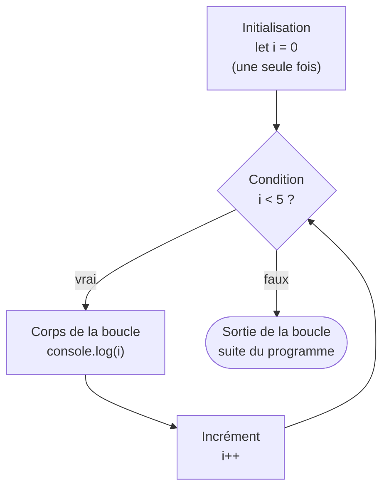
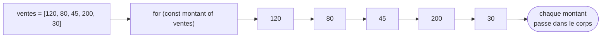

## Répéter sans se répéter

Jusqu'ici, tes programmes savaient **enchaîner** des instructions (séquence) et **choisir** un chemin (conditions). Il manque une chose essentielle quand on manipule des données : **répéter** une action plusieurs fois sans réécrire dix fois la même ligne.

Imagine additionner 3 ventes : `v1 + v2 + v3`, facile. Maintenant additionne 5 000 ventes. Tu ne vas pas taper 5 000 additions à la main. Tu veux dire à la machine : « pour **chaque** vente, ajoute-la au total ». C'est exactement ce qu'une **boucle** exprime.

> 🧠 **Rappel algo.** On appelle ça l'**itération** (ou répétition) : le troisième pilier de l'algorithmique, après la *séquence* (faire dans l'ordre) et le *branchement* (choisir). Une boucle exécute un même **bloc d'instructions** plusieurs fois, tant qu'une condition reste vraie. C'est ce qui rend un programme capable de traiter 3 comme 3 millions d'éléments avec le même code.

## La boucle `for` : quand tu sais compter les tours

La boucle `for` est la plus « cadrée » : elle réunit sur une seule ligne les trois choses dont toute répétition a besoin. On l'utilise quand on connaît (ou qu'on peut calculer) le **nombre de tours**.

```js
for (let i = 0; i < 5; i++) {
  console.log("Tour numéro", i)
}
// Affiche : Tour numéro 0, 1, 2, 3, 4
```

Décortiquons les trois parties, séparées par des `;` :

- **initialisation** `let i = 0` : exécutée **une seule fois**, au tout début. On crée un **compteur** `i` (nommé `i` par tradition, pour *index*).
- **condition** `i < 5` : évaluée **avant chaque tour**. Tant qu'elle est vraie, on entre dans le corps ; dès qu'elle est fausse, on sort de la boucle.
- **incrément** `i++` : exécuté **à la fin de chaque tour**. `i++` est un raccourci pour `i = i + 1` (on augmente le compteur de 1).

> **Attention, on part de 0.** La boucle affiche `0, 1, 2, 3, 4` — soit **5 tours**, mais le dernier `i` vaut `4`, pas `5`. C'est voulu : en informatique on **compte à partir de 0**, et tu verras au module suivant que les tableaux sont numérotés pareil. Retiens `i < 5` = « 5 tours, de 0 à 4 ».

### Le cycle d'un `for`, vu de haut

Le `for` semble compact, mais l'ordre d'exécution suit toujours le même cycle. Garde ce schéma en tête :



Lis la flèche qui remonte de l'incrément vers la condition : c'est **elle** qui crée la répétition. On teste, on exécute, on incrémente, **on re-teste**… jusqu'à ce que la condition devienne fausse.

## Deux usages fondamentaux : compteur et accumulateur

La plupart des boucles que tu écriras servent à l'un de ces deux buts.

**Un compteur** : on incrémente à chaque tour qui vérifie une règle (« combien de ventes dépassent 100 € ? »).

**Un accumulateur** : on cumule une valeur dans une variable déclarée **avant** la boucle (« le total des ventes »). C'est le patron le plus important pour un profil data.

```js
const ventes = [120, 80, 45, 200, 30]

let total = 0          // accumulateur : on part de 0
let grosses = 0        // compteur : on part de 0

for (let i = 0; i < ventes.length; i++) {
  total = total + ventes[i]        // on cumule le montant du tour
  if (ventes[i] > 100) {
    grosses = grosses + 1          // on compte les ventes > 100 €
  }
}

console.log("Total :", total)      // 475
console.log("Ventes > 100 € :", grosses)  // 2
```

Deux points de vigilance qui expliquent **pourquoi** on écrit ça comme ça :

- l'accumulateur est déclaré **avant** la boucle. *Pourquoi ?* S'il était déclaré à l'intérieur, il serait remis à `0` à chaque tour et n'accumulerait jamais rien.
- `ventes[i]` lit la case numéro `i` du tableau (revu en détail au prochain module) ; `ventes.length` donne le **nombre d'éléments**. Écrire `i < ventes.length` (plutôt que `i < 5`) rend la boucle **indépendante de la taille** : ajoute une vente, le code marche toujours.

> **Passerelle data (SQL / tableur).** Cet accumulateur, c'est ce que fait `SELECT SUM(montant), COUNT(*) FROM ventes WHERE montant > 100` — sauf que SQL le fait « en une phrase » et cache la boucle. En tableur, `=SOMME(B2:B6)` fait pareil. La boucle, c'est le **mécanisme sous le capot** de toute agrégation : parcourir les lignes et cumuler.

## La boucle `while` : quand tu ne sais pas combien de tours

Le `for` suppose qu'on sait compter les tours. Parfois non : on veut répéter **tant qu'**une condition reste vraie, sans savoir d'avance combien de fois. C'est le `while`.

```js
let solde = 100
let jours = 0

// On retire 30 € par jour tant qu'il reste de l'argent
while (solde >= 30) {
  solde = solde - 30
  jours = jours + 1
}

console.log("Tenu", jours, "jours, reste", solde, "€")
// Tenu 3 jours, reste 10 €
```

Ici on ne connaissait pas `jours` d'avance : il **dépend** du solde de départ. Le `while` est parfait pour ça — on décrit la **condition d'arrêt**, pas le nombre de tours.

## Le piège à comprendre : la boucle infinie

C'est LE piège du `while` (et parfois du `for`). Regarde ce code — **ne le lance pas tel quel** :

```js
// ⚠️ BOUCLE INFINIE — à ne PAS exécuter
let n = 0
while (n < 5) {
  console.log("Coincée...")
  // on a OUBLIÉ de faire évoluer n
}
```

*Pourquoi* tourne-t-elle sans fin ? Parce que `n` vaut toujours `0` : la condition `n < 5` reste **éternellement vraie**. Rien ne rapproche jamais la boucle de sa sortie. Le programme se fige (dans un navigateur, l'onglet peut planter).

**La règle, et son pourquoi :** dans toute boucle, quelque chose doit **faire progresser** l'état vers la condition d'arrêt. Dans un `for`, c'est l'incrément `i++` qui s'en charge automatiquement (d'où sa sécurité). Dans un `while`, **c'est à toi** de modifier la variable testée dans le corps :

```js
let n = 0
while (n < 5) {
  console.log("Tour", n)
  n++              // ✅ on fait progresser n → la sortie finira par arriver
}
```

> **Réflexe de sécurité.** Avant d'écrire un `while`, pose-toi la question : « quelle instruction, dans le corps, va rendre la condition fausse un jour ? » Si tu ne sais pas répondre, tu as probablement une boucle infinie. *(Rassure-toi : sur cette plateforme, chaque test tourne dans un environnement isolé avec un garde-fou anti-boucle-infinie — mais en vrai, une boucle infinie fige le programme.)*

## `for...of` : parcourir directement les éléments

Très souvent, on ne se soucie pas de l'index `i` : on veut juste **chaque élément** d'un tableau, l'un après l'autre. Le `for...of` fait exactement ça, en plus lisible.

```js
const ventes = [120, 80, 45, 200, 30]

let total = 0
for (const montant of ventes) {   // "pour chaque montant DANS ventes"
  total = total + montant
}
console.log("Total :", total)     // 475
```

Compare avec le `for` classique : plus de `i`, plus de `ventes[i]`, plus de risque de se tromper de borne. On lit littéralement « pour chaque `montant` **of** (parmi) `ventes` ». C'est le style à privilégier **quand tu n'as pas besoin de la position** — parce qu'il y a moins de pièces mobiles, donc moins de bugs.



> **Passerelle PHP/Python.** Tu retrouves une vieille connaissance : le `for...of` de JS ≈ le **`foreach ($ventes as $montant)`** de PHP et le **`for montant in ventes:`** de Python. Même idée : parcourir une collection élément par élément. *Nuance à connaître :* le `for...of` de JS parcourt les **valeurs** d'un tableau ; en Python `for x in liste:` fait pareil, mais `for x in dict:` parcourt les **clés** — les correspondances ne sont pas toujours exactes, on y reviendra avec les objets.

## Quelle boucle choisir ?

| Situation | Boucle conseillée | Pourquoi |
|---|---|---|
| Je connais le nombre de tours (ou j'ai besoin de l'index) | `for` | Compteur, condition et incrément regroupés et visibles |
| Je veux juste parcourir chaque élément d'un tableau | `for...of` | Plus lisible, moins de risque d'erreur d'index |
| Je répète tant qu'une condition tient, sans savoir combien de fois | `while` | On décrit la condition d'arrêt, pas le nombre de tours |

## À retenir

- Une **boucle** = **itération** : répéter un bloc tant qu'une condition est vraie. C'est le 3ᵉ pilier de l'algo (séquence, branchement, **itération**).
- **`for`** réunit **init → condition → corps → incrément**, et re-teste ; idéal quand on **compte** les tours (départ à **0**, `i < n` = n tours).
- Patrons clés : **accumulateur** (`total`, déclaré **avant** la boucle) et **compteur** — le mécanisme sous les `SUM`/`COUNT` de SQL.
- **`for...of`** parcourt directement les éléments (≈ `foreach` PHP / `for x in` Python) : à préférer quand l'index est inutile.
- **`while`** répète tant qu'une condition tient ; **danger de boucle infinie** si rien ne fait progresser vers la sortie — toujours prévoir ce qui rendra la condition fausse.
