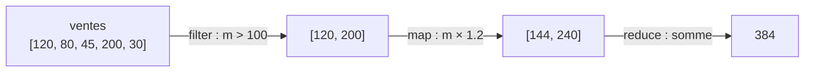

## Ranger plusieurs valeurs dans une seule variable

Une variable ordinaire contient **une** valeur. Mais dès qu'on manipule des données, on a besoin d'en ranger **plusieurs** ensemble : une liste de ventes, de villes, de catégories. C'est le rôle du **tableau** (*array*) — une collection **ordonnée** de valeurs, écrite entre **crochets** `[ ]`.

```js
const ventes = [120, 80, 45, 200, 30]
const villes = ["Paris", "Lyon", "Nice", "Brest"]
console.log(villes)          // ["Paris", "Lyon", "Nice", "Brest"]
```

> 🧠 **Rappel algo.** Un tableau est la structure de données la plus fondamentale : une **suite indexée** d'éléments rangés côte à côte, dans un ordre stable. « Indexée » veut dire que chaque case a un **numéro de position** (l'index) qui permet d'y accéder directement. C'est le support naturel de tout traitement de données en lot.

## L'index commence à 0

Voici le point qui surprend toujours à la reprise : la **première** case porte le numéro **0**, pas 1.


```js
const villes = ["Paris", "Lyon", "Nice", "Brest"]

console.log(villes[0])   // "Paris"  ← première case
console.log(villes[2])   // "Nice"
console.log(villes[3])   // "Brest"  ← dernière case
console.log(villes[4])   // undefined ← cette case n'existe pas
```

On accède à une case avec la **notation crochets** `villes[index]`. Retiens la conséquence directe : pour un tableau de `4` éléments, les index valides vont de **`0` à `3`**. La dernière case est donc à l'index `length - 1`, pas `length`.

*Pourquoi* commencer à 0 ? C'est un héritage technique (l'index est un « décalage » depuis le début du tableau : le premier élément est à un décalage de 0). Peu importe la raison profonde — ce qui compte, c'est le réflexe : **premier = 0, dernier = length - 1**. C'est aussi *pourquoi* les boucles `for` du module précédent démarrent à `let i = 0`.

## Connaître la taille : `.length`

`.length` donne le **nombre d'éléments**. Très utile pour parcourir ou pour trouver le dernier.

```js
const ventes = [120, 80, 45, 200, 30]

console.log(ventes.length)              // 5
console.log(ventes[ventes.length - 1])  // 30  ← le dernier élément
```

> **Passerelle data (tableur / SQL).** Un tableau, c'est une **colonne** de tableur (la plage `A2:A6`) ou l'ensemble des valeurs d'une colonne dans une table SQL. `.length` correspond au `COUNT(*)`. Et là où Excel numérote les lignes à partir de 1, JavaScript numérote les cases à partir de **0** — un décalage à garder en tête.

## Ajouter et retirer : `push` et `pop`

Un tableau `const` n'est **pas figé** : `const` empêche de réétiqueter la variable, mais on peut modifier son **contenu** (souviens-toi de valeur vs référence). Deux opérations très courantes :

```js
const panier = ["pain", "lait"]

panier.push("œufs")     // ajoute à la FIN
console.log(panier)     // ["pain", "lait", "œufs"]

const dernier = panier.pop()   // retire le DERNIER et le renvoie
console.log(dernier)    // "œufs"
console.log(panier)     // ["pain", "lait"]
```

- **`push(valeur)`** ajoute à la fin et renvoie la nouvelle longueur.
- **`pop()`** retire le dernier élément **et le renvoie** — pratique pour l'utiliser au passage.

> **Passerelle PHP/Python.** Le tableau JS correspond à l'**`array`** de PHP (créé avec `[]` ou `array()`) et à la **`list`** de Python (`[120, 80, 45]`). Les opérations se ressemblent : `push` ≈ `$arr[] = x` / `array_push()` en PHP et `liste.append(x)` en Python ; `pop` ≈ `array_pop()` en PHP et `liste.pop()` en Python. Ta mémoire de ces langages te resservira directement ici.

## Parcourir un tableau

On l'a vu au module Boucles : pour traiter chaque élément, on **itère**. Rappel des deux styles, du plus manuel au plus lisible.

```js
const ventes = [120, 80, 45, 200, 30]

// Style 1 — for classique : on a accès à l'index i
for (let i = 0; i < ventes.length; i++) {
  console.log("Vente n°" + i + " :", ventes[i])
}

// Style 2 — for...of : on récupère directement l'élément
for (const montant of ventes) {
  console.log("Montant :", montant)
}
```

Il existe une troisième voie, propre aux tableaux : **`forEach`**. On lui passe une **fonction** qui sera appelée pour chaque élément.

```js
const ventes = [120, 80, 45, 200, 30]

ventes.forEach((montant) => {
  console.log("Montant :", montant)
})
```

La syntaxe `(montant) => { ... }` est une **fonction fléchée** (vue en détail au module Fonctions) : lis-la comme « pour ce `montant`, fais ceci ». `forEach` appelle ta fonction une fois par élément. C'est le pont naturel vers les trois méthodes qui suivent.

## Douceur : `map`, `filter`, `reduce`

Voici les trois outils qui changent la vie quand on traite des données. Chacun **parcourt** le tableau (une boucle est cachée dedans) et répond à une question différente. On les découvre en douceur — tu les maîtriseras avec la pratique.

- **`map`** = *transformer* : produit un **nouveau** tableau de **même taille**, chaque élément transformé.
- **`filter`** = *garder* : produit un **nouveau** tableau **plus court**, en ne gardant que les éléments qui passent un test.
- **`reduce`** = *réduire* : condense tout le tableau en **une seule** valeur (souvent une somme). C'est le patron accumulateur, emballé dans une méthode.

```js
const ventes = [120, 80, 45, 200, 30]

// map : appliquer 20 % de TVA à chaque montant
const avecTva = ventes.map((m) => m * 1.2)
console.log(avecTva)   // [144, 96, 54, 240, 36]

// filter : ne garder que les ventes > 100 €
const grosses = ventes.filter((m) => m > 100)
console.log(grosses)   // [120, 200]

// reduce : additionner tous les montants (0 = valeur de départ)
const total = ventes.reduce((somme, m) => somme + m, 0)
console.log(total)     // 475
```

Le vrai pouvoir vient de les **enchaîner** : chacun renvoie un tableau (sauf `reduce`), donc on peut les mettre à la suite pour décrire un traitement complet, lu de gauche à droite comme une phrase.



```js
const ventes = [120, 80, 45, 200, 30]

const totalGrossesAvecTva = ventes
  .filter((m) => m > 100)      // garder les ventes > 100 €  → [120, 200]
  .map((m) => m * 1.2)         // ajouter 20 % de TVA        → [144, 240]
  .reduce((s, m) => s + m, 0)  // additionner                → 384

console.log(totalGrossesAvecTva)   // 384
```

> **Pourquoi préférer ce style à une boucle `for` ?** Parce qu'il est **déclaratif** : on décrit *ce qu'on veut* (« garder, transformer, additionner ») plutôt que la mécanique du parcours (index, bornes, accumulateur). C'est plus court, plus lisible, et chaque étape produit un tableau intact — on ne modifie pas l'original, donc moins de bugs. Une boucle `for` reste parfaite quand la logique est complexe ou qu'on a besoin de l'index ; les deux styles coexistent.

> **Passerelle data.** `filter` ≈ la clause `WHERE` d'un `SELECT` (garder des lignes) ; `map` ≈ une colonne calculée (`montant * 1.2 AS ttc`) ; `reduce` ≈ une agrégation (`SUM`, `COUNT`). Le pipeline `filter → map → reduce` ci-dessus se lit exactement comme `SELECT SUM(montant*1.2) FROM ventes WHERE montant > 100`. Même intention, autre notation.

## À retenir

- Un **tableau** `[ ]` range plusieurs valeurs **ordonnées** ; c'est une colonne de données en mémoire (≈ `array` PHP / `list` Python).
- **L'index commence à 0** : première case `t[0]`, dernière `t[t.length - 1]`. `.length` = nombre d'éléments.
- **`push`** ajoute à la fin, **`pop`** retire (et renvoie) le dernier ; le contenu d'un tableau `const` reste modifiable.
- On **parcourt** avec `for`, `for...of` ou `forEach`.
- **`map`** (transformer, même taille), **`filter`** (garder, plus court), **`reduce`** (condenser en une valeur) s'**enchaînent** en pipeline — le pendant de `SELECT … WHERE … SUM(…)`.
