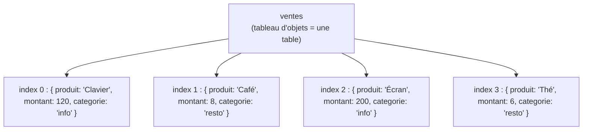

## Regrouper des informations qui vont ensemble

Un tableau range des valeurs **du même type** dans un ordre (des montants, des villes).
Mais souvent on veut décrire **une chose** avec plusieurs caractéristiques nommées : un
client a un *nom*, un *âge*, un statut *actif*… Les ranger dans un tableau
`["Ada", 42, true]` serait illisible (que veut dire la case `1` ?). On veut des **noms**,
pas des positions. C'est le rôle de l'**objet**, écrit entre **accolades** `{ }`.

```js
const perso = {
  nom: "Ada",
  age: 42,
  actif: true,
}
console.log(perso)   // { nom: "Ada", age: 42, actif: true }
```

Chaque ligne est une **paire clé/valeur** : la **clé** (`nom`, `age`, `actif`) est le nom
de l'information, la **valeur** (`"Ada"`, `42`, `true`) est son contenu.


> 🧠 **Rappel algo.** Un objet est un **dictionnaire** (ou *table d'association*) :
> une structure **clé → valeur**. Contrairement au tableau, on n'accède pas par une
> **position** (`0, 1, 2`) mais par un **nom** (`"nom"`, `"age"`). L'ordre n'a pas
> d'importance ; ce qui compte, c'est la correspondance clé → valeur. C'est la deuxième
> grande structure de données, à côté du tableau.

## Lire une valeur : `.cle` ou `["cle"]`

Deux notations, pour le même résultat.

```js
const perso = { nom: "Ada", age: 42, actif: true }

// Notation point (la plus courante, quand on connaît la clé à l'avance)
console.log(perso.nom)      // "Ada"
console.log(perso.age)      // 42

// Notation crochets (quand la clé est dans une variable, ou contient un espace)
console.log(perso["nom"])   // "Ada"

const champ = "age"
console.log(perso[champ])   // 42  ← la clé vient d'une variable
```

*Quand* utiliser l'une ou l'autre ? La notation **point** `perso.nom` est plus lisible et
s'utilise quand tu **connais** la clé en écrivant le code. La notation **crochets**
`perso[champ]` est indispensable quand la clé est **dynamique** (stockée dans une
variable) ou n'est pas un identifiant valide (une clé avec un espace, par exemple
`perso["date de naissance"]`). D'où la double notation.

## Ajouter et modifier des propriétés

Comme pour les tableaux, `const` fige l'**étiquette** de la variable, pas le **contenu** :
on peut ajouter et modifier des propriétés d'un objet `const`.

```js
const perso = { nom: "Ada", age: 42 }

perso.age = 43              // modifier une propriété existante
perso.ville = "Londres"     // ajouter une NOUVELLE propriété
delete perso.age            // supprimer une propriété

console.log(perso)          // { nom: "Ada", ville: "Londres" }
```

- assigner une clé **qui existe** → on la **modifie** ;
- assigner une clé **qui n'existe pas** → on la **crée** ;
- `delete perso.cle` → on la **retire**.

> **Passerelle PHP/Python.** Grande retrouvaille : l'objet JS correspond à l'**array
> associatif** de PHP (`['nom' => 'Ada', 'age' => 42]`) et au **`dict`** de Python
> (`{"nom": "Ada", "age": 42}`). Même idée de clé → valeur. Les accès se ressemblent :
> `perso["nom"]` en JS ≈ `$perso['nom']` en PHP ≈ `perso["nom"]` en Python. La notation
> point `perso.nom` est une facilité propre à JS (PHP/Python passent surtout par les
> crochets). Ta pratique des `dict` Python se transpose presque directement.

## Objets imbriqués

Une valeur peut elle-même être un objet (ou un tableau) : on **imbrique**. C'est ainsi
qu'on modélise des données réelles, souvent hiérarchiques.

```js
const commande = {
  numero: "CMD-1042",
  client: {
    nom: "Ada",
    ville: "Londres",
  },
  articles: ["clavier", "souris"],
}

console.log(commande.client.nom)     // "Ada"   ← on enchaîne les points
console.log(commande.articles[0])    // "clavier"
console.log(commande.articles.length)// 2
```

On **enchaîne** les accès : `commande.client.nom` = « dans `commande`, prends `client`,
puis dans `client` prends `nom` ». Un mélange d'objets (accès par clé) et de tableaux
(accès par index) permet de décrire n'importe quelle donnée structurée — c'est d'ailleurs
la forme du **JSON**, le format d'échange universel du web.

## Le cas roi pour la data : un tableau d'objets

Voici la structure que tu croiseras 90 % du temps quand tu manipuleras des données. Un
**tableau d'objets** : chaque objet est une **ligne** (un enregistrement), chaque clé est
une **colonne**. C'est, littéralement, une **table**.

```js
const ventes = [
  { produit: "Clavier", montant: 120, categorie: "info" },
  { produit: "Café",    montant: 8,   categorie: "resto" },
  { produit: "Écran",   montant: 200, categorie: "info" },
  { produit: "Thé",     montant: 6,   categorie: "resto" },
]
```



On combine alors **tout** ce qu'on a vu : parcourir le tableau (boucle) et lire les champs
de chaque objet (clé).

```js
const ventes = [
  { produit: "Clavier", montant: 120, categorie: "info" },
  { produit: "Café",    montant: 8,   categorie: "resto" },
  { produit: "Écran",   montant: 200, categorie: "info" },
  { produit: "Thé",     montant: 6,   categorie: "resto" },
]

// Total des ventes de la catégorie "info"
let totalInfo = 0
for (const vente of ventes) {
  if (vente.categorie === "info") {   // on lit une COLONNE de la ligne
    totalInfo += vente.montant        // on cumule une autre COLONNE
  }
}
console.log("Total info :", totalInfo)   // 320

// La même chose en style pipeline (module Tableaux)
const total2 = ventes
  .filter((v) => v.categorie === "info")
  .reduce((s, v) => s + v.montant, 0)
console.log("Total info (pipeline) :", total2)   // 320
```

> **Passerelle data (record / ligne de table).** Un objet `{ produit, montant, categorie }`
> **est** une ligne d'une table SQL (un *record*), et le tableau d'objets **est** le
> résultat d'un `SELECT * FROM ventes`. La boucle `if (v.categorie === "info")` reproduit
> un `WHERE categorie = 'info'`, et le `reduce` un `SUM(montant)`. Si tu penses « table de
> données », tu es déjà à l'aise avec les tableaux d'objets — c'est le même modèle mental.

## À retenir

- Un **objet** `{ }` regroupe des **paires clé/valeur** : on accède par **nom**, pas par
  position. C'est un **dictionnaire** (≈ array associatif PHP / `dict` Python).
- On lit avec `perso.cle` (clé connue) ou `perso["cle"]` (clé dynamique / spéciale) ; on
  ajoute/modifie en assignant, on retire avec `delete`.
- `const` fige l'étiquette, **pas** le contenu : un objet `const` reste modifiable.
- Les objets s'**imbriquent** (objets/tableaux dans des objets) — c'est la forme du JSON.
- Un **tableau d'objets** = une **table** : chaque objet est une **ligne** (record),
  chaque clé une **colonne**. On le traite avec boucle + accès aux champs, ou en pipeline
  `filter/map/reduce` — exactement un `SELECT … WHERE … SUM(…)`.
