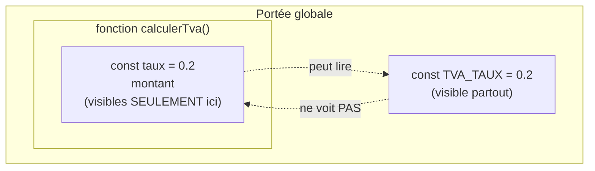

## Donner un nom à un bout de logique

Jusqu'ici, tu écrivais tes calculs « à la suite », dans un seul flot. Ça marche pour trois lignes. Mais dès qu'un même calcul revient à plusieurs endroits — appliquer une TVA, calculer une remise, formater un montant — tu te retrouves à **copier-coller** la même formule. Et le jour où la formule change (la TVA passe de 20 % à 21 %), tu dois la corriger partout… en espérant n'en oublier aucune.

La **fonction** résout ça. C'est un **bloc de code nommé**, écrit **une fois**, que tu peux **rappeler** autant de fois que tu veux. Tu écris la logique à un seul endroit ; tu la réutilises par son nom.

```js
function direBonjour() {
  console.log("Bonjour !")
}

direBonjour()   // "Bonjour !"
direBonjour()   // "Bonjour !"  ← rejouée, sans réécrire le code
```

Deux temps bien distincts, à ne jamais confondre :

- **déclarer** la fonction (le `function direBonjour() { ... }`) : on **décrit** ce qu'elle fait, sans l'exécuter. C'est comme écrire une recette dans un carnet.
- **appeler** la fonction (le `direBonjour()`, avec les parenthèses) : là seulement le code **s'exécute**. C'est cuisiner la recette.

> 🧠 **Rappel algo.** Une fonction, c'est de l'**abstraction** : on emballe une suite d'instructions sous un **nom** parlant, puis on raisonne avec ce nom sans se soucier du détail interne. C'est le mécanisme le plus puissant de tout l'algorithme, parce qu'il permet de **décomposer** un gros problème en petits morceaux nommés, testables et **réutilisables**. Sans fonctions, un programme n'est qu'un long ruban d'instructions impossible à relire.

## Paramètres et `return` : entrée → traitement → sortie

Une fonction sans entrée ni sortie sert peu. Sa vraie force : recevoir des **entrées** (les *paramètres*), faire un traitement, et **renvoyer** un résultat avec `return`. Vois-la comme une **machine** : quelque chose entre, quelque chose de transformé ressort.


```js
function prixTTC(ht, taux) {
  return ht * (1 + taux)
}

const prix = prixTTC(100, 0.2)   // ht = 100, taux = 0.2
console.log(prix)                // 120
```

Décortiquons ce schéma « entrée → traitement → sortie » :

- **`ht` et `taux`** sont les **paramètres** : des variables qui n'existent **que dans** la fonction, et qui reçoivent les valeurs qu'on donne à l'appel. Ici, à l'appel `prixTTC(100, 0.2)`, `ht` prend la valeur `100` et `taux` prend `0.2` — dans l'ordre, position par position. Ces valeurs qu'on passe à l'appel s'appellent les **arguments**.
- **`return`** définit la **sortie** : la valeur que la fonction « rend » à celui qui l'a appelée. Sans `return`, une fonction renvoie `undefined` (elle a fait quelque chose, mais n'a rien à rendre).
- **`const prix = prixTTC(...)`** capture cette sortie dans une variable, pour la réutiliser.

Point crucial sur `return` : **il arrête la fonction sur-le-champ.** Toute ligne écrite après un `return` exécuté ne tourne jamais. On s'en sert souvent pour traiter un cas particulier tôt et sortir :

```js
function appliquerRemise(montant, pourcentage) {
  if (pourcentage <= 0) {
    return montant          // pas de remise : on rend le montant tel quel, et on SORT
  }
  return montant * (1 - pourcentage / 100)
}

console.log(appliquerRemise(200, 10))   // 180  (10 % de remise)
console.log(appliquerRemise(200, 0))    // 200  (le return du haut a stoppé la fonction)
```

> **Passerelle PHP/Python.** Tu connais déjà ce concept ! En PHP c'est `function prixTTC($ht, $taux) { return ...; }`, en Python c'est `def prix_ttc(ht, taux): return ...`. Le mot-clé change (`function` vs `def`), la logique est **identique** : des paramètres entrent, un `return` sort. *Nuance data :* si tu penses SQL, une fonction JS ressemble à une **fonction stockée** ou à une colonne calculée réutilisable — un calcul nommé qu'on rappelle par son nom au lieu de le réécrire.

## Les fonctions fléchées `=>` : la version courte

Tu as déjà croisé cette syntaxe au module Tableaux (`ventes.map((m) => m * 1.2)`). C'est une **fonction fléchée** (*arrow function*) : une écriture plus courte, née pour les petites fonctions qu'on passe en argument (comme à `map`, `filter`, `forEach`).

```js
// Ces deux fonctions font EXACTEMENT la même chose :

function doubler(x) {
  return x * 2
}

const doublerFleche = (x) => x * 2

console.log(doubler(5))        // 10
console.log(doublerFleche(5))  // 10
```

Comment lire la version fléchée `(x) => x * 2` :

- avant la flèche `=>` : les **paramètres**, entre parenthèses ;
- après la flèche : le **corps**. Si c'est une seule expression, sa valeur est **automatiquement renvoyée** — pas besoin d'écrire `return`. C'est ce qu'on appelle le *return implicite*.

Si le corps a plusieurs lignes, on remet des accolades **et** le `return` redevient obligatoire :

```js
const prixTTC = (ht, taux) => {
  const ttc = ht * (1 + taux)
  return ttc                    // accolades → return explicite obligatoire
}
```

> **Passerelle PHP/Python.** La fonction fléchée, c'est le cousin de la **fonction anonyme / lambda**. En Python : `doubler = lambda x: x * 2`. En PHP : `$doubler = fn($x) => $x * 2` (l'*arrow function* de PHP 7.4+, dont JS s'est même inspiré côté syntaxe). Même usage : une mini-fonction jetable, souvent passée à une autre fonction. *Quand choisir ?* Nomme une fonction classique (`function`) pour la logique importante et réutilisée ; réserve la fléchée aux petits traitements passés en argument.

## Portée (scope) : où vit une variable ?

Voici une notion qui évite énormément de bugs. Une variable déclarée **dans** une fonction n'existe **que** dans cette fonction. On dit qu'elle est **locale** : elle naît quand la fonction démarre, meurt quand la fonction se termine, et le reste du programme ne la voit pas.

```js
function calculerTva(montant) {
  const taux = 0.2                 // `taux` est LOCAL à calculerTva
  return montant * taux
}

console.log(calculerTva(100))      // 20
console.log(taux)                  // ❌ ReferenceError : taux n'existe pas ici
```

*Pourquoi* cette règle, qui semble contraignante ? Parce qu'elle est une **protection**. Chaque fonction travaille dans sa propre bulle : ses variables internes ne peuvent pas écraser par accident celles d'une autre fonction. Imagine 50 fonctions utilisant chacune une variable `i` ou `total` : si elles partageaient toutes le même espace, ce serait le chaos. La portée locale garantit qu'une fonction est une **boîte étanche** — c'est ce qui rend le code prévisible.

Une variable déclarée **en dehors** de toute fonction est **globale** : visible partout. On en use avec parcimonie (une globale modifiable par tout le monde redevient une source de bugs).



Retiens la règle du sens de vue : l'**intérieur** d'une fonction peut lire ce qui est **au-dessus** (le global), mais l'extérieur ne peut **pas** voir ce qui est **à l'intérieur**.

## La pile d'appels : quand une fonction en appelle une autre

Une fonction peut en appeler une autre. Comment la machine s'y retrouve-t-elle ? Grâce à la **pile d'appels** (*call stack*). À chaque appel, la machine **empile** une fiche (« cadre ») décrivant l'appel en cours ; quand la fonction se termine, sa fiche est **retirée** et on reprend là où on s'était arrêté.

```js
function double(x) {
  return x * 2
}

function calculer(a, b) {
  return double(a) + b     // calculer appelle double
}

function main() {
  return calculer(5, 3)    // main appelle calculer
}

console.log(main())        // 13
```


Déroulons le film : `main()` démarre → il appelle `calculer()` (qui s'empile par-dessus) → `calculer` appelle `double()` (encore par-dessus). À ce moment précis, la pile contient les trois. Puis `double` finit **en premier** (il est au sommet), rend `10`, sa fiche disparaît ; `calculer` reprend, calcule `10 + 3 = 13`, rend et disparaît ; `main` reprend et rend `13`.

C'est le principe **LIFO** (*Last In, First Out*) : le **dernier** appelé est le **premier** terminé, comme une pile d'assiettes où on retire toujours celle du dessus.

> **Pourquoi tu vas rencontrer ce mot.** Quand une erreur survient, la console t'affiche la **stack trace** : la photo de cette pile au moment du crash. La lire, c'est retracer « qui a appelé qui » jusqu'au point de casse. On y revient en détail au module *Erreurs & débogage* — mais tu sais désormais ce qu'est cette pile.

## Décomposer un problème en petites fonctions

Tout se rejoint ici. Une grosse tâche (« calculer le total facturé d'un panier avec remise et TVA ») fait peur d'un bloc. Découpée en **petites fonctions à responsabilité unique**, elle devient une suite d'étapes simples, chacune testable à part.

```js
const appliquerRemise = (montant, pct) => montant * (1 - pct / 100)
const prixTTC = (ht) => ht * 1.2

function totalFacture(prixHt, remisePct) {
  const remise = appliquerRemise(prixHt, remisePct)   // étape 1 : la remise
  return prixTTC(remise)                              // étape 2 : la TVA
}

console.log(totalFacture(100, 10))   // 108  → (100 - 10 %) = 90, puis × 1.2 = 108
```

*Pourquoi* est-ce mieux qu'un seul gros calcul `prixHt * (1 - remisePct/100) * 1.2` ? Parce que chaque bout porte un **nom qui explique l'intention**, se **teste isolément** (« ma remise est-elle correcte ? »), et se **réutilise** ailleurs (`prixTTC` resservira pour d'autres calculs). Le jour où la TVA change, tu corriges **un seul** endroit. C'est exactement l'esprit du module Tableaux, où on avait découpé `ventesAuDessus` / `ajouterTva` / `totalGrossesTtc`.

## À retenir

- Une **fonction** = un bloc de code **nommé**, écrit une fois, **rappelé** autant qu'on veut. On **déclare** (on décrit) puis on **appelle** (on exécute, avec les parenthèses `()`).
- Modèle mental : une **machine entrée → sortie**. Les **paramètres** sont les entrées ; `return` définit la **sortie** et **arrête** la fonction aussitôt.
- La **fonction fléchée** `(x) => x * 2` est la version courte (return implicite si une seule expression) ≈ **lambda** Python / *arrow* PHP ; idéale pour les mini-fonctions passées à `map`/`filter`.
- La **portée** rend chaque fonction étanche : ses variables sont **locales** (invisibles dehors) — c'est une protection contre les collisions, pas une contrainte gratuite.
- Quand une fonction en appelle une autre, la **pile d'appels** empile/dépile les cadres (**LIFO**) ; c'est ce que montre une *stack trace* lors d'une erreur.
- **Décomposer** un problème en petites fonctions à responsabilité unique = code lisible, testable, réutilisable — le cœur de l'abstraction.
