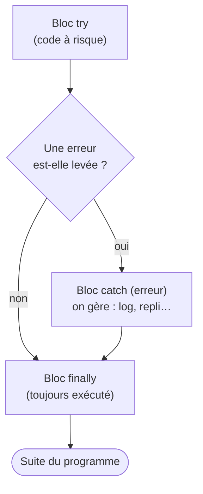

## Une erreur n'est pas un échec, c'est une information

Reprendre le code après deux ans, c'est aussi se réhabituer aux **messages rouges**. Bonne nouvelle : une erreur n'est pas une punition, c'est le programme qui te **parle**. Il te dit *quoi* n'a pas marché, *où*, et souvent *pourquoi*. Apprendre à **lire** ces messages, c'est la moitié du métier — un développeur passe autant de temps à déboguer qu'à écrire.

> 🧠 **Rappel algo.** On parle de **robustesse** : un bon algorithme ne se contente pas de marcher dans le cas idéal, il **anticipe les cas qui se passent mal** (donnée manquante, division par zéro, texte au lieu d'un nombre). Programmer, ce n'est pas seulement décrire le chemin heureux ; c'est aussi décider **quoi faire quand ça dérape**. Le reste du module est une boîte à outils pour ça.

## Les trois familles d'erreurs

Toutes les erreurs ne se ressemblent pas. Les classer aide à savoir **où** chercher.

### 1. Erreur de syntaxe — le code est mal écrit

Le programme ne démarre même pas : la grammaire du langage n'est pas respectée (parenthèse manquante, accolade oubliée). *Pourquoi* ça bloque tout ? Parce que la machine doit d'abord **comprendre** ton code avant de l'exécuter ; si la phrase est incompréhensible, elle refuse de commencer.

```js
// ❌ SyntaxError : parenthèse fermante manquante
function total(a, b {
  return a + b
}
```

### 2. Erreur d'exécution (*runtime*) — ça casse pendant que ça tourne

Le code est grammaticalement correct, il démarre… puis **plante en cours de route** sur une opération impossible : appeler une fonction qui n'existe pas, lire une propriété de quelque chose de `undefined`.

```js
// ❌ TypeError : ventes.toUpperCase n'est pas une fonction
const ventes = [120, 80]
console.log(ventes.toUpperCase())   // toUpperCase est fait pour du texte, pas un tableau
```

### 3. Erreur de logique — ça tourne, mais le résultat est faux

La plus **sournoise** : aucun message rouge, le programme s'exécute tranquillement… mais donne un **mauvais résultat**. *Pourquoi* est-ce la pire ? Parce que rien ne t'alerte : c'est à toi de repérer que « 475 » aurait dû être « 480 ».

```js
// ❌ Erreur de logique : aucun crash, mais la moyenne est FAUSSE
function moyenne(a, b, c) {
  return a + b + c / 3      // priorité oubliée : seul c est divisé par 3 !
}
console.log(moyenne(10, 20, 30))   // 40 au lieu de 20
```

| Famille | Quand ? | Message rouge ? | Où chercher |
|---|---|---|---|
| **Syntaxe** | avant le démarrage | oui | la ligne signalée (souvent juste avant) |
| **Exécution** | pendant l'exécution | oui | l'opération qui a planté (lis la *stack trace*) |
| **Logique** | jamais signalée | **non** | tes calculs, tes conditions — teste avec des cas connus |

> **Passerelle PHP/Python.** Cette classification est **universelle**, elle ne change pas d'un langage à l'autre. Python parle de `SyntaxError` (syntaxe) vs les exceptions à l'exécution comme `TypeError`/`ZeroDivisionError`, et les bugs logiques que **tes** tests doivent attraper. PHP idem (erreur d'analyse au parsing vs `Throwable` à l'exécution). Les mots changent, les trois familles sont les mêmes partout.

## Lire un message et une *stack trace*

Face à une erreur d'exécution, la console affiche deux choses précieuses. Prenons cet exemple :

```js
function double(x) {
  return x.montant * 2      // ← x n'a pas de propriété montant si x est un nombre
}
function traiter(vente) {
  return double(vente)
}
traiter(100)
```

La console dira quelque chose comme :

```
TypeError: Cannot read properties of undefined (reading 'montant')
    at double (script.js:2)
    at traiter (script.js:5)
    at script.js:7
```

Deux niveaux de lecture :

- **La première ligne** = le **type** et le **message** de l'erreur. `TypeError` te dit la famille ; « Cannot read properties of undefined » te dit *quoi* : on a voulu lire une propriété sur quelque chose qui n'existait pas. **Lis toujours cette ligne en premier**, elle contient l'essentiel.
- **Les lignes `at ...`** = la **stack trace** : la photo de la **pile d'appels** (souviens-toi du module Fonctions !) au moment du crash, du **plus profond** vers le plus haut. Ici : ça a cassé dans `double` (ligne 2), qui avait été appelé par `traiter` (ligne 5), lui-même appelé ligne 7. Tu remontes ainsi « qui a appelé qui » jusqu'à la vraie source.

> **Le réflexe.** La toute première ligne `at ...` pointe **où** ça a cassé ; c'est là que tu regardes en premier. La *stack trace* n'est pas du bruit : c'est un fil d'Ariane qui te ramène à la source.

## Attraper une erreur : `try` / `catch` / `finally`

Par défaut, une erreur d'exécution **stoppe** le programme. Souvent tu ne veux pas ça : si le parsing d'une ligne de ventes échoue, tu préfères **l'ignorer et continuer** avec les autres. Le bloc `try / catch` sert exactement à ça : « **essaie** ceci ; **si** ça casse, **attrape** l'erreur et fais autre chose au lieu de tout arrêter ».

```js
function montantEnNombre(texte) {
  try {
    const n = Number(texte)
    if (Number.isNaN(n)) {
      throw new Error("Montant invalide : " + texte)   // on DÉCLENCHE une erreur
    }
    return n
  } catch (erreur) {
    console.log("Souci :", erreur.message)              // on l'ATTRAPE
    return 0                                            // valeur de repli
  } finally {
    console.log("Tentative de conversion terminée.")    // TOUJOURS exécuté
  }
}

console.log(montantEnNombre("120"))    // 120  (bloc try réussi)
console.log(montantEnNombre("abc"))    // 0    (erreur attrapée, repli)
```

Le déroulé, bloc par bloc :

- **`try`** contient le code « à risque ». S'il se déroule sans erreur, `catch` est ignoré.
- **`catch (erreur)`** ne s'exécute **que** si une erreur a été levée dans le `try`. La variable `erreur` contient l'objet d'erreur ; `erreur.message` en donne le texte. C'est ici qu'on **gère** : logguer, renvoyer une valeur de repli, réessayer…
- **`finally`** s'exécute **dans tous les cas**, erreur ou pas. Utile pour du nettoyage (fermer un fichier, arrêter un chargement) qui doit avoir lieu quoi qu'il arrive.



Regarde bien le diagramme : **quel que soit** le chemin (erreur ou non), toutes les flèches passent par `finally`. C'est *pourquoi* on y met ce qui doit arriver « dans tous les cas ».

## Déclencher soi-même une erreur : `throw`

`throw` te laisse **signaler** un problème toi-même, au lieu d'attendre que la machine plante. *Pourquoi* le faire volontairement ? Parce qu'une fonction doit **refuser** une donnée absurde plutôt que de renvoyer un résultat faux en silence (souviens-toi : l'erreur de logique, la sournoise). Mieux vaut un `throw` clair maintenant qu'un `NaN` qui se propage partout.

```js
function diviser(a, b) {
  if (b === 0) {
    throw new Error("Division par zéro interdite")   // on refuse, avec un message clair
  }
  return a / b
}
```

`throw new Error("...")` interrompt la fonction (comme un `return`, mais en signalant un échec) et remonte la pile jusqu'à trouver un `catch`. Si personne n'attrape, le programme s'arrête avec ce message — au moins il est **explicite**.

> **Passerelle PHP/Python.** Tu retrouves une mécanique connue. En **Python** : `try: ... except Exception as e: ... finally: ...`, et on **lève** avec `raise ValueError("...")`. En **PHP** : `try { ... } catch (\Throwable $e) { ... } finally { ... }`, et on lève avec `throw new Exception("...")`. Le vocabulaire diffère un peu (`except` en Python vs `catch` ailleurs ; `raise` vs `throw`), mais le trio essayer / attraper / nettoyer est **identique**.

## Déboguer : `console.log` et la console de Chrome

Quand un résultat est faux (erreur de logique), l'outil n°1 reste le plus simple : **`console.log`**. On sème des affichages pour **voir l'état** des variables à chaque étape et repérer où la réalité diverge de ce qu'on attendait.

```js
function moyenne(notes) {
  let total = 0
  for (const n of notes) {
    total = total + n
    console.log("après", n, "→ total =", total)   // sonde : on suit l'accumulateur
  }
  console.log("total final :", total, "sur", notes.length, "notes")
  return total / notes.length
}
```

Rappel du module 1 : ces affichages apparaissent dans la **console de ton navigateur**. Dans **Chrome**, ouvre les DevTools avec **F12** (ou clic droit → *Inspecter*), puis l'onglet **Console** : c'est là que s'affichent tes `console.log` **et** les messages d'erreur en rouge (avec la *stack trace* cliquable).


> **Pourquoi `console.log` reste roi.** Il est immédiat, ne demande aucune configuration, et te montre la **vérité** de ce que contiennent tes variables — souvent différente de ce que tu **croyais**. La plupart des bugs de logique se résolvent en affichant deux ou trois valeurs au bon endroit. *(Sur cette plateforme, le `console.log` d'un test s'affiche juste sous ce test : c'est ta fenêtre sur l'exécution.)* Astuce : quand tu as fini, **retire** tes sondes de débogage pour ne pas polluer la console.

## À retenir

- Une erreur est une **information**, pas un échec : la **lire** est une compétence à part entière.
- **Trois familles** : **syntaxe** (mal écrit, ne démarre pas) · **exécution** (plante en cours) · **logique** (tourne mais résultat faux, **aucun message** — la plus sournoise).
- La **stack trace** est la photo de la **pile d'appels** au moment du crash : lis d'abord le **message**, puis remonte les `at ...` pour retrouver la source.
- **`try` / `catch` / `finally`** : *essaie* le code à risque, *attrape* l'erreur pour la gérer, *finally* s'exécute **dans tous les cas**. `throw` te laisse **signaler** toi-même une donnée invalide.
- Ce trio existe partout : `try/except`/`raise` (Python), `try/catch`/`throw` (PHP) — même idée, autres mots.
- Pour déboguer une logique fausse : **`console.log`** + la **console de Chrome** (F12 → *Console*). Sème des sondes, compare à ce que tu attendais, retire-les ensuite.
