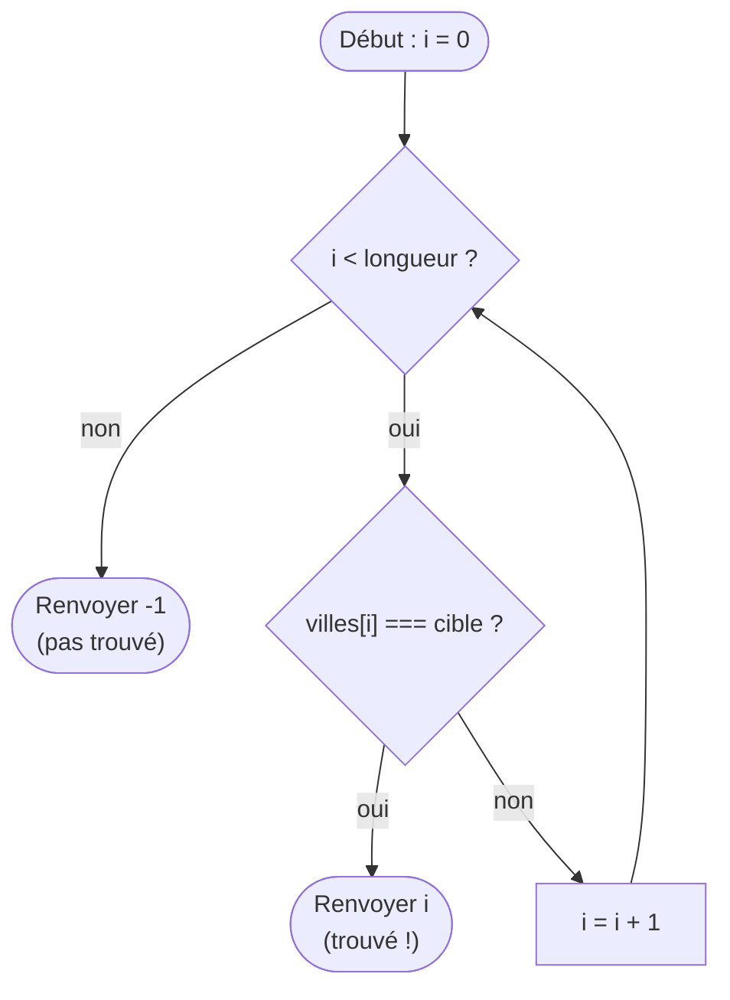
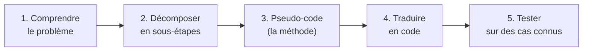

## Le langage n'est qu'un outil ; l'algorithme, c'est la pensée

Te voilà au bout du parcours. Tu sais déclarer des variables, brancher avec des conditions, répéter avec des boucles, ranger dans des tableaux et des objets, découper en fonctions, et gérer les erreurs. Ce module ne t'apprend pas une nouvelle syntaxe : il t'apprend à **assembler** tout ça pour **résoudre un problème**. C'est ça, un **algorithme** — une suite d'étapes claires qui transforme une entrée en un résultat.

> 🧠 **Rappel algo.** C'est LE module de synthèse. Un algorithme se raisonne **avant** de coder et **indépendamment** du langage : les mêmes idées (parcourir, comparer, accumuler, trier) se traduisent en JS, en Python ou en SQL. Retiens la hiérarchie : d'abord **comprendre le problème**, puis **décrire la méthode** (en français ou en pseudo-code), et **seulement ensuite** écrire le code. Coder sans avoir pensé l'algorithme, c'est construire sans plan.

## Décomposer, puis écrire en pseudo-code

Devant un problème qui fait peur (« analyser un jeu de ventes »), le premier réflexe n'est **pas** d'ouvrir l'éditeur. C'est de **décomposer** en sous-questions simples, puis de décrire la méthode en **pseudo-code** : du français structuré, sans se soucier de la syntaxe.

Exemple : « quel est le total des ventes dépassant 100 € ? »

```text
Pseudo-code :
  total ← 0
  Pour chaque vente dans la liste :
      Si le montant de la vente > 100 :
          total ← total + montant
  Renvoyer total
```

*Pourquoi* passer par là plutôt que coder directement ? Parce que le pseudo-code te force à **clarifier la logique** sans te noyer dans les points-virgules. Une fois la méthode juste sur le papier, la traduire en JS devient mécanique :

```js
function totalGrosses(ventes) {
  let total = 0
  for (const v of ventes) {
    if (v.montant > 100) {
      total = total + v.montant
    }
  }
  return total
}
```

Remarque comme le code **calque** le pseudo-code, ligne pour ligne. C'est le signe que tu as bien décomposé : le langage n'a fait que **traduire** une pensée déjà claire.

## Motif 1 : l'accumulation (agrégation)

Tu le connais déjà (module Boucles) : partir d'une valeur de départ et la faire grandir en parcourant les données. C'est le motif le plus courant en analyse de données — total, compte, max, min.

```js
const ventes = [120, 80, 45, 200, 30]

let total = 0
let max = ventes[0]        // on part du premier élément
for (const m of ventes) {
  total = total + m        // accumulation d'une somme
  if (m > max) {
    max = m                // accumulation d'un maximum
  }
}
console.log("total :", total, "— max :", max)   // total : 475 — max : 200
```

> **Passerelle data (SQL / pandas).** Ces motifs sont exactement les **agrégations** que tu écris en une ligne ailleurs. En SQL : `SELECT SUM(montant), MAX(montant) FROM ventes`. En pandas : `df["montant"].sum()`, `df["montant"].max()`. La différence est **conceptuelle** : SQL et pandas sont **déclaratifs** (tu décris *le résultat voulu*, l'outil s'occupe de la boucle), alors qu'ici tu écris la boucle **à la main**. Comprendre la boucle, c'est comprendre ce que ces outils font « sous le capot ».

## Motif 2 : la recherche

Chercher un élément dans une collection. Deux stratégies, selon que les données sont triées ou non.

### Recherche linéaire — parcourir jusqu'à trouver

La plus simple et la plus générale : on regarde **chaque** élément, l'un après l'autre, jusqu'à tomber sur le bon (ou arriver au bout).

```js
function trouverVille(villes, cible) {
  for (let i = 0; i < villes.length; i++) {
    if (villes[i] === cible) {
      return i          // trouvé : on renvoie sa position et on SORT
    }
  }
  return -1             // parcouru en entier sans trouver : convention -1
}

console.log(trouverVille(["Paris", "Lyon", "Nice"], "Lyon"))   // 1
console.log(trouverVille(["Paris", "Lyon", "Nice"], "Brest"))  // -1
```



*Pourquoi* renvoyer `-1` quand on ne trouve pas ? C'est une **convention** : un index valide est toujours `>= 0`, donc `-1` signale sans ambiguïté « absent ». Et remarque le `return i` **dans** la boucle : dès qu'on a trouvé, inutile de continuer — on sort immédiatement.

### Recherche dichotomique — couper en deux (données **triées**)

Si les données sont **déjà triées**, on peut être bien plus malin. Au lieu de tout parcourir, on regarde l'élément du **milieu** : s'il est trop grand, la cible est forcément dans la moitié **gauche** ; trop petit, dans la moitié **droite**. À chaque étape, on **élimine la moitié** des candidats.

```js
function chercheDichotomique(triee, cible) {
  let gauche = 0
  let droite = triee.length - 1
  while (gauche <= droite) {
    const milieu = Math.floor((gauche + droite) / 2)
    if (triee[milieu] === cible) {
      return milieu           // trouvé
    }
    if (triee[milieu] < cible) {
      gauche = milieu + 1     // trop petit : on jette la moitié gauche
    } else {
      droite = milieu - 1     // trop grand : on jette la moitié droite
    }
  }
  return -1                   // absent
}

console.log(chercheDichotomique([10, 30, 45, 80, 120, 200], 80))   // 3
```

C'est le réflexe du « plus grand / plus petit » quand tu cherches un mot dans un dictionnaire papier : tu ne lis pas page par page, tu ouvres au milieu et tu élimines une moitié. Condition **impérative** : les données doivent être **triées**, sinon « la cible est à gauche/droite » n'a aucun sens.

## Motif 3 : le tri (exemple simple)

Trier, c'est ranger dans l'ordre. Il existe des algorithmes de tri sophistiqués ; en voici un **simple à comprendre**, le tri par sélection : « je cherche le plus petit, je le mets devant ; je recommence sur le reste ».

```js
function triSelection(tableau) {
  const t = [...tableau]                 // copie : on ne modifie pas l'original
  for (let i = 0; i < t.length; i++) {
    let idxMin = i
    for (let j = i + 1; j < t.length; j++) {   // boucle DANS la boucle
      if (t[j] < t[idxMin]) {
        idxMin = j                       // on repère le plus petit du reste
      }
    }
    const tmp = t[i]                     // on échange t[i] et t[idxMin]
    t[i] = t[idxMin]
    t[idxMin] = tmp
  }
  return t
}

console.log(triSelection([120, 80, 45, 200, 30]))   // [30, 45, 80, 120, 200]
```

Remarque la **boucle dans une boucle** : pour **chaque** position `i`, on reparcourt tout le reste avec `j`. Retiens ce détail — il est la clé de la section suivante sur le coût. (En vrai, tu utiliseras `tableau.sort(...)`, prêt à l'emploi ; on écrit un tri à la main ici juste pour **comprendre** ce qui se passe dessous.)

## Le coût d'un algorithme : n contre n²

Deux algorithmes peuvent donner le **même résultat** mais coûter très différemment quand les données grossissent. C'est le sujet le plus important pour un profil data.

- **Coût linéaire (n)** : le travail grandit **proportionnellement** à la taille. Une simple boucle qui parcourt `n` éléments fait environ `n` opérations. Deux fois plus de données → deux fois plus de travail. Raisonnable.
- **Coût quadratique (n²)** : une **boucle dans une boucle** (comme le tri par sélection) fait environ `n × n` opérations. Là, **doubler** la donnée **quadruple** le travail (`2n → (2n)² = 4n²`).


Regarde la courbe rouge (n²) : elle démarre doucement puis **explose**. Concrètement : 10 éléments → 100 opérations, 1 000 éléments → **un million**. Pour un tableur de quelques lignes, aucune importance. Pour un jeu de données de plusieurs milliers de lignes, un algorithme en n² peut passer de « instantané » à « figé plusieurs secondes ».

> **Pourquoi ça te concerne directement.** En BI/data, tu manipules de **gros volumes**. Le réflexe à acquérir : quand tu écris une **boucle dans une boucle** sur les mêmes données, une alarme doit sonner — « attention, c'est du n², est-ce que ça passera à l'échelle ? ». Souvent, il existe une approche linéaire (un dictionnaire/objet pour retrouver une valeur en O(1) au lieu de re-parcourir). Tu n'as pas besoin de maîtriser la théorie ; il te faut juste le **réflexe** de repérer le n² et de te demander s'il est acceptable.

> **Passerelle data.** Une **requête SQL** est un **algorithme déclaratif** : tu décris le résultat (`SELECT ... WHERE ... GROUP BY ...`), et le moteur choisit *comment* le calculer (souvent bien mieux que ta boucle, grâce aux **index** — une structure qui évite le parcours linéaire). En **pandas**, `df.groupby(...).sum()` est une opération **vectorisée** optimisée en C. Dans les deux cas, l'algorithme existe toujours — il est juste **caché et optimisé** pour toi. Le comprendre te rend meilleur à écrire des requêtes efficaces.

## La démarche, en résumé

Face à n'importe quel problème, déroule toujours le même fil :



Et à l'étape 4, tu piochera dans ta boîte à motifs : **accumuler** (somme, compte, max), **rechercher** (linéaire ou dichotomique), **trier**, **filtrer/transformer** (les `filter`/`map`/`reduce` du module Tableaux). La plupart des problèmes ne sont que des **combinaisons** de ces briques.

## À retenir

- Un **algorithme** = une suite d'étapes qui transforme une entrée en résultat ; il se **pense avant** de coder et **indépendamment** du langage.
- Démarche : **comprendre → décomposer → pseudo-code → coder → tester**. Le pseudo-code clarifie la logique avant la syntaxe.
- Motifs clés à combiner : **accumulation** (somme/compte/max), **recherche linéaire** (parcourir), **recherche dichotomique** (couper en deux, données **triées**), **tri**, **filtrer/transformer**.
- **Coût** : une boucle simple = **linéaire (n)** ; une **boucle dans une boucle** = **quadratique (n²)** qui **explose** (doubler la donnée → ×4 le travail). Réflexe : repérer le n² sur de gros volumes.
- **SQL** = algorithme **déclaratif** (le moteur optimise via les index) ; **pandas** = opérations **vectorisées**. L'algo est toujours là, caché — le comprendre te rend meilleur à l'utiliser.
