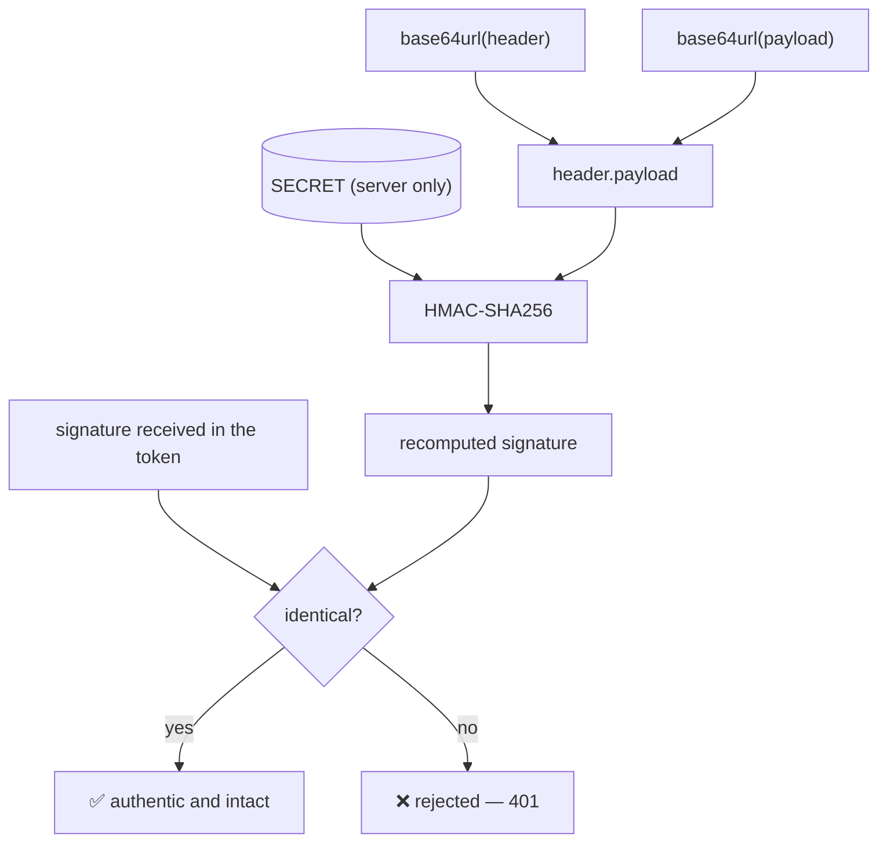

C'est le cœur du système. Le serveur calcule :

```
signature = HMAC_SHA256(
    base64url(header) + "." + base64url(payload),
    SECRET   // known to the server ONLY
)
```

À la réception, le serveur **recalcule** la signature à partir du header+payload reçus et de *son* secret, puis compare :

- Signatures **identiques** → le token est authentique et intact. ✅
- Signatures **différentes** → quelqu'un a bidouillé le payload (ou le secret est faux). ❌ Rejeté.

Un attaquant qui change `"role":"admin"` ne peut **pas** recalculer une signature valide : il n'a pas le secret. C'est ce qui rend le « tout sur le billet » sûr.

On ne fait **jamais confiance** au token : à chaque requête, on recalcule la signature et on compare.



> **HS256 vs RS256 (en une phrase) —** **HS256** = *secret partagé* (même clé pour signer et vérifier) — simple, parfait si c'est la même appli qui émet et vérifie. **RS256** = *paire clé privée/publique* — l'émetteur signe avec la privée, n'importe qui vérifie avec la publique. Utile quand plusieurs services doivent vérifier sans pouvoir émettre (microservices, SSO).
