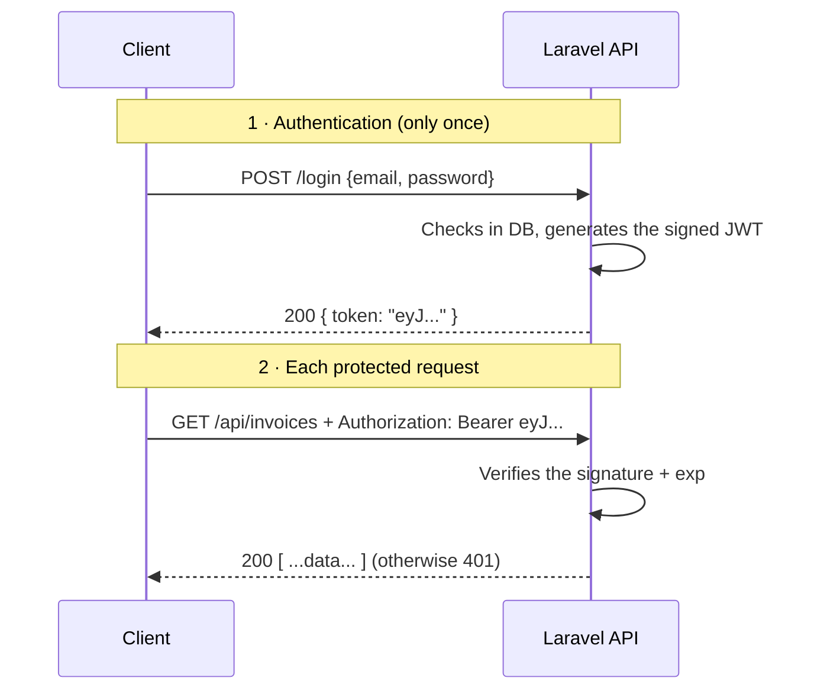

Le **login se fait une fois** ; ensuite chaque appel re-présente le token dans l'en-tête `Authorization`. C'est **sans session** : le serveur ne retient rien entre les requêtes.

> **⬢ Repère Laravel —** Tu n'extrais quasiment jamais le header à la main. Laravel le fait :
>
> - `$request->bearerToken()` récupère la valeur après `Bearer `.
> - Le **middleware** `auth:sanctum` ou `auth:api` sur une route fait toute la vérification et peuple `$request->user()`. Une route protégée, c'est juste :
>
> ```php
> Route::middleware('auth:sanctum')->get('/invoices', [InvoiceController::class, 'index']);
> ```
>
> Le middleware = exactement la place où vit la logique « lire le Bearer, vérifier, autoriser ou renvoyer 401 ».
