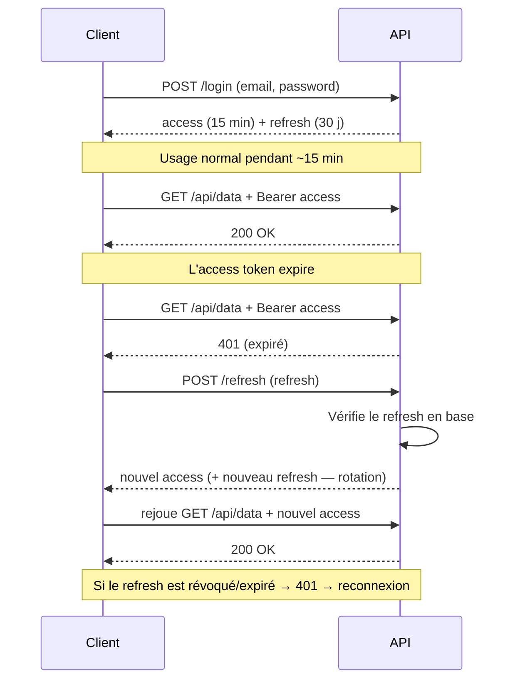

# 2bis. OAuth2 & Refresh Tokens (authentification)

On a vu qu'un JWT court a un défaut : **impossible à révoquer**, et s'il dure longtemps, un vol est catastrophique. La réponse moderne combine **deux tokens** et, pour la délégation entre applications, le protocole **OAuth2**.

## Le duo access token + refresh token

> **L'idée en une phrase —** Un **access token** court (5–15 min) sert à chaque requête. Quand il expire, on présente un **refresh token** long (jours/semaines), stocké en base et révocable, pour en obtenir un nouveau — **sans redemander le mot de passe**.

| | Access token | Refresh token |
| --- | --- | --- |
| Durée de vie | Très courte (5–15 min) | Longue (jours / semaines) |
| Usage | Envoyé à **chaque** requête (Bearer) | Uniquement pour renouveler l'access token |
| Forme typique | JWT autoporteur (stateless) | Chaîne opaque stockée en base |
| Révocable ? | Non (il expire vite, c'est sa sécurité) | **Oui** — on le supprime en base |

C'est le meilleur des deux mondes : la **performance stateless** du JWT au quotidien (pas de lookup DB à chaque appel), et la **révocation** via le refresh token (déconnexion, ban = on tue le refresh, et l'access mourra tout seul en quelques minutes).

Le client **renouvelle silencieusement** son access token : l'utilisateur ne voit rien.

> **⚠ Bonne pratique — rotation —** À chaque refresh, on émet aussi un **nouveau** refresh token et on invalide l'ancien (*refresh token rotation*). Si un ancien refresh réapparaît, c'est le signe d'un vol → on révoque toute la famille de tokens. Sans rotation, un refresh volé reste exploitable des semaines.
