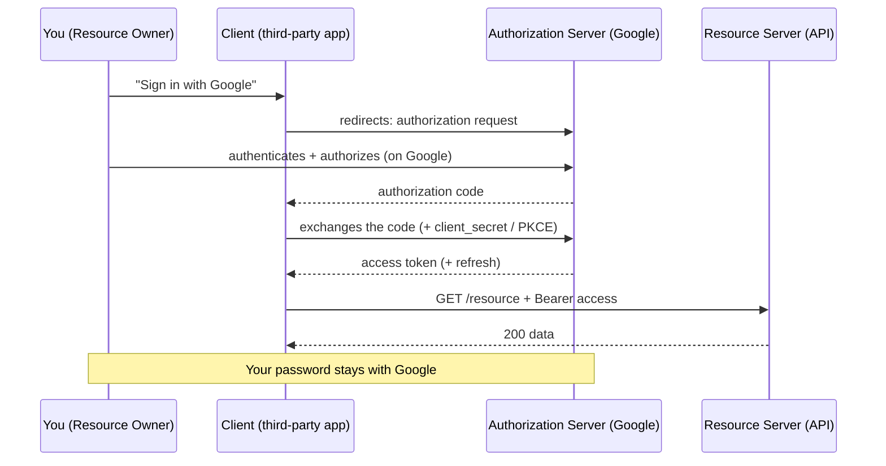

OAuth2 n'est pas « du login ». C'est un protocole de **délégation d'autorisation** : il permet à une appli tierce d'accéder à tes ressources **sans connaître ton mot de passe**. C'est le « Se connecter avec Google » : tu autorises l'appli, Google émet un token, l'appli l'utilise.

Le flux **Authorization Code** met en scène 4 rôles. Le mot de passe ne quitte **jamais** l'Authorization Server :



## Les « grant types » utiles à connaître

- **Authorization Code (+ PKCE)** — le standard pour SPA/mobile et « login social ». L'utilisateur s'authentifie sur le serveur d'autorisation, qui renvoie un *code* échangé contre un token. PKCE sécurise les clients publics.
- **Client Credentials** — pas d'utilisateur : une **machine appelle une autre machine** (service ↔ service). Parfait pour tes microservices qui s'appellent entre eux.
- **Password grant** — déconseillé / déprécié : l'appli manipule directement le mot de passe. À éviter sauf client 100 % de confiance.

> **⬢ Repère Laravel —**
>
> - **Laravel Passport** = un serveur OAuth2 complet clé en main : il gère les grant types, émet des **JWT (access)** + **refresh tokens**, et expose `/oauth/token`. C'est l'outil quand tu es l'*Authorization Server*.
> - **Laravel Socialite** = le côté *client* : « se connecter avec Google/GitHub », gère le flux Authorization Code pour toi.
> - **Sanctum** n'a pas de refresh token natif : on lui donne des tokens à expiration et on régénère via login. Pour du vrai OAuth2 (tiers, délégation), c'est Passport.
>
> Renouveler avec Passport, c'est un simple POST :
>
> ```http
> POST /oauth/token
> {
>   "grant_type": "refresh_token",
>   "refresh_token": "def502...",
>   "client_id": "3", "client_secret": "..."
> }
> // → { access_token, refresh_token, expires_in }
> ```
