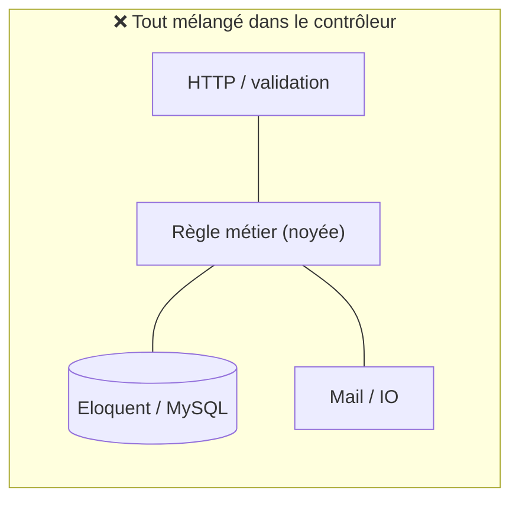

# 3. Architecture Hexagonale (sans DDD) (structure du code)

On change complètement de sujet : plus d'auth, on parle d'**organisation du code**. L'architecture hexagonale (aussi appelée **Ports & Adapters**, par Alistair Cockburn) répond à une seule obsession :

> **La règle d'or —** **Ta logique métier ne doit dépendre de RIEN d'externe.** Ni de Laravel, ni d'Eloquent, ni de MySQL, ni de HTTP. Le métier est au centre ; tout le reste (framework, DB, API) se branche **autour** et peut être remplacé sans toucher au centre.

## Le problème qu'on cherche à éviter

Dans un Laravel « classique », le contrôleur fait souvent tout :

```php
// ❌ Tout est mélangé : HTTP + métier + DB dans le même endroit
public function store(Request $request) {
    $request->validate(['montant' => 'required|numeric']);
    $facture = Facture::create($request->all());   // Eloquent direct
    Mail::to($request->email)->send(...);     // IO direct
    if ($facture->montant > 10000) { /* règle métier noyée ici */ }
    return response()->json($facture);
}
```

Problèmes : la **règle métier** (« au-dessus de 10000€ il faut une validation ») est noyée dans du HTTP et de l'Eloquent. Pour la **tester**, il faut une vraie DB et une fausse requête. Pour **changer de DB** ou exposer la même logique en CLI, tout casse.



*Le métier est collé au HTTP et à la DB : intestable et non réutilisable. L'hexagonal va **extraire le métier au centre** et repousser HTTP/DB autour (leçon suivante).*
