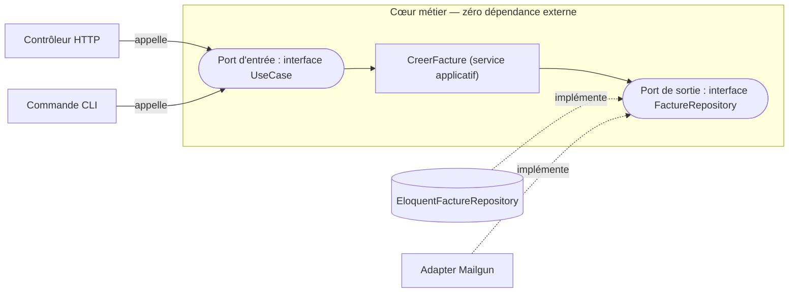

Les **adapters** (côté entrée *et* côté sortie) dépendent du cœur, jamais l'inverse — toutes les flèches pointent **vers le centre** :

*À gauche, les adapters **driving** (HTTP, CLI) qui déclenchent le métier ; à droite, les adapters **driven** (DB, mail) qui l'implémentent. Le cœur, au milieu, ne dépend que d'interfaces.*

- **Port** = une **interface** (un contrat). « Voici ce dont j'ai besoin / ce que j'offre. »
- **Adapter** = une **implémentation concrète** de ce contrat (Eloquent, HTTP, Mailgun…).
- **Port d'entrée (driving)** : ce qui *déclenche* le métier (HTTP, CLI, queue).
- **Port de sortie (driven)** : ce dont le métier *a besoin* (DB, mail, API tierce).

> **L'inversion de dépendance, le vrai secret —** Normalement « métier → utilise MySQL ». Ici on **inverse** : le métier définit l'interface `FactureRepository`, et c'est l'adapter Eloquent qui **dépend de cette interface**. La flèche de dépendance pointe vers le centre. Résultat : le centre ignore totalement Eloquent.
