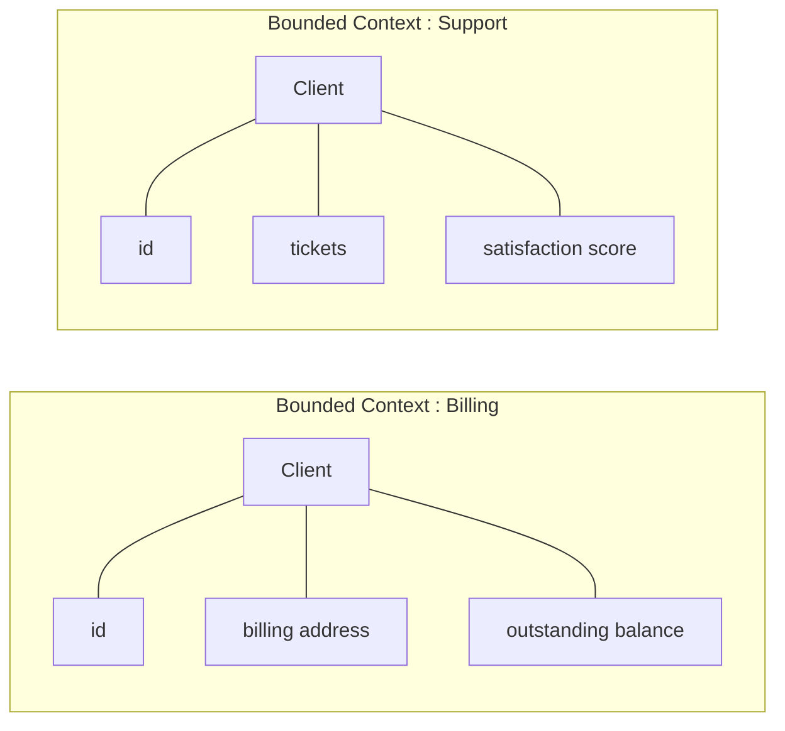

# 4. DDD — Domain-Driven Design (structure du code)

> **D'abord, lever la confusion —** **Hexagonal ≠ DDD.** L'hexagonal organise le code en *couches* (centre vs périphérie). Le DDD s'intéresse à **comment modéliser le métier lui-même**. On les combine souvent, mais on peut faire l'un sans l'autre. La section 3 était de l'hexagonal *sans* DDD.

Le DDD (Eric Evans) part d'un constat : sur un domaine **complexe**, le plus dur n'est pas la technique, c'est de **bien modéliser la réalité métier** et de parler le même langage que les experts métier.

> **Les 2 piliers du DDD —**
>
> - **Langage ubiquitaire** : développeurs et métier utilisent **exactement les mêmes mots**, et ces mots se retrouvent **dans le code**. Si le métier dit « clôturer une facture », il y a une méthode `$facture->cloturer()`, pas un `update(['status' => 3])`.
> - **Bounded Contexts** : on découpe le grand système en **contextes délimités**, chacun avec son propre modèle. Le mot « Client » ne veut pas dire la même chose en *Facturation* et en *Support* — donc deux modèles distincts.

## Exemple concret : le mot « Client » n'a pas un sens unique

Dans une même entreprise, deux équipes parlent du « Client » sans parler de la même chose :

Le *Client* de la Facturation porte son adresse de facturation et son encours ; le
*Client* du Support porte ses tickets et sa satisfaction. **Ce n'est pas la même
classe** : forcer un seul modèle « Client » universel obligerait chaque contexte à
trimballer des champs qui ne le concernent pas. Chaque **Bounded Context** a le droit
de définir *son* Client, avec *son* vocabulaire.

C'est là que le **langage ubiquitaire** entre en jeu : dans le contexte Facturation, si
le métier dit « clôturer une facture », le code a une méthode nommée exactement comme
le métier parle — `$invoice->close()`, pas un vague `update(['status' => 3])`. Le nom
de la méthode **est** la règle métier, lisible par un non-développeur.
