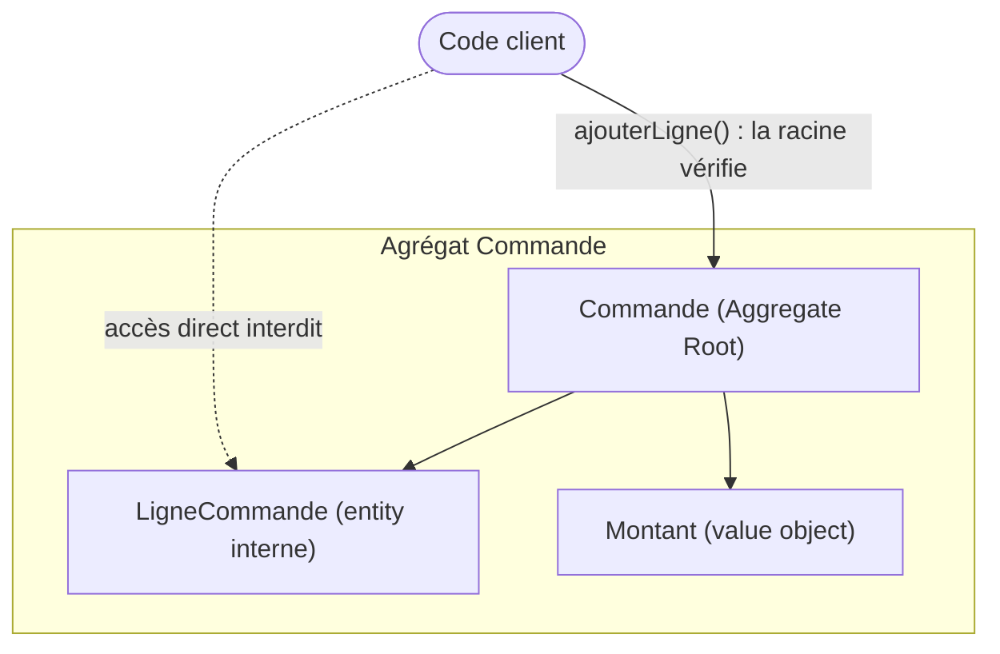

| Brique | C'est quoi | Exemple |
| --- | --- | --- |
| **Entity** | Objet avec une **identité** qui persiste dans le temps, même si ses attributs changent. | Une `Facture` (identifiée par son id). |
| **Value Object** | Objet **sans identité**, défini par sa valeur, **immuable**. Deux VO égaux si mêmes valeurs. | `Montant(100, 'EUR')`, `Email`, `Adresse`. |
| **Aggregate** | Grappe d'objets traitée comme un tout, avec une **racine** (Aggregate Root) seule porte d'entrée, garante des invariants. | `Commande` + ses `LignesCommande`. |
| **Repository** | Abstraction de persistance **par agrégat** (collection en mémoire fictive). | `CommandeRepository`. |
| **Domain Service** | Logique métier qui n'appartient à **aucune** entité en particulier. | `CalculTaxe` entre pays. |
| **Domain Event** | Fait métier **passé** qui intéresse le reste du système. | `FactureCloturee`. |

## Entity vs Value Object — l'exemple qui débloque

> **✗ Sans DDD (primitif) —**
>
> ```php
> // montant = float anonyme
> $facture->montant = -50.0;
> // devise ? négatif permis ?
> // validations éparpillées partout
> ```

> **✓ Avec un Value Object —**
>
> ```php
> final class Montant {
>   public function __construct(
>     public readonly int $cents,
>     public readonly string $devise
>   ) {
>     if($cents < 0)
>       throw new MontantNegatif();
>   }
> }
> ```

Le VO **concentre la règle** (« un montant ne peut pas être négatif ») en un seul endroit, et la rend **impossible à violer** : tu ne peux pas construire un `Montant` invalide. Plus de validation dispersée.

## L'agrégat protège les invariants

Le code client **ne touche jamais** les objets internes : il passe par la racine, qui valide chaque règle. C'est la racine qui garantit les invariants.



```php
class Commande {              // Aggregate Root
    private array $lignes = [];
    private Statut $statut;

    // On passe TOUJOURS par la racine — jamais $ligne directement
    public function ajouterLigne(Produit $p, int $qte): void {
        if ($this->statut->estValidee())
            throw new CommandeDejaValidee(); // invariant garanti
        $this->lignes[] = new LigneCommande($p, $qte);
    }
}
```

La règle « on ne modifie pas une commande validée » est **impossible à contourner** : on n'accède aux lignes que via la racine, qui vérifie. C'est ça « protéger les invariants ».
