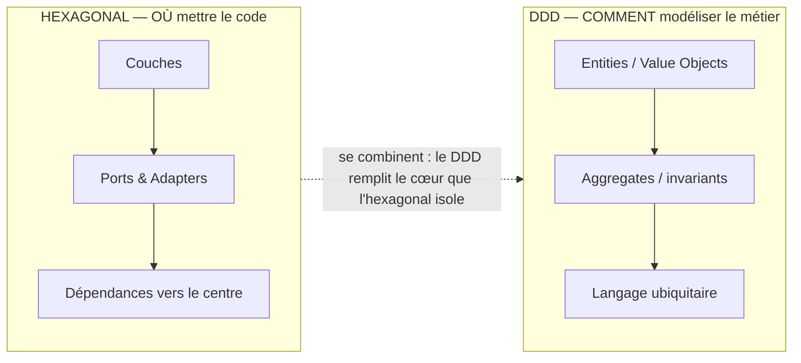
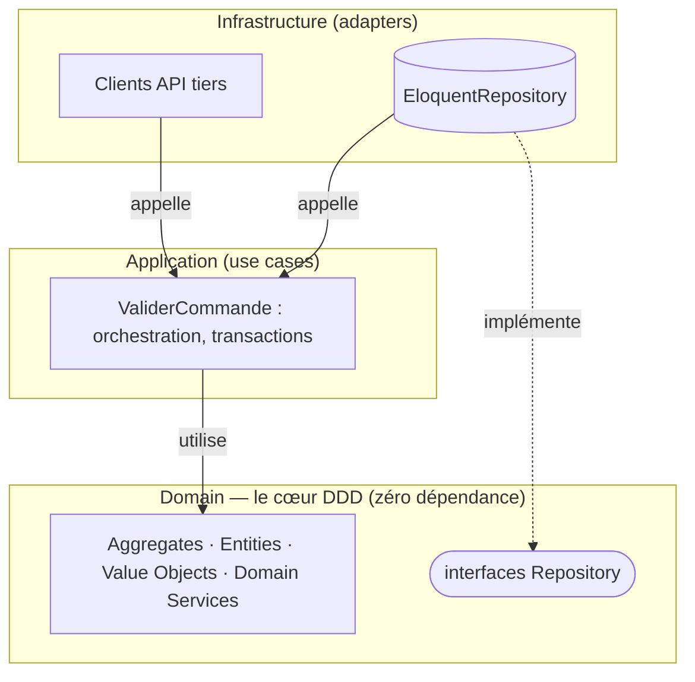

## D'abord, la différence en une image

Ce sont **deux questions différentes** — d'où la confusion. L'un dit *où* ranger le code, l'autre *comment* modéliser le métier :

*Tu peux faire de l'hexagonal sans DDD (section 3), et du DDD sans hexagonal. Mais réunis, l'hexagonal **range** et le DDD **remplit**.*

## Comment ils s'emboîtent

En pratique on superpose les deux : l'hexagonal donne les **couches**, le DDD remplit le **cœur** avec un modèle riche. Les dépendances pointent vers le centre ; le Domain est en DDD pur, sans aucune dépendance technique.

| | Hexagonal | DDD |
| --- | --- | --- |
| Répond à | *Où* mettre le code ? | *Comment* modéliser le métier ? |
| Apporte | Ports, Adapters, inversion de dépendance | Entities, VO, Aggregates, langage ubiquitaire, bounded contexts |
| Niveau | Structurel / technique | Conceptuel / métier |
| Sans l'autre ? | Oui (section 3) | Oui (mais souvent combiné) |

> **⚠ Le vrai coût du DDD —** Le DDD est **cher** : beaucoup de classes, mapping entre objets domaine et modèles Eloquent, courbe d'apprentissage de l'équipe. Il ne se justifie que si le **domaine est réellement complexe** (assurance, logistique, finance…). Pour un blog ou un CRUD, c'est de l'over-engineering : Eloquent + contrôleurs suffisent largement. **Le DDD se mérite par la complexité métier.**
