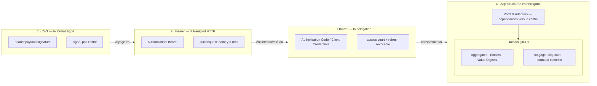

## Le voyage d'une requête, du token à l'agrégat

*Un JWT (format signé) **voyage** en Bearer dans l'en-tête HTTP ; ce token est **émis et renouvelé** via un flux OAuth2 (access court + refresh révocable) ; une fois authentifiée, la requête est **consommée** par une application rangée en hexagone (ports/adapters), dont le cœur est un domaine modélisé en DDD.*

> **Carte mentale —** La formation se résume en deux branches. **Auth** : *JWT* (3 parties header.payload.signature ; stateless / signé / lisible ; jamais de secret dans le payload) et *Bearer* (schéma HTTP Authorization ; transporte le token JWT ou opaque ; 401 si absent/invalide). **Architecture** : *Hexagonal* (ports = interfaces ; adapters = implémentations ; dépendances vers le centre ; sans DDD = classes simples) et *DDD* (langage ubiquitaire ; bounded contexts ; Entity / Value Object / Aggregate ; se mérite par la complexité).

> **Les 6 phrases à retenir —**
>
> 1. **JWT** = carte d'identité signée et autoporteuse ; lisible mais infalsifiable.
> 2. **Bearer** = l'enveloppe HTTP qui transporte le token, pas le token lui-même.
> 3. **Sanctum ≠ JWT** : tokens opaques en base (stateful), révocables mais avec lookup DB.
> 4. **Hexagonal** = le métier au centre, ne dépend de rien ; ports/adapters branchés autour.
> 5. **DDD** = modéliser le métier (entities, VO, aggregates) avec le langage des experts.
> 6. Les deux architectures **se méritent** : pas de sur-ingénierie sur un CRUD.

> **⬢ Pour aller plus loin côté Laravel —**
>
> - Émettre un vrai JWT à la main : `firebase/php-jwt`.
> - Voir le Service Container comme la « colle » ports↔adapters : `bind()` / `singleton()`.
> - Tester un use case sans DB en bindant un repository in-memory.
> - Décoder n'importe quel JWT pour comprendre : `jwt.io`.

Fin de la formation — relis les blocs **« ? »** que tu as ratés. 💪
