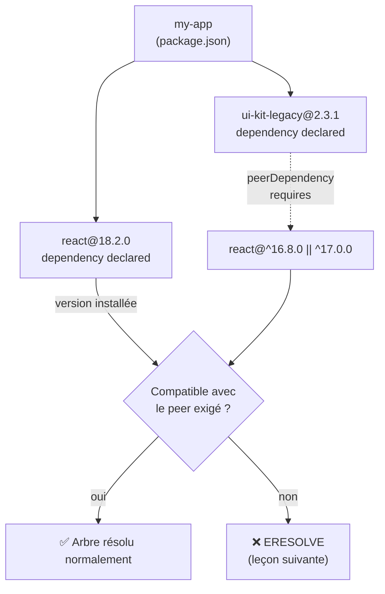

## Comment npm construit l'arbre

Quand tu lances `npm install`, npm ne se contente pas de lire ton `package.json` :
il télécharge **récursivement** le `package.json` de chaque dépendance, qui a
elle-même ses propres dépendances (« transitives »), et ainsi de suite. Le
résultat est un **arbre** que npm essaie ensuite d'**aplatir** dans un seul
`node_modules/` — une seule copie partagée par paquet quand c'est possible,
une copie imbriquée uniquement quand deux paquets ont besoin de versions
réellement incompatibles.

> **Passerelle Composer.** Composer fait la même résolution récursive
> (`require` en cascade), mais avec une différence structurelle de fond :
> Composer **refuse d'installer** si deux contraintes sont incompatibles — il
> te force à résoudre le conflit avant même de commencer. npm, historiquement
> plus permissif, préfère **imbriquer** plusieurs versions plutôt que
> bloquer. C'est une des raisons pour lesquelles `node_modules/` peut peser
> plusieurs centaines de Mo là où `vendor/` reste sobre.

## Rappel éclair : semver (`^`, `~`, exact)

Tu connais déjà `MAJOR.MINOR.PATCH` côté Composer — la règle est identique
côté npm :

| Préfixe | Exemple | Autorise |
|---|---|---|
| `^` (caret) | `^4.19.0` | tout `4.x.x` ≥ `4.19.0`, jamais `5.0.0` |
| `~` (tilde) | `~4.19.0` | tout `4.19.x` ≥ `4.19.0`, jamais `4.20.0` |
| exact | `4.19.0` | uniquement `4.19.0` |

> 💡 Si ce tableau n'est pas familier, la leçon **« Semver : `^`, `~` et
> package-lock.json »** du parcours Node.js le détaille avec plus de contexte.
> Ici, on va directement au piège spécifique que cette règle simple ne montre
> pas.

## Le piège que le tableau ci-dessus cache : les versions `0.x.y`

> ⚠️ **Erreur fréquente — croire que `^0.2.3` se comporte comme `^4.2.3`.**
> La convention semver considère qu'**avant la version `1.0.0`**, une
> bibliothèque n'a **aucune garantie de stabilité** — même un `MINOR` peut
> casser des choses. npm applique donc une règle spéciale au caret quand le
> `MAJOR` vaut `0` :

```text
^1.2.3   :=  >=1.2.3 <2.0.0     # normal : verrouille seulement le MAJOR
^0.2.3   :=  >=0.2.3 <0.3.0     # MAJOR = 0 : le caret verrouille aussi le MINOR !
^0.0.3   :=  >=0.0.3 <0.0.4     # MAJOR = 0 ET MINOR = 0 : verrouille même le PATCH
```

```js
// What "^" actually means, package by package
// (this is real npm/semver behavior, not a simplification)

// Case 1: MAJOR >= 1 -> classic caret, locks only MAJOR
// "^4.19.0" accepts 4.20.0, 4.99.9 -- rejects 5.0.0

// Case 2: MAJOR == 0, MINOR > 0 -> caret behaves like tilde (locks MINOR too!)
// "^0.2.3" accepts 0.2.4, 0.2.99 -- REJECTS 0.3.0 (surprise!)

// Case 3: MAJOR == 0, MINOR == 0 -> caret locks even PATCH (almost exact)
// "^0.0.3" accepts ONLY 0.0.3 -- rejects 0.0.4
```

Autrement dit : **plus le paquet est jeune (en `0.x.y`), plus `^` devient
strict** — jusqu'à devenir quasiment un pin exact en `0.0.z`. C'est une règle
que Composer n'a pas d'équivalent direct à te montrer, parce que la
convention « pré-1.0 = instable » n'y est pas encodée dans l'algorithme de
résolution de la même façon.

> **Réflexe à prendre.** Avant de fixer une dépendance en `^0.x.y`, vérifie
> avec `npm view <pkg> versions` si le mainteneur publie encore beaucoup de
> `0.x` — un simple `npm update` peut alors ne **rien** faire remonter alors
> que tu t'y attendais, ou au contraire ne pas suivre le paquet aussi
> largement que tu le penses.

## Les autres notations de plage que tu croiseras

```json
{
  "dependencies": {
    "left-pad": "1.3.0",
    "express": "^4.19.0",
    "lodash": "~4.17.0",
    "react": ">=18.0.0 <19.0.0",
    "some-tool": "*",
    "another-tool": "latest"
  }
}
```

| Notation | Sens | Danger |
|---|---|---|
| `>=18.0.0 <19.0.0` | plage explicite composée | rien de spécial, lisible |
| `*` | n'importe quelle version | ⚠️ aucune garantie, à éviter en `dependencies` |
| `latest` | toujours la dernière publiée | ⚠️ jamais reproductible, casse le principe même du lock |

> ⚠️ **Erreur fréquente — `*` ou `latest` dans un `package.json` commité.**
> Ces deux notations cassent la reproductibilité que `package-lock.json` est
> censé garantir : une CI qui régénère le lock à zéro peut récupérer une
> version publiée **hier**, jamais testée. Réserve `latest` à un usage
> ponctuel en ligne de commande (`npm install some-tool@latest`), jamais dans
> les dépendances déclarées.

## L'arbre, visuellement — et où naissent les conflits



`ui-kit-legacy` déclare qu'il a besoin de React 16 ou 17 pour fonctionner
(une **peer dependency**, pas une dépendance classique) — mais ton projet a
déjà React 18 installé. C'est exactement ce type de conflit que la prochaine
leçon détaille : l'erreur `ERESOLVE`.

## À retenir

- npm résout l'arbre **récursivement** puis **aplatit** `node_modules/` —
  contrairement à Composer, il peut imbriquer plusieurs versions plutôt que
  bloquer.
- `^`/`~` suivent semver, **mais** `^` devient strict sur les versions
  `0.x.y` (verrouille le MINOR, voire le PATCH) — un piège 100 % npm.
- Évite `*` et `latest` dans les dépendances **déclarées** : ça casse la
  reproductibilité que le lockfile est censé garantir.
- Les conflits naissent typiquement d'une **peer dependency** insatisfaite —
  sujet de la leçon suivante.
