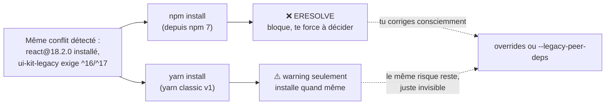

On reprend le conflit de la leçon précédente : `my-app` a `react@18.2.0`,
mais sa dépendance `ui-kit-legacy@2.3.1` exige un peer `react@^16.8.0 ||
^17.0.0`. Trois façons d'y répondre — une seule est vraiment recommandable en
premier réflexe.

## Option 1 — `--legacy-peer-deps` : le retour au comportement npm 6

```bash
npm install --legacy-peer-deps
```

Ça **désactive entièrement** la vérification des peer dependencies pour
toute l'installation — exactement le comportement d'avant npm 7. npm
installe `react@18.2.0` sans même regarder ce que `ui-kit-legacy` demande.

> ⚠️ **Erreur fréquente — croire que `--legacy-peer-deps` "règle" le
> problème.** Il ne règle rien : il **arrête de vérifier**. Si
> `ui-kit-legacy` utilise en interne une API de React 16 qui a disparu en
> React 18, le conflit existe toujours à l'exécution — simplement, npm ne te
> le dira plus à l'installation. Tu le découvriras peut-être en production,
> sous une forme bien moins claire qu'un message `ERESOLVE`.

Utile pour : débloquer une installation **rapidement**, en exploration, ou
en attendant une vraie mise à jour de `ui-kit-legacy` par son mainteneur.
À éviter comme réglage **permanent** en `.npmrc` (`legacy-peer-deps=true`) —
ça désactive le garde-fou pour **toute** l'équipe, silencieusement.

## Option 2 — `overrides` : la correction chirurgicale

Introduits en npm 8.3, les `overrides` forcent une version précise pour un
paquet donné, **y compris** au sein d'une dépendance transitive — sans
attendre que `ui-kit-legacy` publie une mise à jour.

```json
{
  "name": "my-app",
  "dependencies": {
    "react": "^18.2.0",
    "ui-kit-legacy": "^2.3.1"
  },
  "overrides": {
    "ui-kit-legacy": {
      "react": "$react"
    }
  }
}
```

`"$react"` référence la version **déjà déclarée** à la racine de
`dependencies` (ici `^18.2.0`) — pas besoin de la dupliquer en dur. Résultat :
npm force `ui-kit-legacy` à considérer que la `react@18.2.0` de la racine
convient, sans toucher au reste de l'arbre.

```bash
npm install    # re-resolves the tree with the override applied
```

> 💡 **À retenir.** `overrides` est **documenté dans le `package.json`
> commité** : toute l'équipe (et la CI) voit *quoi* est forcé et, si tu
> ajoutes un commentaire au-dessus dans un commit ou le README, *pourquoi*.
> C'est la différence essentielle avec `--legacy-peer-deps`, qui est une
> option de commande invisible dans le code.

| | `--legacy-peer-deps` | `overrides` |
|---|---|---|
| Portée | **toute** l'installation | le paquet ciblé, précisément |
| Visibilité | invisible (flag de commande, ou `.npmrc`) | visible dans `package.json`, committée |
| Bon pour | débloquer vite, exploration, en attendant l'amont | fix documenté, tenu dans le temps |
| Risque | masque **tous** les conflits, pas seulement celui-ci | peut casser `ui-kit-legacy` si l'API utilisée diffère vraiment entre React 17 et 18 (à re-tester) |

> **Réflexe à prendre.** Par défaut, préfère `overrides` : c'est explicite,
> localisé, et relu en revue de code. Réserve `--legacy-peer-deps` à un usage
> ponctuel, en ligne de commande, jamais figé dans un `.npmrc` commité.

## L'étude de cas : « quand j'utilise yarn, ça marche »

C'est une observation très répandue chez les devs qui migrent de Composer
vers npm — et elle a une explication précise, pas magique.

**Yarn classic (v1)** n'a **jamais** implémenté la vérification stricte des
peer dependencies que npm applique depuis sa version 7. Face au même
`ui-kit-legacy` exigeant React 16/17 alors que `react@18.2.0` est installé,
yarn v1 affiche :

```text
warning "ui-kit-legacy@2.3.1" has unmet peer dependency "react@^16.8.0 || ^17.0.0".
```

... et **installe quand même**, sans bloquer.

> ⚠️ **Erreur fréquente — confondre « yarn est plus intelligent » et « yarn
> vérifie moins ».** Ce n'est pas que yarn a résolu le conflit : il **ignore**
> le même conflit que npm te signale. `yarn install` qui « marche » là où
> `npm install` échoue produit, dans l'immense majorité des cas, **exactement
> le même résultat** que `npm install --legacy-peer-deps` : une installation
> qui se termine, avec un conflit non résolu, qui peut se révéler plus tard
> sous une forme bien moins lisible (`Invalid hook call`, comportement
> incohérent d'un composant...).



Ce n'est **pas** un jugement contre yarn : c'est un choix de conception
différent (voir le module 3 pour la comparaison complète npm/yarn/pnpm en
2026). Le vrai risque, c'est de traiter « passer à yarn » comme un **fix**
plutôt que comme un **contournement** — et de ne jamais revenir comprendre le
conflit réel.

> **Règle d'or, développée au module 3.** Ne mélange jamais npm et yarn sur
> le même projet (deux lockfiles = deux résolutions possibles = « ça marche
> chez moi, pas en CI »). Si tu bascules ponctuellement sur yarn pour
> « tester », ne commite jamais le `yarn.lock` généré à côté d'un
> `package-lock.json` existant.

## Les autres outils de diagnostic à connaître

```bash
npm outdated          # which installed packages have a newer version available?
npm dedupe             # try to flatten the tree: remove duplicate nested copies when compatible
```

```text
$ npm outdated
Package     Current  Wanted  Latest  Location
ui-kit-legacy  2.3.1   2.3.1    3.1.0  node_modules/ui-kit-legacy
```

`Wanted` = la version la plus haute **autorisée par ton `package.json`**
actuel ; `Latest` = la toute dernière publiée, même si ta plage ne l'autorise
pas encore. Ici, `ui-kit-legacy@3.1.0` (qui, en pratique, supporterait sans
doute React 18) existe déjà — la vraie correction est peut-être simplement
une mise à jour du paquet, pas un `override`.

## À retenir

- `--legacy-peer-deps` : désactive **toute** la vérification des peer deps —
  pratique en dépannage ponctuel, dangereux en réglage permanent.
- `overrides` : correction **chirurgicale**, documentée dans `package.json`,
  committée — le bon réflexe par défaut pour un fix durable.
- « yarn qui marche là où npm plante » = yarn **ignore** le même conflit que
  npm signale (yarn v1 ne bloque jamais sur les peer deps) : un pansement, pas
  un fix, sauf si tu as vérifié que le conflit est réellement sans
  conséquence.
- Avant tout fix : vérifie `npm outdated` — le paquet fautif a peut-être
  simplement une nouvelle version qui résout le conflit nativement.
