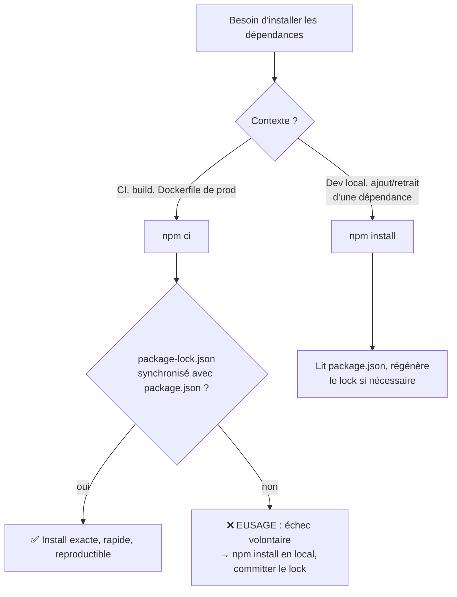

## Le rôle exact de `package-lock.json`

`package.json` déclare des **plages** (`^4.19.0`). `package-lock.json`
enregistre les **versions exactes** réellement résolues — y compris pour
chaque dépendance **transitive** — pour que `npm install` reproduise
**rigoureusement** la même arborescence sur toutes les machines.

> **Passerelle Composer.** Rôle identique à `composer.lock` : à **committer**
> systématiquement dans le dépôt Git, jamais dans `.gitignore`. Sans lock
> commité, chaque machine (la tienne, celle d'un collègue, la CI) peut
> résoudre des versions transitives légèrement différentes, avec des bugs qui
> n'apparaissent que sur l'une d'elles.

## `npm ci` vs `npm install` : pas juste un raccourci

```bash
npm install    # reads package.json, MAY update package-lock.json if needed
npm ci         # reads ONLY package-lock.json, installs EXACTLY what's locked,
               # wipes node_modules first, and NEVER modifies the lock
```

| | `npm install` | `npm ci` |
|---|---|---|
| Source de vérité | `package.json` (peut ajuster le lock) | `package-lock.json` **uniquement** |
| Si le lock est désynchronisé | le régénère silencieusement | **échoue** (garde-fou) |
| `node_modules/` existant | conservé, ajusté | **supprimé puis recréé** |
| Vitesse | normale | plus rapide (moins d'étapes de résolution) |
| Usage recommandé | développement local | **CI, build, déploiement** |

> **Passerelle Composer.** `npm ci` ≈ `composer install` (strict, piloté par
> le lock, jamais modifié). `npm install`, lui, a un comportement plus
> hybride : il peut **régénérer** le lock si `package.json` a changé (nouvelle
> dépendance ajoutée à la main, plage modifiée) — un entre-deux entre
> `composer install` et `composer update`. `npm ci` supprime cette ambiguïté :
> soit c'est synchronisé, soit ça échoue.

> **Réflexe à prendre.** En CI/CD et dans tout `Dockerfile` de production,
> utilise **toujours** `npm ci`, jamais `npm install`. Le gain n'est pas que
> la vitesse : c'est le **garde-fou**. `npm ci` refuse de deviner quoi que ce
> soit à ta place.

## Le drift de lockfile : le scénario qui plante « seulement en CI »

Un développeur ajoute une dépendance **directement dans `package.json`** (à
la main, sans lancer `npm install`), commit, et pousse. En local, tout
continue de fonctionner (`node_modules/` a déjà l'ancien état en cache). En
CI, `npm ci` échoue :

```text
npm ERR! code EUSAGE
npm ERR!
npm ERR! `npm ci` can only install packages when your package.json and
npm ERR! package-lock.json or npm-shrinkwrap.json are in sync. Please update
npm ERR! your lock file with `npm install` before continuing.
npm ERR!
npm ERR! Missing: dayjs@1.11.10 from lock file
```

> 💡 **À retenir.** Ce n'est **pas** un bug de la CI : `npm ci` fait
> exactement ce qu'on lui demande — refuser d'installer quoi que ce soit tant
> que `package.json` et `package-lock.json` ne racontent pas la même
> histoire. Le message dit littéralement quoi faire : lancer `npm install` en
> local, puis committer le `package-lock.json` mis à jour.

```bash
# Fix: locally, resync the lock with package.json, then commit BOTH files
npm install
git add package.json package-lock.json
git commit -m "chore: add dayjs dependency"
```

## Le flux de décision



## À retenir

- `package-lock.json` fige les versions **exactement résolues**
  (≈ `composer.lock`) : à committer, toujours.
- `npm ci` : lecture **stricte** du lock, échoue si désynchronisé, supprime et
  recrée `node_modules/` — le réflexe CI/prod.
- `npm install` : plus tolérant, peut **régénérer** le lock — le réflexe dev
  local.
- Un lockfile désynchronisé (dépendance ajoutée à la main, sans
  `npm install`) plante en CI, jamais en local — ce n'est pas un hasard, c'est
  exactement le garde-fou que `npm ci` est censé fournir.
