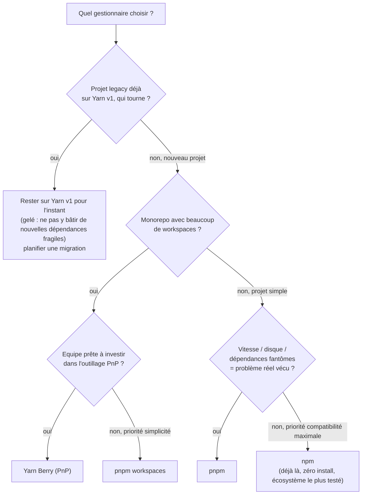

## Le flux de décision



**En résumé, honnêtement :**

- **npm** : le choix par défaut raisonnable pour la plupart des projets —
  zéro installation, compatibilité maximale avec absolument tous les outils
  et tutoriels. Pas de raison de migrer si tu n'as pas de problème concret.
- **pnpm** : souvent **le vrai bon choix** en 2026 dès que tu gères plusieurs
  projets Node sur la même machine (le store partagé économise réellement de
  l'espace disque et du temps d'installation) ou que tu veux éliminer les
  dépendances fantômes par construction. Résolution aussi stricte que npm
  7+, donc pas de surprise côté peer dependencies.
- **Yarn Berry (PnP)** : pertinent pour un **gros monorepo**, si l'équipe est
  prête à adapter son outillage (bundlers, IDE) à l'absence de
  `node_modules/`.
- **Yarn classic (v1)** : ne pas **démarrer** de nouveau projet avec — gelé,
  sans nouvelle fonctionnalité de sécurité. Sur un projet existant qui
  tourne déjà dessus, migrer n'est pas toujours urgent, mais à planifier.

## La règle d'or : un projet, un gestionnaire, un lockfile committé

> ⚠️ **Erreur fréquente — mélanger npm et yarn "juste pour tester" sur un
> projet.** Si `package-lock.json` **et** `yarn.lock` coexistent dans le
> dépôt, chaque outil résout l'arbre **indépendamment**, potentiellement
> avec des versions transitives différentes. Résultat classique : « ça marche
> chez moi (avec yarn), pas en CI (qui utilise npm) » — le symptôme exact du
> fil rouge du module 1, mais version lockfiles.

```bash
# Confirm you have exactly ONE lockfile committed
git ls-files | grep -E 'package-lock\.json|yarn\.lock|pnpm-lock\.yaml'
# -> should print exactly ONE line
```

## Migrer proprement, d'un gestionnaire à l'autre

```bash
# 1) Remove EVERY trace of the previous manager
rm -rf node_modules package-lock.json yarn.lock

# 2) Let pnpm reconstruct an equivalent lockfile from the OLD one,
#    preserving already-resolved versions (avoids re-resolving from scratch)
pnpm import

# 3) Then install for real, with the new manager
pnpm install
```

`pnpm import` lit un `package-lock.json` (ou un `yarn.lock`) existant et
produit un `pnpm-lock.yaml` équivalent, en réutilisant les versions déjà
résolues plutôt que de tout recalculer — une migration bien plus sûre qu'un
simple `rm -rf` suivi d'un `install` à l'aveugle.

## Verrouiller le choix : `packageManager` + Corepack

Livré avec Node depuis la 16.9 (toujours marqué **expérimental**, à activer
manuellement — il n'est PAS actif par défaut), **Corepack** peut imposer, et
même télécharger automatiquement, la version exacte du gestionnaire déclarée
dans `package.json` :

```json
{
  "name": "my-app",
  "packageManager": "pnpm@9.1.0"
}
```

```bash
corepack enable          # one-time, per machine — installs the yarn/pnpm shims
pnpm install             # runs EXACTLY pnpm@9.1.0 (auto-downloaded), as pinned above
# running a DIFFERENT manager (e.g. `yarn`) in this project is blocked by Corepack
```

> ⚠️ **Erreur fréquente — croire que `corepack enable` protège `npm`.** Corepack
> ne shime, par défaut, que `yarn` et `pnpm` — **pas `npm`** (npm est déjà livré
> avec Node). Un `npm install` lancé par erreur dans un projet « pnpm » n'est donc
> PAS intercepté. Pour un garde-fou vraiment fiable, ne compte pas sur Corepack
> seul : ajoute un `preinstall` (voir ci-dessous).

> **Réflexe à prendre.** Ajoute le champ `packageManager` **et** un script
> `preinstall` qui bloque explicitement le mauvais outil, avec un paquet
> comme `only-allow` :

```json
{
  "scripts": {
    "preinstall": "npx only-allow pnpm"
  }
}
```

```text
$ npm install
> npx only-allow pnpm

  ██████╗ ██╗     ███████╗ █████╗ ███████╗███████╗
  Please use "pnpm install" to install dependencies.
  Other package managers are not allowed in this project.
```

Ainsi, un collègue qui tape `npm install` par réflexe (habitude d'un autre
projet) est **bloqué immédiatement**, avec un message clair — plutôt que de
générer silencieusement un second lockfile incohérent.

## À retenir

- Pas de gestionnaire "meilleur" universellement : **npm** par défaut,
  **pnpm** souvent le meilleur compromis en 2026 (vitesse, disque, pas de
  dépendances fantômes), **Yarn Berry** pour les gros monorepos qui
  investissent dans PnP, **Yarn v1** à ne plus démarrer sur un nouveau
  projet.
- **Un seul lockfile committé, toujours** — vérifie-le explicitement si tu
  reprends un projet inconnu.
- Migrer proprement : supprimer `node_modules/` + l'ancien lockfile, puis
  `pnpm import` (ou équivalent) pour repartir des versions déjà résolues.
- `packageManager` (Corepack) + `only-allow` en `preinstall` : la combinaison
  qui empêche mécaniquement qu'un deuxième gestionnaire s'installe par
  erreur.
