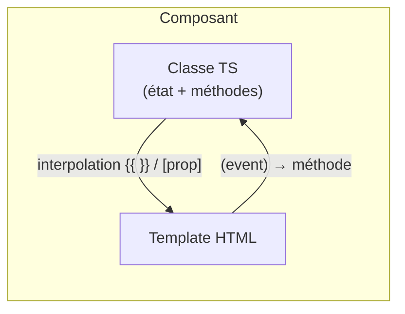

# Étape 1 — Angular : les bases

Le point de départ d'Angular : le **composant**, son **template** et le lien entre les deux via le **data binding**.

> **Objectif de l'étape —** comprendre comment un composant affiche des données, réagit aux interactions, et communique avec son parent et ses enfants.

## Au programme

- Le composant : décorateur `@Component`, template et classe
- Interpolation `{{ }}` et liaison de propriété `[prop]`
- Liaison d'événement `(event)` et `[(ngModel)]`
- Directives structurelles : `*ngIf`, `*ngFor`
- Communication parent/enfant : `@Input()` et `@Output()`

> **À noter —** les composants Angular **ne s'exécutent pas** dans le bac à sable des exercices (réservé à JS/TS pur, sans navigateur ni compilateur Angular). Les exercices interactifs porteront donc sur de la **logique TypeScript** ; le code propre aux composants sera présenté en **mode correction**.

## La mécanique d'Angular en une image

Angular est un framework **à composants** : l'écran est un arbre de composants, chacun couplant une **classe TypeScript** (l'état, la logique) à un **template HTML** (l'affichage). Le lien entre les deux, dans les deux sens, c'est le **data binding**.

- La classe **pousse** ses données vers le template : interpolation `{{ }}`, liaison de propriété `[prop]`.
- Le template **remonte** les actions de l'utilisateur vers la classe : liaison d'événement `(event)`.
- `[(ngModel)]` combine les deux pour les champs de formulaire.

On termine l'étape par la **communication entre composants** (`@Input` / `@Output`) — la même idée, mais entre un parent et son enfant.
