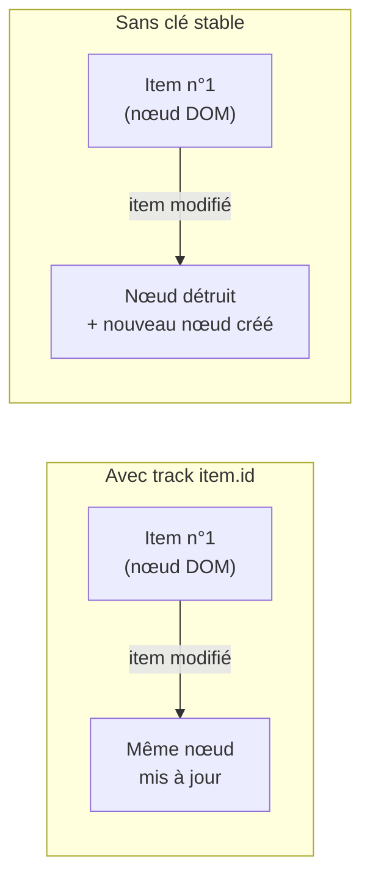

# Afficher conditionnellement et boucler

## Le control flow moderne (Angular 17+)

Depuis Angular 17, on écrit le rendu conditionnel et les listes avec une **syntaxe de bloc** intégrée au template : `@if`, `@for`, `@switch`. Pas d'import à faire, et c'est plus lisible.

### `@if` / `@else`

```ts
@Component({
  standalone: true,
  selector: 'app-status',
  template: `
    @if (user) {
      <p>Welcome, {{ user.name }}</p>
    } @else {
      <p>Please sign in.</p>
    }
  `,
})
export class StatusComponent {
  user: { name: string } | null = null
}
```

### `@for` (la clé `track` est obligatoire)

```html
<ul>
  @for (item of items; track item.id) {
    <li>{{ item.label }}</li>
  } @empty {
    <li>No items yet.</li>
  }
</ul>
```

`track item.id` indique à Angular comment **identifier** chaque élément pour ne re-rendre que ce qui change (perf). `@empty` gère le cas liste vide — pratique.

Quand la liste change (tri, ajout, item mis à jour), Angular compare les clés pour décider quel `<li>` **réutiliser**. Avec une clé stable (`item.id`), le nœud DOM existant est conservé : moins de travail, et l'état interne du nœud (focus, animation, formulaire en cours de saisie) survit. Sans clé stable, Angular ne peut pas relier l'ancien élément au nouveau : il **détruit puis recrée** le nœud, ce qui coûte en performance et efface tout état local.



### `@switch`

```html
@switch (status) {
  @case ('loading') { <p>Loading…</p> }
  @case ('error')   { <p>Something went wrong.</p> }
  @default          { <p>Ready.</p> }
}
```

## L'ancienne syntaxe : `*ngIf` / `*ngFor`

Tu la croiseras dans la plupart des bases de code existantes. Elle repose sur des **directives structurelles** (le `*`) et nécessite d'importer `CommonModule` (ou `NgIf`, `NgFor`).

```ts
import { CommonModule } from '@angular/common'

@Component({
  standalone: true,
  imports: [CommonModule],
  template: `
    <p *ngIf="user; else guest">Welcome, {{ user.name }}</p>
    <ng-template #guest><p>Please sign in.</p></ng-template>

    <ul>
      <li *ngFor="let item of items; trackBy: trackById">{{ item.label }}</li>
    </ul>
  `,
})
export class LegacyComponent {
  user: { name: string } | null = null
  items: { id: number; label: string }[] = []
  trackById(_index: number, item: { id: number }): number {
    return item.id
  }
}
```

| Besoin | Moderne (17+) | Ancien |
|---|---|---|
| Condition | `@if (x) { } @else { }` | `*ngIf="x; else tpl"` |
| Liste | `@for (x of xs; track x.id) { }` | `*ngFor="let x of xs; trackBy: fn"` |
| Choix multiple | `@switch` | `[ngSwitch]` |

> **À retenir —** pour du code neuf, utilise `@if` / `@for` / `@switch` : rien à importer, `@empty` inclus, `track` obligatoire (donc tu n'oublies plus la perf). Sache **lire** `*ngIf` / `*ngFor` car le legacy est partout.
