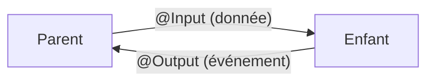

# Parent ↔ enfant : `@Input` et `@Output`

Comme en Vue : **les données descendent, les événements remontent**. Un parent passe des données à un enfant via `@Input`, l'enfant prévient le parent via `@Output`.



## `@Input` — recevoir une donnée du parent

```ts
import { Component, Input } from '@angular/core'

@Component({
  standalone: true,
  selector: 'app-badge',
  template: `<span class="badge">{{ label }}</span>`,
})
export class BadgeComponent {
  @Input() label = ''
  @Input({ required: true }) count!: number   // required since Angular 16
}
```

Le parent lie l'input comme une propriété :

```html
<app-badge [label]="'Inbox'" [count]="unread" />
```

## `@Output` — émettre un événement vers le parent

L'enfant expose un `EventEmitter`. Le parent s'y abonne avec la syntaxe `(event)`.

```ts
import { Component, Output, EventEmitter } from '@angular/core'

@Component({
  standalone: true,
  selector: 'app-delete-button',
  template: `<button (click)="onClick()">Delete</button>`,
})
export class DeleteButtonComponent {
  @Output() confirmed = new EventEmitter<void>()

  onClick(): void {
    this.confirmed.emit()        // notify the parent
  }
}
```

Côté parent :

```html
<app-delete-button (confirmed)="removeItem(item)" />
```

Pour transmettre une charge utile, on type l'`EventEmitter` :

```ts
@Output() rated = new EventEmitter<number>()
// ...
this.rated.emit(5)
```

## La règle d'or

Un `@Input` se lit, **il ne se mute pas** dans l'enfant. Si l'enfant veut changer quelque chose qui appartient au parent, il **émet** un événement et laisse le parent décider.

> **À retenir —** `@Input()` = entrée (parent → enfant), `@Output()` = sortie via `EventEmitter` + `.emit()` (enfant → parent). On ne modifie jamais un `@Input` directement : on remonte l'intention par un `@Output`.
