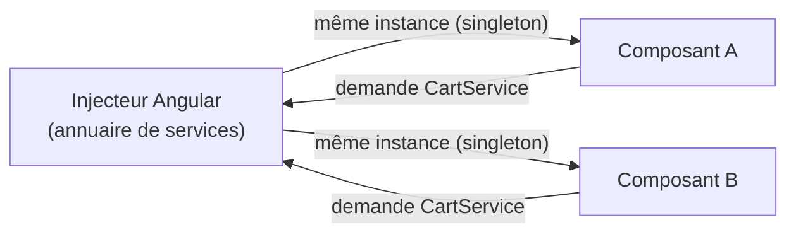

# Étape 2 — Services & injection de dépendances

Les composants affichent ; les **services** portent la logique métier et les données partagées. Angular les fournit aux composants via l'**injection de dépendances**.

> **Objectif de l'étape —** extraire la logique d'un composant vers un service, et le récupérer par injection plutôt que de l'instancier soi-même.

## Au programme

- Le service : décorateur `@Injectable`
- `providedIn: 'root'` et la portée des fournisseurs
- Injecter un service dans un composant (constructeur, `inject()`)
- Pourquoi la DI : testabilité, découplage, instance partagée

> **Rappel —** les classes de service Angular ne s'exécutent pas dans le bac à sable (réservé JS/TS pur). Les exercices interactifs porteront sur de la **logique TypeScript** ; les exemples de service seront présentés en **mode correction**.

## L'idée en une image

Un composant ne crée pas lui-même ce dont il a besoin (un service) : il le **demande**, et Angular le lui **fournit**. C'est l'inversion de contrôle.

Avec `providedIn: 'root'`, A et B reçoivent la **même** instance : c'est ainsi qu'on partage de l'état entre composants. Et comme la dépendance est injectée (et non codée en dur), on peut la **remplacer** par un faux en test.
