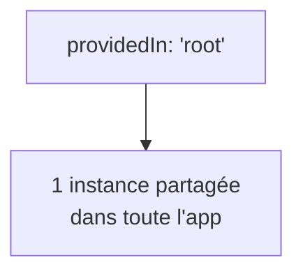

# Le service

Un service est une classe ordinaire qui porte de la **logique métier** ou de l'**état partagé**, hors des composants. On le marque avec `@Injectable`.

```ts
import { Injectable } from '@angular/core'

export interface Product {
  id: number
  name: string
  price: number
}

@Injectable({ providedIn: 'root' })
export class CartService {
  private items: Product[] = []

  add(product: Product): void {
    this.items.push(product)
  }

  total(): number {
    return this.items.reduce((sum, p) => sum + p.price, 0)
  }

  count(): number {
    return this.items.length
  }
}
```

## `providedIn: 'root'`

C'est la façon recommandée d'enregistrer un service. Elle signifie :

- **un seul** exemplaire (singleton) pour toute l'application : tous les composants qui l'injectent partagent le même `CartService`, donc le même panier ;
- **tree-shakable** : si personne ne l'injecte, il est éliminé du bundle final.



## Autres portées (pour info)

| `providedIn` / déclaration | Portée |
|---|---|
| `'root'` | Singleton global (le cas par défaut) |
| `providers: [X]` dans un composant | Une instance **par instance** de ce composant et ses enfants |

La portée composant est utile quand chaque instance d'un composant a besoin de **son propre** état isolé. Dans le doute, reste sur `'root'`.

## Pourquoi pas juste un objet importé ?

On pourrait écrire un singleton « à la main » avec un module exportant un objet. Mais on perdrait deux choses qu'Angular offre gratuitement : la possibilité de **substituer** le service en test, et une **portée** gérée par le framework. La DI, c'est précisément ce contrat.

> **À retenir —** `@Injectable({ providedIn: 'root' })` = service singleton, partagé et tree-shakable. C'est ton réglage par défaut pour tout service qui détient de l'état ou de la logique partagée.
