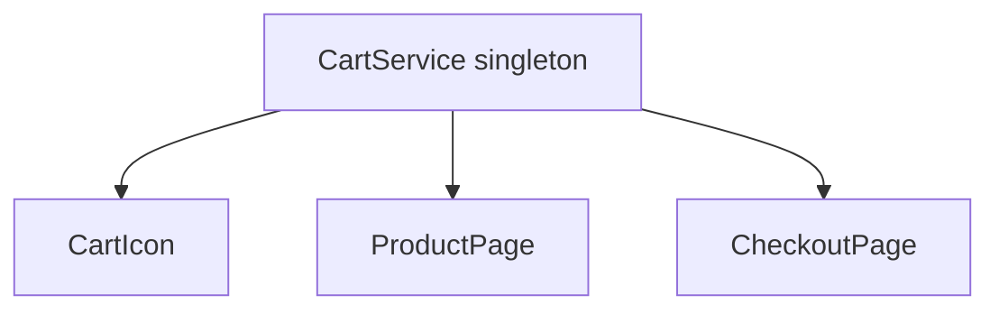

# Pourquoi s'embêter avec la DI ?

Tu connais le principe (master info) : **inversion de contrôle**. Le composant déclare *ce dont* il a besoin, pas *comment* le construire. Concrètement, Angular t'offre trois bénéfices.

## 1. Testabilité — substituer une dépendance

Comme le composant reçoit son service au lieu de l'instancier, on peut lui en passer un **faux** en test, sans réseau ni base de données.

```ts
// Component under test
@Component({ /* ... */ })
export class CheckoutComponent {
  private cart = inject(CartService)
  get total(): number {
    return this.cart.total()
  }
}
```

```ts
// In a unit test: provide a fake implementation
const fakeCart = { total: () => 99 } as CartService

TestBed.configureTestingModule({
  providers: [{ provide: CartService, useValue: fakeCart }],
})
// CheckoutComponent now uses fakeCart — deterministic, fast, offline
```

`{ provide: CartService, useValue: fakeCart }` dit : « quand quelqu'un demande `CartService`, donne-lui ceci ». Le composant ne voit pas la différence.

## 2. Découplage — dépendre d'un contrat, pas d'une implémentation

Le composant dépend du **type** `CartService`. On peut changer l'implémentation (panier en mémoire → panier persisté en API) sans toucher au composant, tant que l'interface tient.

## 3. Instance partagée — état cohérent

Un service `providedIn: 'root'` est un singleton : icône du panier, page produit et page de paiement lisent le **même** état. Pas de désynchronisation, pas de variable globale bricolée.



## Le revers à connaître

La DI a un coût d'abstraction : pour un petit utilitaire **pur et sans état** (ex. formater une date), une simple fonction exportée suffit — pas besoin d'un service. Réserve les services à l'**état partagé** et aux dépendances qu'on voudra **remplacer** (HTTP, stockage, horloge).

> **À retenir —** la DI rend le code **testable** (on injecte des faux), **découplé** (on dépend d'un type, pas d'un `new`) et permet l'**état partagé** via les singletons. Mais ne transforme pas chaque fonction pure en service : la DI sert ce qu'on veut substituer ou partager.
