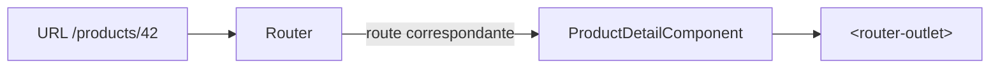

# Étape 3 — Routing

Une application Angular est une **single-page application** : le `Router` affiche le bon composant selon l'URL, sans recharger la page.

> **Objectif de l'étape —** déclarer des routes, naviguer entre les vues et lire les paramètres d'URL.

## Au programme

- Déclarer des routes (`Routes`) et `RouterOutlet`
- Navigation : `routerLink` et le service `Router`
- Paramètres de route et `ActivatedRoute`
- Routes enfants et lazy loading (aperçu)

> **Rappel —** le `Router` Angular ne s'exécute pas dans le bac à sable (réservé JS/TS pur). Les exercices interactifs porteront sur de la **logique TypeScript** (ex. analyse d'URL) ; la configuration des routes sera présentée en **mode correction**.

## Le routing en une image

L'URL est la **source de vérité** : le `Router` lit l'URL, trouve la route correspondante et affiche son composant dans le `<router-outlet>`. Naviguer, c'est changer l'URL — pas recharger la page.

