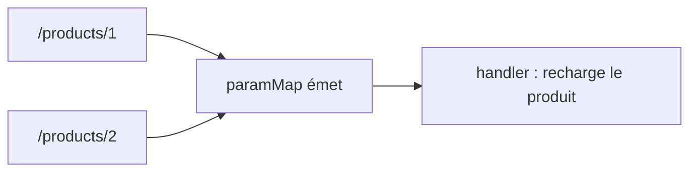

# Lire les paramètres d'URL

Une route `products/:id` capture un `id`. Le composant le lit via le service `ActivatedRoute`.

## Snapshot : la valeur au moment de l'arrivée

Le plus simple quand le composant est (re)créé à chaque navigation :

```ts
import { Component, inject, OnInit } from '@angular/core'
import { ActivatedRoute } from '@angular/router'

@Component({ /* ... */ })
export class ProductDetailComponent implements OnInit {
  private route = inject(ActivatedRoute)
  id = ''

  ngOnInit(): void {
    // route params/:id and ?ref=... query param
    this.id = this.route.snapshot.paramMap.get('id') ?? ''
    const ref = this.route.snapshot.queryParamMap.get('ref')
    console.log('product id:', this.id, 'ref:', ref)
  }
}
```

`paramMap.get('id')` lit le paramètre de chemin ; `queryParamMap.get('ref')` lit un query param. Tous deux renvoient `string | null`.

## Observable : réagir aux changements **sans** recréer le composant

Problème classique : si on navigue de `/products/1` à `/products/2`, Angular **réutilise** le même composant — `ngOnInit` (et donc le snapshot) ne se rejoue pas. Il faut alors s'abonner au flux :

```ts
ngOnInit(): void {
  this.route.paramMap.subscribe((params) => {
    this.id = params.get('id') ?? ''
    this.loadProduct(this.id)     // re-fetch when :id changes
  })
}
```



| Cas | Choix |
|---|---|
| Le composant est recréé à chaque route | `snapshot` (simple) |
| On navigue entre deux paramètres de la **même** route | s'abonner à `paramMap` |

> **À retenir —** `ActivatedRoute` donne accès aux paramètres : `snapshot.paramMap.get('id')` pour la valeur figée, ou l'observable `paramMap.subscribe(...)` pour réagir quand seul le paramètre change (même composant réutilisé). `paramMap` = chemin, `queryParamMap` = `?clé=valeur`.
