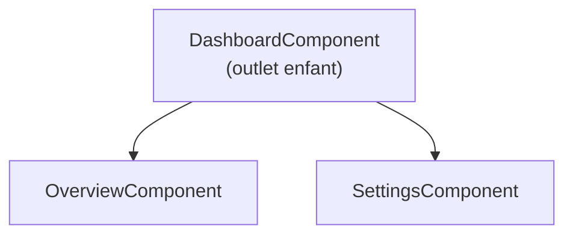

# Routes enfants et chargement différé

## Routes enfants

Une section avec sa propre navigation interne (ex. un tableau de bord avec onglets) se modélise avec des routes **enfants** : un composant parent expose son propre `<router-outlet>`.

```ts
export const routes: Routes = [
  {
    path: 'dashboard',
    component: DashboardComponent,     // has its own <router-outlet>
    children: [
      { path: '', redirectTo: 'overview', pathMatch: 'full' },
      { path: 'overview', component: OverviewComponent },
      { path: 'settings', component: SettingsComponent },
    ],
  },
]
```

- `/dashboard/overview` rend `DashboardComponent` **avec** `OverviewComponent` dans son outlet imbriqué.
- `redirectTo` + `pathMatch: 'full'` envoie `/dashboard` vers `/dashboard/overview` par défaut.



## Lazy loading

Par défaut, tout le code des composants part dans le bundle initial. Pour une grosse section rarement visitée (admin, paramètres…), on la charge **à la demande** avec `loadComponent` / `loadChildren` :

```ts
export const routes: Routes = [
  { path: '', component: HomeComponent },
  {
    // the admin code is fetched only when /admin is visited
    path: 'admin',
    loadComponent: () => import('./admin/admin.component').then((m) => m.AdminComponent),
  },
  {
    // lazy-load a whole sub-tree of routes
    path: 'reports',
    loadChildren: () => import('./reports/reports.routes').then((m) => m.reportsRoutes),
  },
]
```

L'`import()` dynamique fait qu'un **bundle séparé** est téléchargé seulement lorsqu'on atteint la route. Résultat : le chargement initial de l'app est plus rapide.

> **Repère —** `children` imbrique des vues sous un parent (qui a son propre outlet) ; `loadComponent` / `loadChildren` avec `import()` chargent le code **à la demande** pour alléger le bundle initial. Deux leviers indépendants : structure d'un côté, performance de l'autre.
