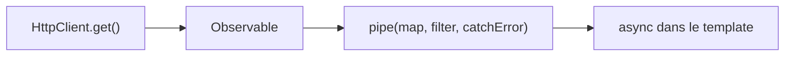

# Étape 4 — RxJS & HTTP

Angular communique avec une API via `HttpClient`, qui renvoie des **Observables** (RxJS). On apprend à consommer ces flux et à les transformer.

> **Objectif de l'étape —** appeler une API avec `HttpClient` et manipuler le flux de données avec les opérateurs RxJS.

## Au programme

- Observables : `subscribe`, le pipe `async`
- `HttpClient` : `get`, `post`, typage de la réponse
- Opérateurs courants : `map`, `filter`, `catchError`
- Désabonnement et bonnes pratiques

> **Rappel —** `HttpClient` et les Observables Angular ne s'exécutent pas dans le bac à sable (réservé JS/TS pur). Les exercices interactifs porteront sur de la **logique TypeScript** (transformation de données) ; les appels HTTP seront présentés en **mode correction**.

## Le flux de données en une image

`HttpClient.get()` ne renvoie pas une donnée : il renvoie un **Observable**, un flux auquel on s'abonne. On enchaîne des opérateurs (`map`, `filter`, `catchError`) dans un `pipe`, puis on consomme — souvent via le pipe `async` dans le template.

