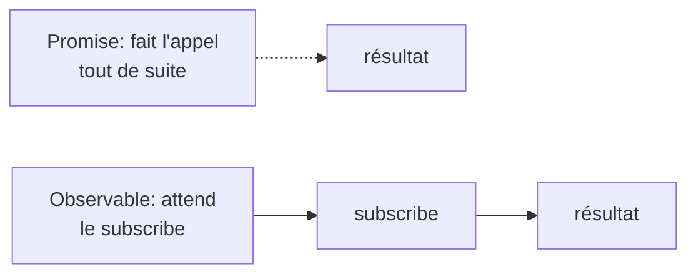

# Observables vs Promesses

Tu connais les `Promise`. Un **Observable** (RxJS) répond au même besoin — du code asynchrone — mais avec des différences qui expliquent pourquoi Angular l'a choisi.

| | Promise | Observable |
|---|---|---|
| Valeurs émises | **une** seule | **zéro à plusieurs** (un flux) |
| Démarrage | s'exécute immédiatement (eager) | **lazy** : rien tant qu'on ne `subscribe` pas |
| Annulation | non | oui (`unsubscribe`) |
| Opérateurs | `.then` | `map`, `filter`, `debounceTime`, … (riche) |

Un Observable modélise donc aussi bien une réponse HTTP unique qu'un flux continu (frappe clavier, événements WebSocket, valeur d'un formulaire qui change).

## S'abonner

Rien ne se passe avant `subscribe` :

```ts
import { of } from 'rxjs'

const numbers$ = of(1, 2, 3)          // an observable that emits 1, then 2, then 3

numbers$.subscribe({
  next: (n) => console.log('value:', n),
  error: (err) => console.error(err),
  complete: () => console.log('done'),
})
// logs: value: 1 / value: 2 / value: 3 / done
```

> Convention : on suffixe les variables Observable d'un `$` (`numbers$`, `products$`). C'est juste une convention de lecture.

## Lazy : pourquoi ça compte

Comme l'Observable ne démarre qu'au `subscribe`, **aucun appel HTTP ne part** tant que personne ne s'abonne. C'est ce qui rend le pipe `async` (prochaine leçon) si pratique : il s'abonne pour toi quand le template en a besoin, et se désabonne tout seul.



> **À retenir —** Promise = **une** valeur, eager, non annulable. Observable = **flux** (0..n valeurs), **lazy** (rien sans `subscribe`), annulable, avec des opérateurs riches. `HttpClient` renvoie des Observables : il faut donc s'y abonner pour déclencher la requête.
